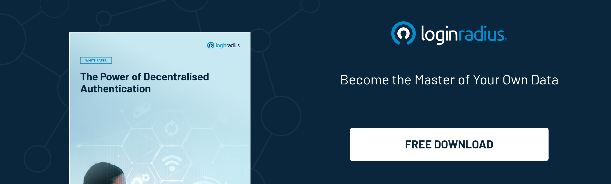

## Introduction

Every day, we encounter various events where we need to verify our identities. Whether you’re applying for a loan, booking flight tickets, or signing up online for a service, [identity verification](https://www.loginradius.com/blog/identity/what-is-identity-verification/) is crucial. 

However, most conventional authentication processes are inconvenient and even threaten consumers’ details. 

Whether we talk about inappropriate data collection and storage or a loophole in managing consumer identities, anything could lead to compromised sensitive information. 

Here’s where the concept of decentralized authentication in identity management comes into play. 

Storing essential information like name, address, and credit card details at a centralized location could mitigate the risk of identity disclosure or a breach of privacy. 

Let’s understand how decentralized authentication paves the path for a secure and seamless authentication process across multiple platforms in 2022 and beyond. 

## What is Decentralized Authentication? 

[Decentralized authentication](https://www.loginradius.com/blog/identity/what-is-decentralized-authentication/) means no central authority is required to verify your identity, i.e., decentralized identifiers. DIDs (Decentralized Identifiers) are unique identifiers that allow for decentralized, verified digital identification. 

A DID any subject identified by the DID's controller (e.g., a person, organization, thing, data model, abstract entity, etc.).

DIDs, unlike traditional federated identifiers, are designed to be independent of centralized registries, identity providers, and certificate authorities.

## How is Decentralized Authentication Used? 

Let’s understand this with a simple example. If someone creates a couple of personal and public keys in an identification wallet, the public key (identifier) is hashed and saved immutably in an ITF. 

A dependent third party then proves the person's identification and certifies it by signing with its non-public key.

If the person desires to get admission to a carrier, it's sufficient to give its identifier within the shape of a QR code or inside a token. The provider company verifies the identification to evaluate the hash values of identifiers with their corresponding hash facts within the ITF. The certification report is likewise saved within the ITF.

If they match, admission is granted. In greater ideal scenarios, the person can derive separate key pairs from a non-public key to generate different identifiers for one-of-a-kind relationships to allow privacy-pleasant protocols.

## Benefits of Decentralized Authentication

Both government and private sectors are already leveraging the true potential of decentralized authentication to deliver a seamless and [secure user experience](https://www.loginradius.com/blog/identity/balancing-security-cx/) to their clients. 

The growing use of decentralized identity eventually eliminates the need for storing user credentials on several websites, which further reduces the risk of identity theft. 

Here are some business advantages of incorporating decentralized authentication: 

* It helps establish trust in a customer since identity frauds are reduced, and there is a negligible risk of identity theft. 
* Personally identifiable information of customers is secured and adequate security for other sensitive information like credit card details or medical information. 
* Efficient and quick verification of the authenticity of data by third-party. 
* Reduced vulnerability to information misuse via the ones charged with coping with it and cyberattacks, fraud, and different monetary crimes.
* Give clients extra comfort via putting off passwords for login and [continuous authentication](https://www.loginradius.com/blog/identity/continuous-authentication/).
* Generate remarkable degrees of human acceptance as accurate among the corporation and its customers and companions.
* Reduce the compliance burden of dealing with clients' private information in services.
* Allow participation in open, trustworthy, interoperable standards.

## The Bottom Line

The modern technological ecosystem has offered endless possibilities to build a better and safer future with more robust control over our individual privacy. 

Decentralized authentication can be the game-changer in mitigating the risks of [identity theft](https://www.loginradius.com/blog/identity/identity-theft-frauds/) in both the government and private sectors.  Organizations thinking of enhancing consumer information security should strictly put their best foot forward to incorporate decentralized authentication for a secure experience. 

