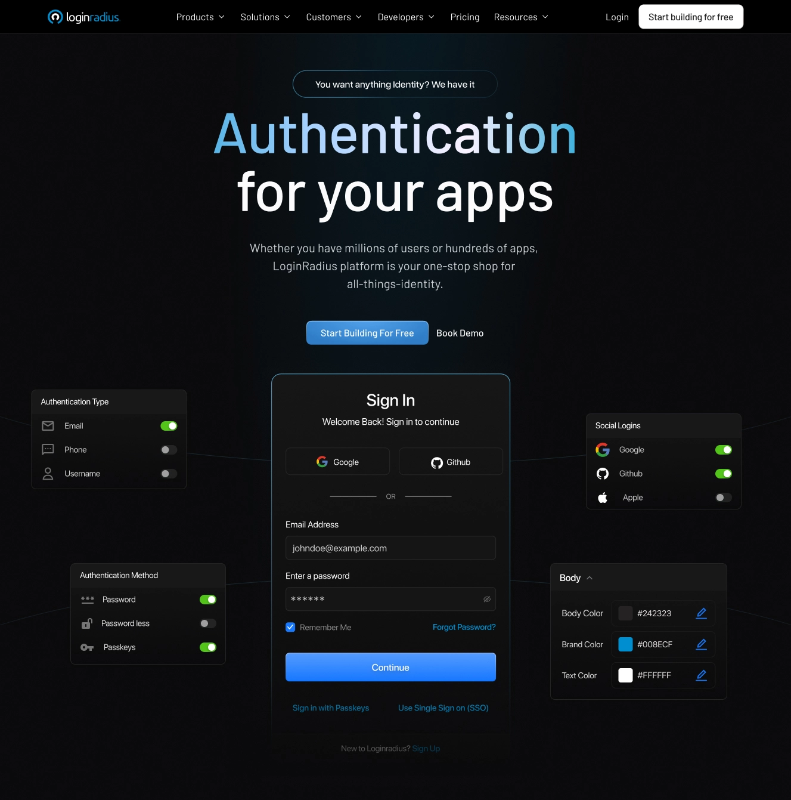
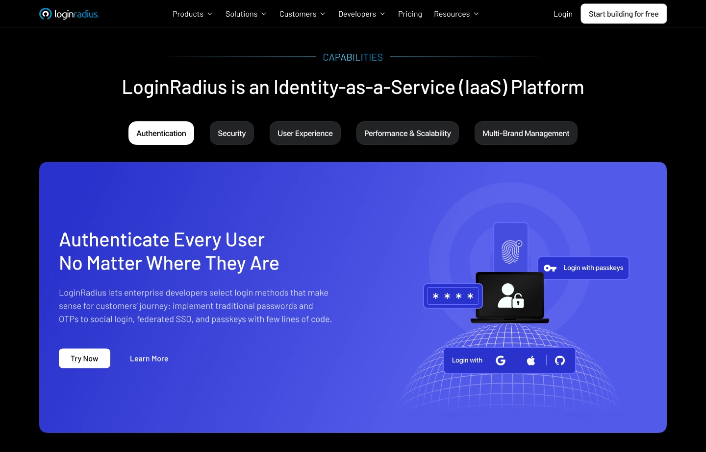
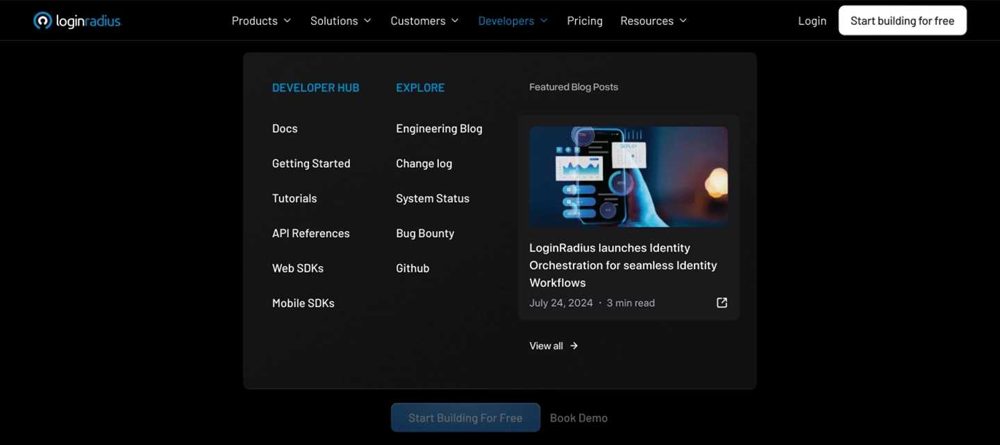
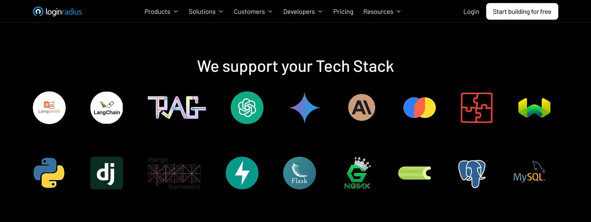
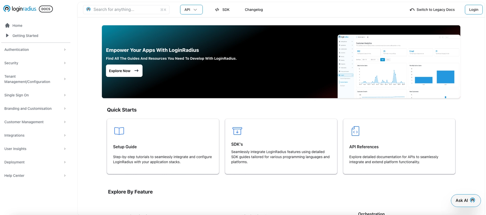

---
title: "Revamped & Ready LoginRadius Just Got Better for Developers"
date: "2025-02-21"
coverImage: "hero-section.webp"
tags: []
author: "Rakesh Soni"
description: "LoginRadius’ vision is to give developers a product that simplifies identity management so they can focus on building, deploying, and scaling their applications. To enhance this experience, we’ve redesigned our website interface, making navigation more intuitive and reassuring that essential resources are easily accessible."
metatitle: "Revamped & Ready LoginRadius Just Got Better for Developers"
metadescription: "Experience the new developer-first LoginRadius, which is redesigned for faster navigation, better accessibility, and seamless CIAM integration."
--- 

Identity is evolving, and developers are at the forefront of this transformation. Every day brings a new learning—adapting to new standards and refining approaches to building secure, seamless experiences.

We’re here to support developers on that journey. We know how important simplicity, efficiency, and well-structured documentation are when working with identity and access management solutions. That’s why we’ve redesigned the LoginRadius website—to be faster, more intuitive, and developer-first in every way.

The goal? Having them spend less time searching and more time building.

## What’s New and Improved on the LoginRadius Website?

LoginRadius’ vision is to give developers a product that simplifies identity management so they can focus on building, deploying, and scaling their applications. To enhance this experience, we’ve spent the last few months redesigning our interface— making navigation more intuitive and reassuring that essential resources are easily accessible.

Here’s a closer look at what’s new and why it’s important:

### A Developer-Friendly Dark Theme

  
  
  

Alt text: This image shows how LoginRadius offers several authentication methods like traditional login, social login, passwordless login, passkeys and more in a dark mode.

  
  
  
  

Developers spend long hours working in dark-themed IDEs and terminals, so we’ve designed the LoginRadius experience to be developer-friendly and align with that preference.

The new dark mode reduces eye strain, enhances readability, and provides a seamless transition between a coding environment and our platform. Our new design features a clean, modern aesthetic with a consistent color scheme and Barlow typography, ensuring better readability. High-quality graphics and icons are thoughtfully placed to enhance the content without adding visual clutter.

So, whether you’re navigating our API docs or configuring authentication into your system, our improved interface will make those extended development hours more comfortable and efficient.

### Clear Categorization for LoginRadius Capabilities

  
  

Alt text: This image shows a breakdown of all the LoginRadius CIAM capabilities, including authentication, security, UX, scalability and multi-brand management.

  

We’ve restructured our website to provide a straightforward breakdown of our customer identity and access management platform capabilities, helping you quickly find what you need:

-   Authentication: Easily understand [how to choose the right login method](https://www.loginradius.com/blog/identity/authentication-option-for-your-product/), from traditional passwords and OTPs to social login, federated SSO, and passkeys with few lines of code.
    
-   Security: Implement no-code security features like bot detection, IP throttling, breached password alerts, DDoS protection, and adaptive MFA to safeguard user accounts.
    
-   User Experience: Leverage AI builder, hosted pages, and drag-and-drop workflows to create smooth, branded sign-up and login experiences.
    
-   High Performance & Scalability: Confidently scale with sub-100ms API response times, 100% uptime, 240K+ RPS, and 28+ global data center regions.
    
-   Multi-Brand Management: Efficiently manage multiple identity apps, choosing isolated or shared data stores based on your brand’s unique needs.
    

This structured layout ensures you can quickly understand each capability and how it integrates into your identity ecosystem.

### Developer-First Navigation

  
  
  

Alt text: This image shows the LoginRadius menu bar, highlighting the developer dropdown.

  

We’ve been analyzing developer workflows to identify how you access key resources. That’s why we redesigned our navigation with one goal in mind: to reduce clicks and make essential resources readily available.

The new LoginRadius structure puts APIs, SDKs, and integration guides right at the menu bar under the Developers dropdown so you can get started faster. Our Products, Solutions, and Customer Services are also clearly categorized, helping development teams quickly find the right tools and make informed decisions.

### Quick Understanding of Integration Benefits

  

Alt text: This image shows a list of popular programming languages and frameworks offered by LoginRadius.

  

Developers now have a clear view of the tech stack available with LoginRadius, designed to support diverse business needs.

Our platform offers pre-built SDKs for Node.js, Python, Java, and more, making CIAM integration seamless across popular programming languages and frameworks.

### A Developer-Friendly Documentation Experience

Alt text: This image displays the LoginRadius developer docs section, highlighting its structured layout and easy navigation.

  
  
  

We’ve restructured the [LoginRadius documentation](https://www.loginradius.com/docs/) to make integration even smoother for developers. With a cleaner layout and intuitive navigation, finding the right information now takes fewer clicks.

The Quick Starts section provides step-by-step guides to help you get up and running fast, while detailed SDK documentation covers multiple programming languages and frameworks. Everything is organized into intuitive categories like Authentication, Orchestration, Single Sign-On, Branding & Security, and more, so you can quickly navigate to relevant content.

With enhanced guides, comprehensive API references, and real-world examples, the revamped documentation ensures a frictionless CIAM architecture—so you can focus on building, not troubleshooting.

## Over to You Now!

Check out our revamped LoginRadius website and see how the improved experience makes it easier to build, scale, and secure your applications.

Do not forget to explore the improved navigation and API documentation, and get started with our free trial today. We’re excited to see what you’ll build with LoginRadius!