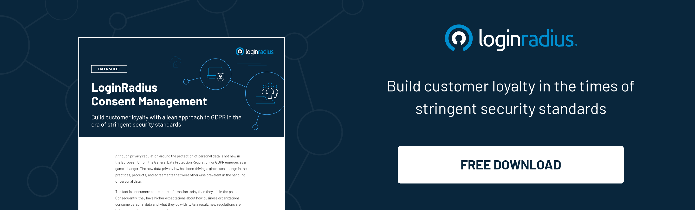

## Introduction

Securing consumer information is crucial for every business in a technologically advanced modern digital world where data breaches and identity thefts are the new normal. 

Whether we talk about user data leaks or personally identifiable information (PII) breaches, businesses face losses worth millions of dollars every year and end up compromising their brand image. 

Hence, it’s paramount for businesses collecting user information to incorporate a [robust identity management system](https://www.loginradius.com/b2b-identity/) to secure consumer information. 

But before organizations gear up themselves to offer stringent security measures to their clients, it’s crucial to understand the fundamental difference between personal data and personally identifiable information (PII). 

Personal information or data can be anything related to an individual and may reveal its identity. However, on the other hand, personally identifiable information is any data related to an individual user to identify a particular individual. 

In a nutshell, not all personal information is PII, while every PII is personal information associated with an individual. 

Let’s understand the aspects associated with personal information and PII and how businesses can safeguard the same. 

## What is Personally Identifiable Information

Data that helps identify a specific individual is called personally identifiable information, or PII in short. For example, your social security number is an excellent example of PII Compliance because it is unique, and the number itself will lead someone to find you directly.

In addition to this, your full name, driver's license ID, email address, bank account information, password, or phone number can also be considered personally identifiable information.

PII has a principal role in network security, especially when it comes to data breaches and identity theft. For example, if a company that manages personal information encounters a data breach, its customers will likely suffer personal identity theft because the company-managed data will be stolen.

The information related to this is stored with online marketers and brokers who trade your data to various companies that "want to show you appropriate ads" and provide you with an "improved user experience."

## Protection of PII

Many countries/regions have adopted multiple data protection laws like the [GDPR and CCPA](https://www.loginradius.com/blog/identity/ccpa-vs-gdpr-the-compliance-war/) to create guidelines for companies collecting, storing, and sharing customers' personal information. 

Businesses collecting sensitive personal information about users in these countries/regions should strictly adhere to these data protection and privacy regulations to avoid hefty fines. 

Some basic principles outlined in these laws stipulate that certain sensitive information shouldn’t be collected except in extreme circumstances.

In addition, the regulatory guidelines also stipulate that if the data is no longer needed for its intended purpose, it should be deleted, and personal information should not be shared with sources whose protection cannot be guaranteed. 

Moreover, supervision and protection of personally identifiable information may become a significant issue for individuals, companies, and governments in the coming years.

## Why Should Businesses Immediately Work on Protecting their Clients’ PII?

With the increasing cybersecurity risks in a post-pandemic world, protecting consumer information is as essential for businesses as their sensitive information. 

Attackers are always on a hunt for a loophole that allows them to sneak into a business network to exploit consumer identities. 

Hence, a business that faces a data breach where the initial loss was compromised consumer identities end up losing trust in the global markets and can also be entailed for hefty fines for not complying with the [data privacy](https://www.loginradius.com/blog/identity/consumer-data-privacy-security/) and protection regulations. 

### Getting the PII Compliance 

Without considering the type or size of any company, all organizations must have some detailed and comprehensive knowledge of PII compliance and how it can be utilized. 

The companies must have legal knowledge about which among the various country and state regulations related to PII is applied to some specific situation. 

It is also essential to consider that adopting acceptable privacy policies associated with this particular data can be advantageous. 

## How LoginRadius Helps Businesses in Securing Their Customers’ PII? 

[LoginRadius](https://www.loginradius.com/) offers layered security by limiting and monitoring access to consumers' data. The platform provides seamless protection with data management and real-time fraud analysis to improve customer experience and detect fraud attempts at the entrance.

The CIAM solution ensures fewer employees can access customer data and handle it. This further reduces the chance of accidental data leaks and secures consumer data privacy. Some of the global standards it adheres to include the GDPR in the EU and the CCPA in California.

LoginRadius, a [customer identity management system](https://www.loginradius.com/blog/identity/customer-identity-and-access-management/), supports global regulatory compliance in the fight against data breaches, essential for delivering zero friction customer experience.

## The Bottom Line

Businesses embarking on a digital transformation journey shouldn’t ignore the importance of securing their customers’ PII, especially if they’re dealing with heaps of consumer information. 

On the other hand, incorporating stringent security mechanisms to secure PII would build trust in the global markets and decrease the chances of a data breach. 

Hence, the consumer data privacy and security plan should comply with the rapid development of technology and the increasing cyber-attacks. Organizations should consider investing in compliance with the latest regulations to future-proof their consumer data protection plan. 

