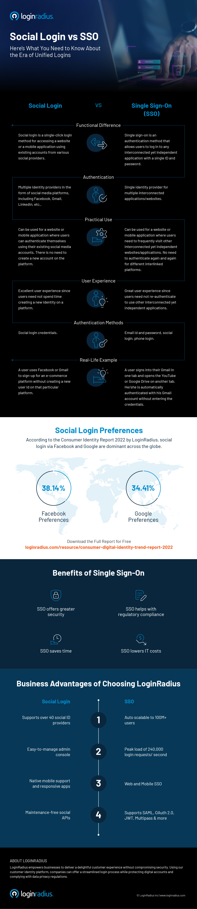

## Introduction 

In the modern digital world, where customer experience decides the overall growth of a business, crafting a [frictionless customer journey](https://www.loginradius.com/blog/growth/consumer-journey-from-sign-up-to-purchase/) holds the most significant importance. 

Moreover, when a business embarks on a digital transformation journey, secure and seamless authentication becomes an integral part of its customer success journey. 

However, most enterprises aren’t sure whether they need social login on their platform or single sign-on (SSO) to improve user experience and security. 

Social login and SSO are both different ways of authentication and can be used together or individually, depending on the business requirements. 

Let’s understand the differences between the two terms and how enterprises can make wiser decisions to incorporate a seamless and secure authentication mechanism into their platforms. 

## What is Social Login?

Social login, also known as social sign-in or social sign-on, allows your consumers to log in and register with a single click on a website or mobile application using their existing accounts from various social providers like Facebook, Google, etc. 

Social login simplifies the sign-in and registration experiences, providing a convenient alternative method to create an account where it is mandatory.

Social login reduces the effort to remember passwords, which means people don’t need to create and keep track of more credentials, lessening password fatigue and login failure. Log in via a third-party web page or Facebook or Google accounts can be done with just a few clicks on the button.

## What is Single Sign-On (SSO)?

Single Sign-On (SSO)  is an authentication method that allows websites to use other trustworthy sites to verify users. Single sign-on enables users to log in to any independent application with a single ID and password.

Verifying user identity is vital to knowing which permissions a user will have. SSO is an essential feature of an Identity and Access Management (IAM) platform for controlling access. The LoginRadius Identity platform is one example of managing access that combines user identity management solutions with SSO solutions. 

Customers can use a single identity to navigate multiple web and mobile domains or service applications since they only need to use one password. Also,  SSO makes generating, remembering, and using stronger passwords simpler for users.

## SSO vs. Login - Understanding the Difference 

While both authentication mechanisms are widely used for securely and seamlessly authenticating users, many differences can help better understand their core functionality. 

To learn more about the Social Login vs. SSO - concept, differences, and techniques, check out the infographic created by LoginRadius.

## Implementing Social Login and SSO with LoginRadius CIAM

LoginRadius' cloud-based CIAM offers endless possibilities to businesses seeking digital transformation by adopting cutting-edge authentication techniques, including social login and SSO. 

With [LoginRadius’ social login](https://www.loginradius.com/social-login/) and [SSO](https://www.loginradius.com/single-sign-on/), businesses can quickly bridge the gap between users and brands since the leading CIAM offers world-class security and a rich consumer experience that increases user engagement, retention rates, and conversion. 

If you wish to witness the future of CIAM and how it works for your business, schedule a free personalized demo today! 

