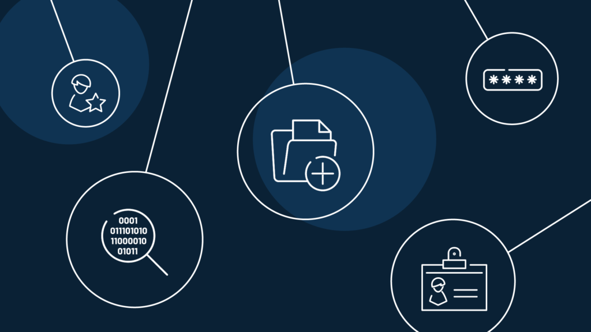
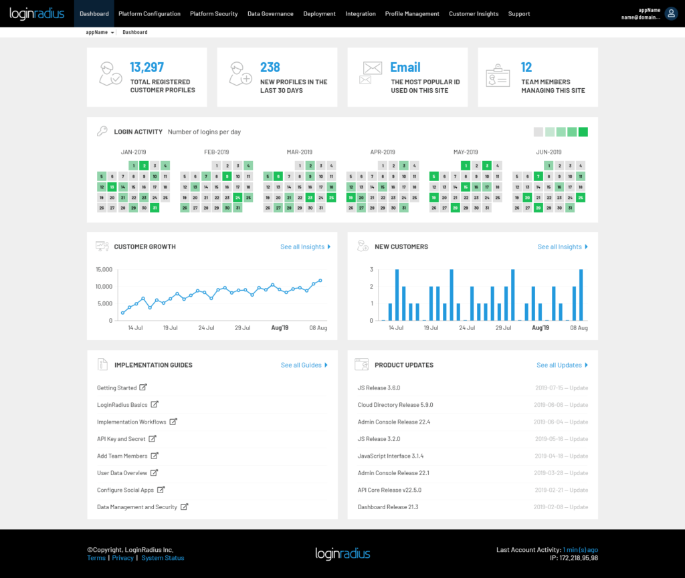
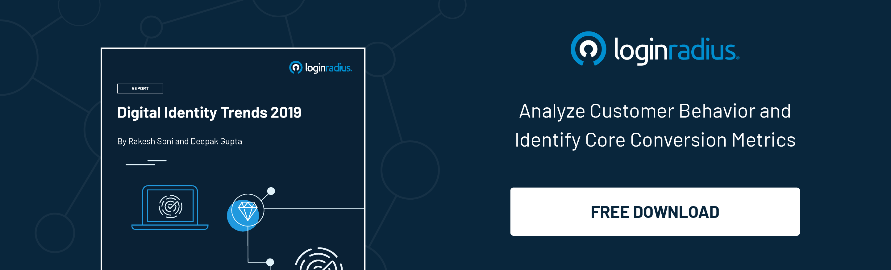
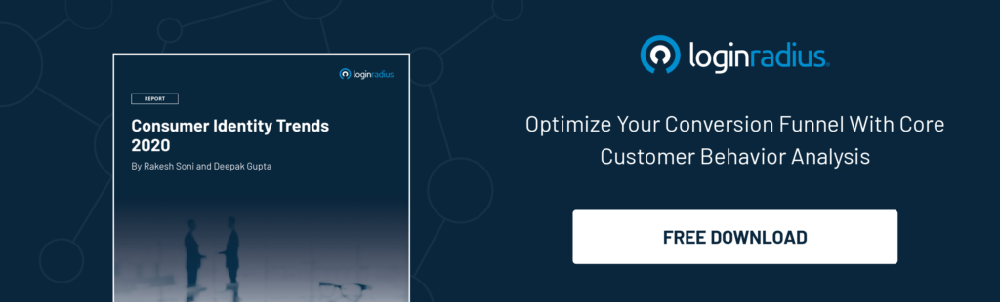

In business, [digital identity management](https://www.loginradius.com/blog/growth/identity-management-critical-revenue-generation/) primarily refers to the way a customer’s personal information is safely collected, stored, and accessed.

While this may appear simple, many businesses fall prey to misconceptions about building or managing a customer’s digital identity. To help you leverage customer identity data, let’s discuss the top three misconceptions that trip businesses up.

## 3 Common misconceptions around digital identity

1. **“_A digital identity must use highly personal identifiable information_.”** 

Many businesses make the mistake of putting sensitive personal information like full names or social insurance numbers in their system to track customer identities. Due to the proliferation of data breaches, this is risky. Safer methods should be used instead, such as coded customer numbers.

2\. **“_You can only get customer insights from surveys or forms._”**

Sure, one way of getting consumer insights is having them fill out a form on your site. Another way is to use a device ID to identify customer behavior

But what about consumers who own multiple devices, have separate digital IDs at work and home, and access the internet through multiple IP addresses or 3rd-party apps? When you gather data from multiple sources, you’ll need to compile this and store it in one place. But how?

With [customer identity and access management](https://www.loginradius.com/blog/2019/06/customer-identity-and-access-management/) (CIAM) software, you can access an individual’s extensive data from multiple sources. Even “anonymous” user data can help you create a customer identity. You can even gather data through [progressive profiling](https://www.loginradius.com/progressive-profiling/)—a gradual, more natural way for customers to share their personal information.   
  
3\. **“_Consumer behavior analytics is all you need._”**

Due to marketing’s reliance on user experience mapping, session analytics, and content engagements, this myth is rampant. As a result, many businesses mistakenly think “behavioral” data is all they need for digital identity management. Not true. In the next section, we’ll explain why.  

- 
    

## Why is digital identity management important?

We live in an era where data is the most valuable commodity in the world. However, where there is _value,_ there is also _risk_. For instance...

**Did you know that [60% of companies fail](https://www.inc.com/thomas-koulopoulos/the-biggest-risk-to-your-business-cant-be-eliminated-heres-how-you-can-survive-i.html) within 6 months of a cyber attack?**

Malicious software, hackers, online fraud, and user errors all pose a danger to the digital identification data that you collect or store. 

For businesses that collect or store customer data, security is vital to winning and maintaining customer trust. If you’re uncertain how, here are 5 methods that can help.

## 5 Gold Standards for Winning Customer Trust

1\. **Collect only what’s needed**

Many businesses are quick to collect an array of customer data during the registration process. If you don’t take the time to consider if/why/how you’ll use all of this data— or determine the right time to collect this information—you’ll run into a lot of issues. 

Collecting unnecessary data wastes resources and increases the risk of identity theft. Plus, gathering too much data also causes customers to abandon registration, as it slows down the process and feels intrusive.  
  
2\. **Invest in data encryption and hashing.**

When data is in transit from one server to another, it’s at its most vulnerable. That’s why [encryption in transit](https://www.loginradius.com/data-governance/) is crucial to data protection. Likewise, encryption at rest is necessary for data governance and compliance efforts. 

When it comes to hackers, anything that has been coded can be decoded. Thus, utilizing [one-way hashing](https://www.loginradius.com/docs/infrastructure-and-security/cryptographic-hashing-algorithms/) for safeguarding sensitive data like passwords is a must-do.

Safety Tip: When you implement encryption at rest and encryption in transit, be sure that you’re using a platform with an ISO 27001 certification. This ensures that your system complies with industry-leading standards for information security and risk management.   
  
3\. **Limit access to data.**

Not all data is in use continuously. That’s why sensitive customer data should not be accessible to everyone, all the time. 

Utilizing field-level encryption allows you to set up access based on an individual’s role. In other words, field-level encryption is the ability to encrypt data within specific [data fields](https://searchoracle.techtarget.com/definition/field), making this data unreadable to anyone who lacks access or the keys to decrypt this data.  
  
4\. **Require safer authentication.**

While some tech-savvy users know how to look after their personal information, many are unaware of how digital identity verification impacts security. 

To reduce risk, it’s important to invest in systems that enable a higher level of passwordless login. One method, [multi-factor authentication](https://www.loginradius.com/blog/identity/what-is-multi-factor-authentication/) (MFA), uses an SMS or a call-in code, and/or an email link as extra levels of security. 

Another method, risk-based authentication (RBA), recognizes user patterns and alerts your system if this pattern suddenly changes. For example, if someone tries to log in from a foreign country or a new IP address, an email will be sent to the registered user, asking them to validate the action.   
  
5\. **Respect your customers.**

In the past, digital identity management practices were not very respectful of customer privacy. But soon, customers demanded better—and [compliance regulations](https://en.wikipedia.org/wiki/Regulatory_compliance) were born. 

Compliance regulations require businesses to communicate with customers about why their data is collected, by whom, and what will be done with it. It also demands customer consent before collecting their data.

Did you know that requesting consent can also strengthen your brand reputation and build customer trust? That’s why it’s smart to employ a [compliance-ready platform](https://www.loginradius.com/compliances/) now. This will prepare your business for global data regulations while also fostering customer loyalty.

### Conclusion

**Is there one way to achieve all 5 gold standards?**  
  
Yes—with CIAM software. LoginRadius CIAM offers a variety of highly-secure customer identity management features. For added peace of mind, LoginRadius keeps its platforms ahead of emerging data regulations and consistently performs rigorous updates.

