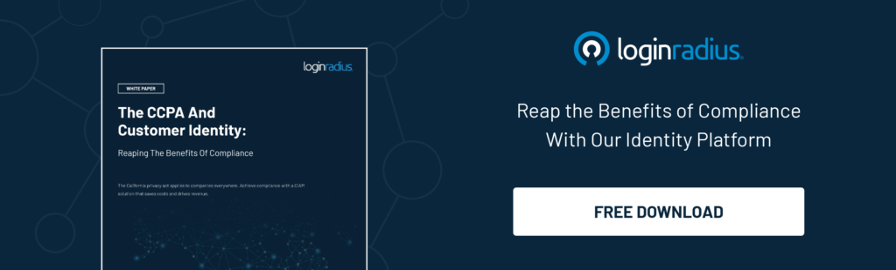
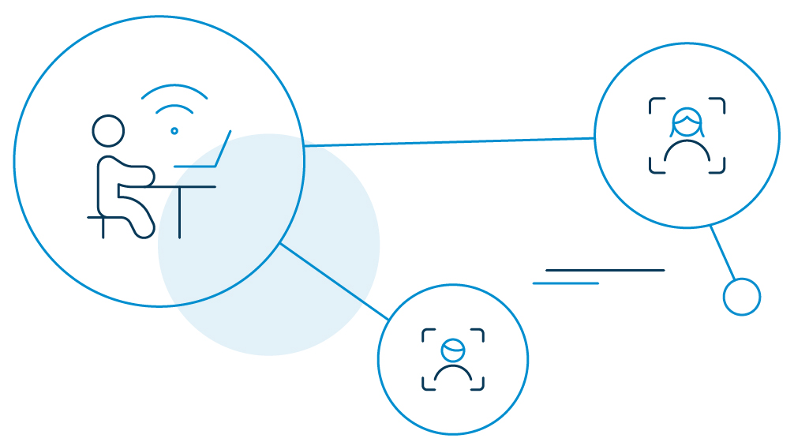

_It’s never too soon to plan for the future. Taking proactive steps to secure your client’s digital privacy could pay off big in 2020._

Concerns over protecting digital data have always been at the forefront of a CIO’s mind. But when the 2017 Equifax breach struck, it brewed fresh reservations. Executives across business verticals began working even harder to secure the digital privacy of their consumers’ data. 

## What Is Digital Privacy

Digital privacy is keeping consumers’ personal data private. It is the act of using a safer internet and securing other connected devices based on their perceived importance. 

For example, a person may not be comfortable sharing names, contact numbers or profile pictures on the internet, while another may be okay with it. Hence, digital privacy is about [protecting consumers' data](https://www.loginradius.com/blog/2020/05/cyber-threats-business-risk-covid-19/) within the scope of their comfort zone.

## What Do the Experts Think About Digital Privacy

As we move towards a more data-centric economy, C-suite execs have a lot on their plates in terms of external collaboration, information sharing, and above all, protecting consumers' sensitive data. 

Three security experts provide advice on the best privacy practices in 2020.

**1\. Deepak Gupta, Chief Technical Officer at LoginRadius**

"Today enterprises move their data through streaming pipelines. Keeping track of where the data ends up is as crucial as safeguarding the data itself," [Gupta points out](https://twitter.com/dip_ak?lang=en), continuing  "Modern data privacy laws like the GDPR and CCPA couldn't have come at a better time. This is what security operations teams needed at the moment—an unbiased wake-up call. “

**2\. David Kemp, Business Strategist with Micro Focus**

"Looking at the year ahead, we will see a major drive from organizations to achieve data privacy compliance," Kemp says, "individuals will increasingly recognize their right to data privacy, and ability to hold businesses to account for negligence."

**3\. Kelvin Coleman, Executive Director at NCSA**

“With new privacy legislation going to affect this year, digital privacy couldn’t be a more timely opportunity for helping businesses and consumers understand the importance of respecting and protecting personal information,” said [Coleman](https://twitter.com/kcolemanncsa?lang=en).

## How Important Is Online Privacy 

Data is an incredibly valuable commodity today. Marketing is just one of the many ways of businesses exploiting consumer data—mostly to boost revenue and improve their market position.

Simply put, data or digital privacy is a basic human right. The concept in business reflects the personally identifiable information of its employees and consumers, at large. It also includes the data (financial or research) required to operate a business. These are sensitive information and should remain confidential at all times. 

After the European Union enacted the [General Data Protection Regulation (GDPR)](https://www.loginradius.com/gdpr-and-privacy/), many companies have begun exploring the role of privacy as a human right. It’s been giving a new direction to companies to develop the necessary tools and processes to collect consumer data and not exploit it. 

## 5 Major Threats to Data Privacy in the Digital Age

### 1\. Extremely Poor Password Hygiene

The importance of using strong passwords is never irrelevant. Inadequate [password hygiene](https://www.loginradius.com/blog/2018/12/infographic-the-death-of-passwords/) has always been the primary source of attacks like credential stuffing and account takeovers. 

One of the easiest ways to mitigate the uncertainty of cyber attack is by making passwords hard-to-steal and never re-using them across multiple accounts. 

Businesses are also going passwordless, which means consumers do not need to memorize any credentials whatsoever and use social media sign-in, PIN authentication or email verification instead to authenticate.

### 2\. Phishing Attacks

[Phishing attacks](https://www.loginradius.com/blog/2018/02/phishing-for-identity/) happen when cybercriminals scam consumers with fraudulent email messages and trick them into giving away sensitive data. Most of these messages seem like they are from authentic sources and no one usually questions their legitimacy.

Do not click on links from suspicious email addresses, always type the target website address yourself, and never give away your personal information to anyone. Safeguarding against phishing is possible. All you need is to do is pay attention to detail. 

### 3\. Inadequate Data Security Training

Simple cybersecurity drills for employees within organizations can go a long way in achieving digital privacy. Train them on the various data security protocols so they know how to protect consumers' sensitive data.

At the end of it, they should know how to spot phishing scams, the importance of changing passwords frequently, always use encrypted emails while sending sensitive information, whom to report if their [credentials are stolen](https://www.loginradius.com/blog/2019/09/prevent-credential-stuffing-attacks/), how to conduct security updates on their home and office devices, and the likes. 

### 4\. Shoulder Surfing

Shoulder surfing dates back to even before when the internet was invented. In those days, thieves used to spy on user's phones as they punched numbers or fed information.

Shoulder surfing, in the age of the internet, refers to the attacker peering over the user's shoulder to get information from the screen or keyboard movements. Credit card numbers, bank accounts, and credentials like user name, passwords are most susceptible to such attacks. 

### 5\. Lack of faster breach response

Even if you have the best security protocols in place, a data breach can still happen. Maintaining digital privacy does not only mean that you need to protect your organization from every cyberattack, it also means preparing for the prompt response, if a breach has to happen. Many lack a faster incident response plan. 

## How Organisations Can Protect Their Digital Privacy

### 1\. Support leadership buy-in.

Protecting customer data can make or break a company, so it should be a top priority. If security isn’t considered vital when issuing departmental finances, you might not get the resources you need to protect your company.

Luckily, most organizations support privacy-focused leadership buy-ins. If your company does not, remind them of the high costs of poor data management if they [fail to protect their customer identities](https://www.loginradius.com/blog/2019/10/cybersecurity-best-practices-for-enterprises/).

### 2\. Designate one dedicated security personnel. 

With security at the leadership level, companies can plan more robust organizational initiatives.

Appointing one individual to manage an enterprise’s digital privacy is a sound practice. This means a C-level professional should screen for legal and [compliance risks](https://www.loginradius.com/blog/2019/09/ccpa-vs-gdpr-the-compliance-war/) that impact customer security and privacy. 

### 3\. Develop a culture of security and privacy.

Let’s face it—many security-related incidents occur due to human negligence. With packed schedules and tight deadlines, crucial processes may sometimes go unattended. When that happens, an enterprise may suffer irreparable damage.  

It’s no surprise that employees are the gatekeepers of a company’s digital privacy. One wrong move can result in severe repercussions. Hence, companies must teach employees how to adhere to security and privacy policies. It also helps to explain why certain security controls are in place. 

To achieve this, companies should invest in employee security training and educate different departments about the [impact of a data breach](https://www.loginradius.com/blog/2020/04/marriott-data-breach-2020/). Let them know that one careless action can ruin the reputation of a company. In short, when people understand why certain rules are important, they’ll respect these more. 

### 4\. Establish transparent processes and policies. 

No matter how perfect your framework is, it’s useless if your customers aren’t aware of your processes and policies. Make dedicated policy pages and place links to these on your site’s home page and menu bar.

### 5\. Strategize an incident response plan. 

Data breaches are a nightmare that companies dread. That’s why gatekeepers must prepare for it in advance. 

Don’t wait to draft incident policies for your customers after a data breach. With a digital privacy response plan, you can tell your customers what to do, discuss their roles, and show them how to communicate internally and externally in the event of a data breach. 

The ability to demonstrate Return on Mitigation (ROM) is also a critical metric to CEOs. To do this, calculate [potential risks and assess](https://www.loginradius.com/loginradius-business-continuity-covid-19-outbreak/) how much can be saved through on-time mitigation.

## How LoginRadius Helps Businesses Protect Consumer Data

[Consumer identity and access management (CIAM)](https://www.loginradius.com/blog/2019/06/customer-identity-and-access-management/) platform LoginRadius offers a comprehensive methodology that helps businesses to collect, store, and process consumers’ data by ensuring the highest level of protection. 

LoginRadius complies with major regulatory laws and privacy requirements. It helps global digital companies to conduct business by keeping consumer digital privacy and security sentiments at the forefront. 

### LoginRadius fulfills the following rights of the consumers.

- The right to be informed.
- The right of access.
- The right to withdraw consent.
- The right to rectification.
- The right to be forgotten.
- The right to restriction of processing data.
- The right to deletion of inactive data. 
- The right to protection of children's personal data.

### Overview of global regulations that LoginRadius is compiled with.

- **General Data Protection Regulation** (GDPR): Offers data protection and privacy for all individual citizens of the European Union and the European Economic Area.
- **California Consumer Privacy Act** (CCPA): focuses on the privacy [rights of California consumers](https://www.loginradius.com/blog/2020/03/how-loginradius-helps-enterprises-stay-ccpa-compliant-in-2020/).
- **US Privacy Shield**: Enables US-based organizations to benefit from the adequacy determinations.
- **ISO/IEC 27018:2019**:  Protects Personally Identifiable Information (PII) in the public cloud computing environment.

## Conclusion 

Getting your enterprise onboard with these best practices is the first step to attaining better digital privacy for your consumers. Start by setting up a data maintenance process—operational efficiencies will follow through. 

