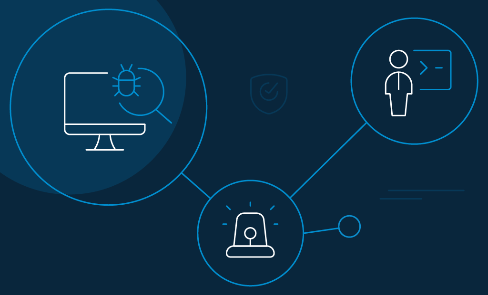

## What is DNS Cache Poisoning

DNS cache poisoning, also known as DNS spoofing, is a cyber-attack that exploits the weaknesses in the Domain Name System (DNS) servers. It enables the attacker to poison the data in DNS servers, including your company server, by providing false information to your internet traffic and diverting it to fake servers. This is done by redirecting the data in DNS to their IP address. 

DNS cache poisoning utilizes the vulnerabilities in the DNS protocols' security to divert internet traffic away from legitimate servers to the wrong address. 

DNS cache poisoning is effectively used for phishing attacks, often referred to as Pharming, for spreading malware. In the background, the malware runs and connects with the legitimate servers to steal sensitive information.

When the DNS server is attacked, users may be requested to login into their accounts, and the attacker finds its way to steal the sensitive and financial credentials. 

Moreover, [phishing attacks](https://www.loginradius.com/blog/identity/phishing-for-identity/) also install viruses on the client's computer to exploit the stored data for long term access. 

## How Does DNS Cache Poisoning Works

DNS spoofing is a threat that copies the legitimate server destinations to divert the domain's traffic. Ignorant of these attacks, the users are redirected to malicious websites, which results in insensitive and personal data being leaked. 

It is a method of attack where your DNS server is tricked into saving a fake DNS entry. This will make the DNS server recall a fake site for you, thereby posing a threat to vital information stored on your server or computer. 

The cache poisoning codes are often found in URLs sent through spam emails. These emails are sent to prompt users to click on the URL, which infects their computer. 

When the computer is poisoned, it will divert you to a fake IP address that looks like a real thing. This way, the threats are injected into your systems as well.

## What Are the Different Stages of Attack of DNS Cache Poisoning

*   First Stage

The attacker proceeds to send DNS queries to the DNS resolver, which forwards the Root/TLD authoritative DNS server request and awaits an answer. 

*   Second Stage

The attacker overloads the DNS with poisoned responses that contain several IP addresses of the malicious website. 

To be accepted by the DNS resolver, the attacker's response should match a port number and the query ID field before the DNS response. 

Also, the attackers can force its response to increasing their chance of success.

*   Third Stage

If you are a legitimate user who queries this DNS resolver, you will get a poisoned response from the cache, and you will be automatically redirected to the malicious website.

## How to Detect DNS Cache Poisoning

Now that we know what is DNS cache poisoning let's understand how to detect it. 

One way is to monitor the DNS server for any change in behavior patterns. Also, you can apply data security to DNS monitoring.  

Another way is to look for a potential birthday attack. This occurs when there is a sudden increase in DNS activity from a single source in a single domain. When there is an increase in the DNS activity from a single source, querying your DNS server for multiple domain names without recurring shows that the attacker is looking for a DNS entry for poisoning. 

Monitor the file system behavior and active directory events for any abnormal activities. You can use analytics for correlating activities among three vectors to add important information to your [cybersecurity strategy](https://www.loginradius.com/blog/identity/2019/10/cybersecurity-best-practices-for-enterprises/). 

## Why Is DNS Cache Poisoning Dangerous for Your Business

When the DNS server is poisoned, it will start spreading towards other DNS servers and home routers. Computers that lookup DNS entries will get the wrong response by causing more users to end up as victims of DNS poisoning. 

This issue will be resolved only when the poisoned DNS cache is cleared on each affected DNS server; you are at risk of losing your precious information until then. 

One of the major reasons DNS cache poisoning is highly dangerous is that it can spread from one DNS server to another. 

**Here are a few DNS poisoning attack examples-**

A [DNS poisoning event](https://www.computerworld.com/article/2516831/china-s-great-firewall-spreads-overseas.html) had resulted in the Great Firewall of China's temporary escape from China's national borders by censoring the internet in the USA till the problem was resolved. 

Recently, [attackers](https://searchsecurity.techtarget.com/answer/How-did-OurMine-hackers-use-DNS-poisoning-to-attack-WikiLeaks) targeted WikiLeaks, who used a DNS Cache poisoning attack for hijacking traffic to their WikiLeaks like version. This intentional attack was created to divert the traffic away from WikiLeaks and was implemented successfully.

## How To Protect Against DNS Cache Poisoning

### For DNS server providers and website owners

If you are a DNS service provider or a website owner, you have a huge responsibility for safeguarding your users by using various tools and protocols to manage the threats. 

Some of the resources we have specified will help you in this regard.

*   Just like endpoint user security products, you can proactively use DNS spoofing detection tools to scan before you send or receive the data.
*   Using DNSSEC (Domain Name System Security Extensions) helps to keep DNS lookup fool-proof and authentic.
*   You can use end-to-end encryption to send DNS requests and replies. Hackers will not be able to duplicate the unique security certificate that is present on the legitimate website. 

### For endpoint users

To avoid making your users vulnerable to a DNS poisoning attack, you can use the specified tips.

*   Do not click on the links that you don't recognize; these include text messages, emails, or social media links. To be safe, you can opt for entering the URL manually in the address bar.
*   Regularly scan your computer for any malware. Your security software will help and remove any secondary infections. As the poisoned sites deliver malicious programs, you need to scan for spyware, viruses, or any other hidden issues.
*   Flush your DNS cache to solve the problem of poisoning. Nevertheless, cache poisoning remains in your system for a long time until you clean the infected area.
*   Use the [virtual private network (VPN)](https://www.loginradius.com/blog/engineering/learn-about-vdn-for-cybersecurity/), a service that offers an encrypted tunnel for your web traffic. You can use a private DNS service exclusively for end-to-end encrypted requests; as a result, your servers are tougher against DNS spoofing. 

## Final Thoughts

DNS cache poisoning can be summarised as an attacker controlling the DNS server to send fake DNS responses. As a result, when the user visits the counterfeit domains, they will be directed to a new IP address selected by the hacker. 

This new IP address might be from a malicious phishing website, where the users are prompted to download malware, or they might be asked to provide their financial or login details. 

Hence, understanding what is DNS cache poisoning, how to detect it, and ways to prevent it is crucial so you can [protect your business](https://www.loginradius.com/blog/identity/2020/06/consumer-data-privacy-security/) against it. 

