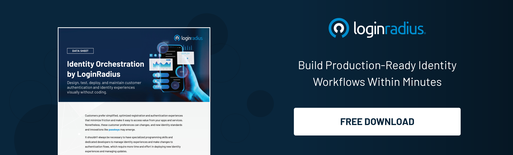

## Introduction

User experience is paramount in today’s modern digital business landscape. A seamless, [hassle-free authentication](https://www.loginradius.com/authentication/) process can significantly enhance user satisfaction and retention. However, many businesses struggle with outdated, cumbersome login systems that frustrate users and create security vulnerabilities. 

Enter LoginRadius, a powerful SaaS tool designed to streamline user identity management. This article explains the benefits of migrating to LoginRadius and outlines a step-by-step guide for a smooth transition.

## The Critical Role of Login Systems in User Experience

A seamless login experience is essential in today's competitive digital landscape. Here's why:

1. **User Satisfaction**: A cumbersome login process can lead to user frustration and abandonment. An intuitive, fast login system ensures users have a positive experience every time they access your platform.

2. **First Impressions Matter**: The login process is often the first interaction a user has with your service. A smooth, hassle-free experience can set the tone for their entire journey with your brand.

3. **Retention and Engagement**: Simplified login procedures encourage users to return frequently, boosting engagement and long-term retention.

## Why LoginRadius is the Optimal Choice

LoginRadius stands out for several reasons:

1. **Advanced Security Measures**: LoginRadius offers multi-factor authentication (MFA), single sign-on (SSO), passkeys, and state-of-the-art encryption to safeguard user data.

2. **Customizable User Experience**: With [social login options](https://www.loginradius.com/social-login/) and customizable interfaces, LoginRadius makes the login process as user-friendly as possible.

3. **Scalability and Flexibility**: From small startups to large enterprises, LoginRadius scales seamlessly to accommodate your user base.

4. **Regulatory Compliance**: With LoginRadius's [built-in compliance](https://www.loginradius.com/compliances/) features, ensure your operations comply with global data protection regulations like GDPR and CCPA.

5. **Identity Orchestration**: LoginRadius provides granular flexibility in designing and deploying identity flows without the need for coding, enabling anyone with identity expertise to build production-ready identity workflows within minutes.

 

## Planning Your Migration

Preparation is key to a successful migration. Here’s how to get started:

1. **Audit Your Current System**: Evaluate your existing login system to identify weaknesses and areas for improvement.

2. **Set Clear Goals**: Define what you hope to achieve with the migration, such as improved security, better user experience, or enhanced compliance.

3. **Involve Key Stakeholders**: Ensure all relevant departments, including IT, security, and user experience teams, are involved in the planning process.

If you are still unable to understand how to plan your migration, [contact us](https://www.loginradius.com/contact-sales/), and we’ll ensure a smooth migration planning process and provide you with a product demo. 

## Detailed Migration Steps

1. **Develop a Comprehensive Plan**: Outline your migration strategy, including timelines, resource allocation, and risk management.

2. **Secure Data Transfer**: Move user data to LoginRadius securely, maintaining data integrity and confidentiality.

3. **Test Thoroughly**: Conduct extensive testing to ensure the new system integrates seamlessly with your existing infrastructure.

4. **Training and Onboarding**: Provide thorough training for your staff and users to ensure a smooth transition.

5. **Launch and Monitor**: Go live with the new system, monitoring closely for any issues and being ready to make necessary adjustments.

## Enhancing User Security

Security is a paramount concern for any business managing user identities. LoginRadius excels in this area with:

1. **Multi-Factor Authentication (MFA)**: Adding an extra layer of security, MFA requires users to provide multiple forms of verification. Moreover, with LoginRadius’ [Risk-Based Authentication](https://www.loginradius.com/blog/identity/risk-based-authentication/), you can reinforce security in high-risk situations. 

2. **Single Sign-On (SSO)**: SSO simplifies the login process by allowing users to access multiple applications with a single set of credentials.

3. **Data Encryption**: Advanced encryption methods protect sensitive user information from potential breaches.

## Improving Operational Efficiency

Migrating to LoginRadius can streamline your operations significantly:

1. **Reduced Administrative Burden**: Automated login processes mean less manual intervention, freeing up your IT team to focus on more critical tasks.

2. **Enhanced System Performance**: LoginRadius’s efficient design ensures fast, reliable login experiences, even during peak usage times.

3. **Centralized Management**: Manage all user identities and access controls from a single, centralized platform.

## Post-Migration Benefits

Once the migration to LoginRadius is complete, your business will enjoy numerous advantages:

1. **Superior User Experience**: A smooth, quick, and secure login process keeps users happy and engaged.

2. **Stronger Security Posture**: Advanced security features protect against data breaches and unauthorized access.

3. **Regulatory Peace of Mind**: Built-in compliance with global regulations ensures your operations are always in line with legal requirements.

## Final Thoughts

Migrating to LoginRadius is an investment in your business's future. By eliminating login hassles, you enhance user satisfaction, bolster security, and streamline operations. 

With a strategic approach and thorough preparation, the transition to LoginRadius can be effortless and highly rewarding. Don't let outdated login systems hold you back—embrace the future of user identity management with LoginRadius.

