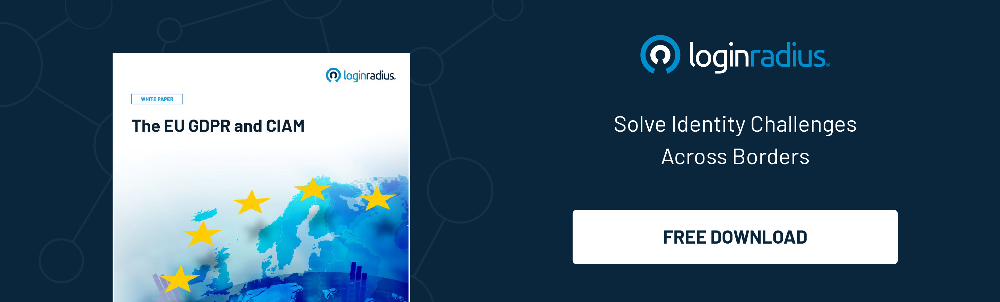

## Introduction 

Businesses embarking on a digital transformation journey to deliver seamless user experiences to their customers shouldn’t compromise security and privacy, especially today when various regulations are becoming more stringent. 

When it comes to the identity and access management landscape, businesses must be more precise while catering to a broader circle of customers globally. 

One such regulation is Regulation (EU) 910/2014, commonly referred to as the eIDAS Regulation (short for "Electronic Identification, Authentication, and Trust Services"). This is a European regulatory framework that establishes rules and standards for electronic identification and trust services across EU member states.

What’s concerning is that the latest update, eIDAS 2.0, will revolutionize the way businesses handle customer details and protect their digital identities through [consent management](https://www.loginradius.com/privacy-consent/).  

Let’s uncover the aspects associated with eIDAS 2.0 and learn how businesses should gear up themselves. 

## What is eIDAS 2.0?

eIDAS 2.0 marks a significant leap forward in how electronic identification and signatures are managed within the European Union. This update aims to modernize the original eIDAS regulation, aligning it with technological advancements and the evolving needs of the EU digital market. 

The primary goals of eIDAS 2.0 are to enhance security, flexibility, and seamless use of digital identities across various applications, such as cross-border travel, online document signing, and accessing public services.

## Key Innovations in eIDAS 2.0

**1. Universal Digital Identity Wallets:** Imagine a digital equivalent of your physical wallet, stored securely on your smartphone or computer. This digital wallet allows users to safely store their identification documents and use them effortlessly throughout the EU.

**2. Streamlined Cross-Border Access:** Say goodbye to the complexities of using digital IDs across different EU countries. eIDAS 2.0 simplifies this process, making it easier to access services no matter where you are in the EU.

**3. Enhanced Data Protection:** eIDAS 2.0 introduces stricter regulations to protect personal data, giving individuals more control over their information. Users can selectively share their data based on the specific needs of each service.

**4. Expanded Service Accessibility:** The range of services [accessible with digital IDs](https://www.loginradius.com/blog/identity/digital-identity-verification/) is broadened under eIDAS 2.0, aiming to include more people in the digital ecosystem and encourage greater participation in digital transactions and interactions.

## The Impact of eIDAS 2.0

eIDAS 2.0 represents a pivotal advancement in digital identity management within the EU, prioritizing security, accessibility, and user empowerment. 

This regulation not only enhances the safety and flexibility of digital identities but also ensures their seamless use across various contexts, driving forward the digital transformation of Europe.

Hence, businesses have to ensure they meet the compliance requirements if they wish to serve the customers in the EU since failing to this could lead to hefty fines and reputational losses. 

## How to Obtain an eIDAS Certificate?

To secure an eIDAS certificate, follow these steps:

1. **Select a Qualified Trust Service Provider (QTSP):** Begin by choosing an accredited QTSP authorized to issue eIDAS certificates. These providers ensure compliance with eIDAS regulations.

2. **Determine the Type of Certificate:** Identify the specific type of eIDAS certificate you need, such as for electronic signatures, seals, or website authentication, based on your requirements.

3. **Submit Identification and Documentation:** Provide the necessary identification documents and other required paperwork to the QTSP. This may include personal identification, business registration documents, or other relevant information.

4. **Undergo the Verification Process:** The QTSP will verify your identity and the information provided. This verification may involve in-person, online, or a combination of both methods, depending on the certificate type and the QTSP’s procedures.

5. **Receive Your Certificate:** After successful verification, the QTSP will issue your eIDAS certificate. This certificate typically includes cryptographic keys that enable you to digitally sign documents, [authenticate websites](https://www.loginradius.com/authentication/), or perform other relevant actions.

6. **Install and Configure:** Once you have the certificate, install it on your devices or systems and configure any necessary software to use it for electronic transactions or authentication purposes.

Follow any specific guidelines or requirements set by the QTSP during the application process to ensure the smooth and successful issuance of your eIDAS certificate.

By understanding and implementing eIDAS 2.0, businesses can better navigate the digital landscape, ensuring they remain compliant, secure, and ready to meet the demands of an increasingly digital world.

## Final Thoughts 

The digital revolution demands robust security and seamless user experiences, and eIDAS 2.0 is key to achieving this. By obtaining an eIDAS certificate through a qualified trust service provider, businesses can comply with stringent regulations and protect their customers' digital identities. 

Embracing eIDAS 2.0 enhances data protection, streamlines cross-border access, and expands service accessibility, positioning businesses to thrive in the digital era. Leverage the full potential of eIDAS 2.0 to ensure your business is ready to survive and excel.

