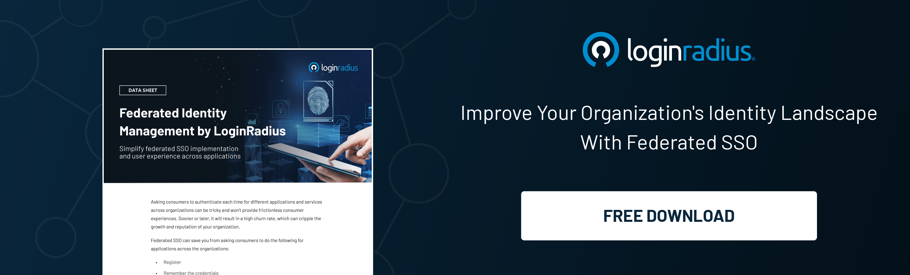

## Introduction

For organizations today, maintaining an array of productive networking tools is all about easy access. Enterprises often introduce new applications that support their production and help them implement their business strategies successfully. However, every time an application or tool gets implemented, the end-users are forced to create new credentials for access.

As a result, employees and customers end up with too many passwords to remember. Unfortunately, remembering all the different credentials is easier said than done. More than [60% of employees](https://www.techrepublic.com/article/25-of-employees-admit-that-they-use-the-same-password-for-everything/) use the same password for their work and personal applications, leading to greater vulnerability to data breaches. And about 13% of users reuse passwords on all their accounts regularly. In fact, compromised passwords are accountable for 81% of hacking-related breaches. 

Enterprises need to use methods to maximize the use of digital identities for multiple users. And tools like [single sign-on (SSO)](https://www.loginradius.com/blog/identity/what-is-single-sign-on/) and federated identity management (FIM) seem to be the go-to methods for most organizations. However, most companies do not understand the differences between these two methods. And the implications they may have on the overall company security.

What is SSO, how is it different from FIM, and what are the benefits of both methods? Let's find out.

## What is Single Sign-On?

Since the early days of the internet, using a single digital identity for multiple logins was considered a risk from cybersecurity's perspective. And it is indeed. However, logging in to different web applications one by one is time-consuming, inconvenient, and disrupts the workflow. The solution to this dilemma lies with SSO. 

A [single sign-on](https://www.loginradius.com/single-sign-on/) or SSO is an authentication scheme that allows users to access multiple web applications securely through a single set of credentials. For example, it's what lets you browse your Gmail account in one tab and use Youtube in another tab on your browser. 

It also allows web services like online banking to grant access to various sections within the same account. Typically, your savings and general account are very distinct and require separate login credentials. However, with SSO, when you click on another section of your account, the site re-authenticates you with the credentials you used during the initial login.

In enterprises, it lets employees access various business applications like HR functions, financial records, and more with only one login credential. 

## How Single Sign-On Works?

SSO is a [token-based system](https://www.loginradius.com/blog/identity/pros-cons-token-authentication/), which means users are assigned a token for identification instead of a password. Let's say you go to an application you want to use; you will receive a security token that contains all your information (like your email address, username, etc.). Then, an Identity Provider compares this token to the credentials you provide during login and grants your authentication.

## Benefits of Single Sign-On

### 1. Reduces costs and password resets

It eliminates the need for frequent password resets and reduces customer care calls, lowering IT costs.

### 2. Streamlines production

It eliminates the need for employees to remember multiple passwords and can cut down the time it takes to access the resources they need to do their jobs securely.

### 3. Enhanced customer experience

It allows customers to access all the services and products an organization offers through a single login, removing the vexation of logging in multiple times.

### 4. Reliable security

Most SSO platforms now have built-in security integrations with thousands of software applications. And, one password can grant you access to all of them.

## Challenges in Single Sign-On (SSO)

### 1. Integration Complexity

Implementing SSO across heterogeneous IT environments with diverse applications and systems can be challenging. Ensuring seamless integration and compatibility with existing infrastructure requires careful planning and coordination.

### 2. User Experience

While SSO aims to enhance user experience by simplifying authentication processes, issues such as session management, logout procedures, and cross-domain authentication can impact usability. Ensuring a seamless and intuitive user experience is crucial to maximize the benefits of SSO.

### 3. Security Concerns

SSO introduces potential security risks, as compromising the user's single sign-on credentials can grant unauthorized access to multiple applications and systems. Implementing robust authentication mechanisms, such as multi-factor authentication (MFA) and encryption, is essential to mitigate security threats.

### 4. Vendor Lock-in

Depending on third-party SSO solutions can lead to vendor lock-in, limiting flexibility and scalability. Organizations must evaluate vendor dependencies and consider interoperability with other identity management solutions to avoid potential vendor lock-in issues.

### 5. Identity Lifecycle Management

Managing the lifecycle of user identities, including provisioning, deprovisioning, and access management, can be complex in SSO environments. Ensuring timely updates and synchronization of user attributes across all connected systems is essential to maintain data accuracy and security.

## What is Federated Identity Management (FIM)?

[Federated Identity Management](https://www.loginradius.com/blog/identity/what-is-federated-identity-management/) (Identity Federation) is a system that allows users from different enterprises (domains) to use the same digital identity to access all their applications and networks. 

Through FIM, an enterprise maintains its unique management system. It is interlinked with other enterprises through a third service (the identity provider) that stores the credentials. The identity provider or identity broker also offers the trust mechanism required for FIM to work. 

## How Does Federated Identity Management Work?

[Federated identity management](https://www.loginradius.com/federated-sso/) (FIM) is a system that enables the use of a single digital identity across multiple domains and organizations. The process begins when a user attempts to access a resource from a service provider. 

The service provider then sends a request to the user's identity provider, which authenticates the user's identity and provides the service provider with the necessary credentials to grant access to the requested resource. 

This process is known as identity federation and allows users to access resources from multiple organizations without the need for separate login credentials for each organization. The FIM system uses industry-standard protocols like [SAML](https://www.loginradius.com/glossary/saml/), OAuth, and OpenID Connect to establish trust and securely exchange identity information between the identity provider and service provider.

## Benefits of Federated Identity Management

Federated identity management (FIM) offers several benefits to both users and organizations. For users, FIM provides a seamless experience across multiple domains and services, eliminating the need to remember and manage multiple usernames and passwords. 

FIM improves security by centralizing identity management and reducing the number of identity stores that need to be maintained. Organizations benefit from FIM by reducing the complexity and cost associated with managing multiple identities and credentials. 

FIM also enhances security by implementing consistent authentication and authorization policies across all domains and services, reducing the risk of unauthorized access and data breaches. 

Furthermore, FIM supports compliance by providing organizations with the ability to enforce regulatory requirements and audit access to sensitive resources.

## Challenges in Federated Identity Management

### 1. Interoperability

Federated Identity Management (FIM) involves establishing trust between multiple identity providers across different organizations. Achieving interoperability between these disparate systems can be challenging, requiring standardized protocols and careful coordination.

### 2. Security Risks

FIM introduces potential security risks, as it involves sharing user identity information across organizational boundaries. Ensuring the secure transmission and storage of sensitive authentication data is crucial to mitigate the risk of data breaches and unauthorized access.

### 3. Trust Establishment

Establishing trust relationships between identity providers (IdPs) and service providers (SPs) requires mutual agreements and verification mechanisms. Building and maintaining trust can be complex, particularly in multi-party federations involving diverse stakeholders.

### 4. Identity Mapping

Mapping user identities across federated domains can be challenging, especially when dealing with different naming conventions, attribute formats, and data schemas. Ensuring accurate identity mapping is essential to maintain seamless user access across federated environments.

### 5. Policy Enforcement

Enforcing access control policies and authorization rules across federated domains can be complex, particularly when dealing with diverse regulatory requirements and organizational policies. Establishing consistent policy enforcement mechanisms is essential to ensure compliance and mitigate security risks.

## Federated Identity Management vs. SSO

Although SSO and FIM are used together, they do not mean the same thing. While single sign-on is an important component of FIM, it is not the same as FIM. The main difference between Identity Federation and SSO lies in the range of access. 

SSO allows users to use a single set of credentials to access multiple systems within a single organization (a single domain). On the other hand, FIM lets users access systems across federated organizations. They can access the applications, programs, and networks of all members within the federated group.

If we follow the above bank example, customers can access various external banking services like loan applications or ordering checks seamlessly through a single login with FIM.
## In Conclusion

Expanding digital identity management can boost an organization's work efficiency by reducing authentication time for all programs and applications. Using SSO or FIM have their benefits, along with the associated security and financial incentives. 

As you advance towards improving customer and employee support, these protocols can help you streamline password creation and [user authentication](https://www.loginradius.com/authentication/).

## Frequently Asked Questions (FAQs)

**1. What is an example of a federated SSO?**

An example is when a user logs into a third-party application (like Google) using their credentials from another identity provider (like Facebook).

**2. What is federated SSO a mechanism?**

Federated SSO is a mechanism allowing users to access multiple applications using a single set of credentials, authenticated across different organizations or domains.

**3. Is identity federation the same as SSO?**

No, identity federation is broader, involving the establishment of trust relationships between different identity providers, while SSO focuses on seamless access to multiple applications with one set of credentials.

**4. What is federation identity management?**

Federation identity management is a system allowing users from different organizations or domains to access shared resources using a single digital identity, managed through mutual trust agreements.

**5. What is identity federation in AWS?**

Identity federation in AWS enables users to access AWS resources securely using their existing identity credentials from external identity providers, such as Active Directory or SAML-based systems.

