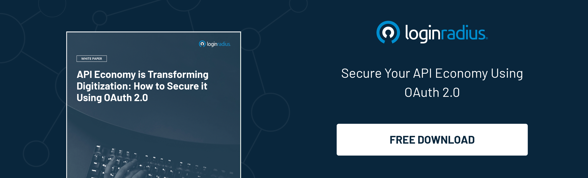

Open banking has revolutionized the way we use conventional banking as it offers endless possibilities for consumers requiring transactions and other financial data from third-party service providers. 

With open banking, consumers can leverage bank accounts information and data networking across diverse institutions through APIs (application programming interfaces), which has reshaped the entire banking industry. 

When it comes to [securing consumer data](https://www.loginradius.com/blog/identity/account-security-consumers/) and critical information regarding banks and other financial institutions, FAPI (financial grade API) becomes the need of the hour. 

In a nutshell, open banking is reinforced and strengthened through FAPI, a security framework offered through OpenID Foundation providing technical guidance and essential requirements for secure use of APIs in financial services. 

Let’s understand the role of FAPI and how it supports open banking for a flawless banking experience on third-party platforms. 

## What is Open Banking? 

Suppose you’re not familiar with the term “open banking”. In that case,- it’s an umbrella term used to describe access and control of consumers’ personal and financial data for third-party service providers to carry out transactions and other related activities based on consumers’ financial information. 

Consumers are required to grant consent to let their bank allow such access by carefully going through the policies describing the use of their banking data in a way that doesn’t exploit their identity, finances, and financial information. 

Third-party vendors can leverage consumer financial information through their banks once the [consumer gives them consent](https://www.loginradius.com/consent-management/). The vendor accesses the information through integrated APIs. 

## What is FAPI? 

Financial grade API can be defined as a security framework powered by OpenID Foundation that ensures safe use of APIs in the financial industry by offering technical guidance and other essential protocols. 

Security becomes a primary concern when it comes to processing consumer banking information for third-party vendors. FAPI offers pioneered industry standards since its the part of OpenID Foundation, which eventually helps organizations securely leverage APIs in the banking sector. 

## What is OpenID Connect (OIDC)? 

It is an OpenID Foundation (OIDF) standard that leverage OAuth 2.0 process flow to add an identity layer to obtain basic profile information about the End-User in an interoperable and REST-like manner or verify the identity of the End-User based on the authentication done by an Authorization Server or Identity Provider (IDP).

[OpenID Connect](https://www.loginradius.com/blog/identity/what-is-openid-connect/) supports clients of all types, including web-based, mobile, and JavaScript clients, to request and receive information about authenticated sessions and end-users. 

By implementing OpenID Connect, leveraging OAuth 2.0 fabricates a unified framework that promises mobile native applications, secure APIs, and browser applications in a single, cohesive architecture.

## Risks Associated with Open Banking

Though open banking offers endless opportunities to different organizations, including financial institutions and non-financial organizations, the risks associated with open banking can’t be overlooked. 

Open banking poses a threat to financial privacy and increases risks associated with consumers’ finances since its APIs aren’t secured without stringent policies and access control. 

Organizations handling heaps of consumers’ banking data are always on the verge of a data breach due to poor security or inside threats that may lead to the exploitation of consumers’ sensitive information. 

## Why FAPI Matters for Open Banking? 

FAPI paves the path for secure handling of consumer banking information required by third-party service providers to deliver consumer-rich experiences while transacting and in other similar activities regarding API security best practices. 

Since FAPI isn't a common security and API-related term, most people confuse it with protocols required to carry out transactions related to consumers’ banking information. However, FAPI eventually closes all the OIDC and OAuth 2.0 loopholes by bridging the gap between the end-user, client, and API endpoint. 

The need for FAPI has recently increased since carrying out banking-related transactions requires stringent security mechanisms to secure consumer information and ensure banks’ sensitive data isn’t compromised. 

## How FAPI Improves OpenID and OAuth 2.0? 

Since FAPI offers technical specifications to scale diverse APIs through improved OpenID Connect and OAuth 2.0 processes, both of them provide enhanced security features uniquely when combined with robust FAPI guidelines. 

Now, as we know, [OAuth 2.0](/blog/identity/oauth2-0-guide/) is an authorization protocol, which offers third-party applications delegated access to an HTTP resource securely; OpenIDto Connect seamlessly builds another stringent security layer. Both of them work harmoniously to authenticate through the OAuth authorization server. 

As we know, online banking services require stringent security; FAPI helps secure financial APIs by flawlessly binding the end-user, client, and endpoint. 

## Final Thoughts 

Open banking is paving the way for the next generation of digital experiences, especially when managing transactions and expenses. 

However, the risks associated with open banking require organizations to put their best foot forward in adopting FAPI through a reliable service provider that helps enhance API integration security.  

