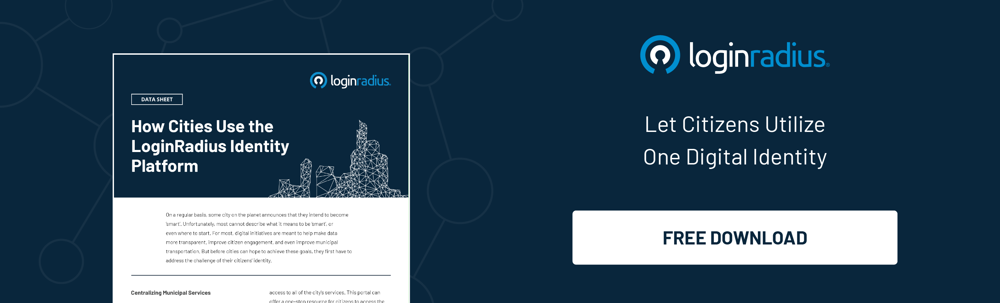

## Introduction

We’re in an era where rich customer experiences backed with robust identity security is all that user need from businesses. And the same is expected from private sector organizations. 

However, when we talk about citizens’ experience and security, most government and public sector organizations seem impotent to match the level of security and usability. 

Hence, issues about identity management in the government sector linger on that can severely impact citizens’ privacy and information security. 

So, what can be the ideal solution to ensure robust identity security without hampering [user experience in the public sector](https://www.loginradius.com/blog/identity/improving-customer-experience-public-sector/)? 

Here’s where the crucial role of identity management comes into play! 

Identity management has been a game-changer for enterprises for decades as it helps businesses succeed by ensuring the highest level of security and great user experience. 

Let’s understand the aspects of leveraging identity management through a reliable customer identity and access management (CIAM) platform for fixing security and usability issues in the public sector. 

## The Power of Digital Identity for Smart Cities

With population growth and expanding public services, cities must be innovative about providing services to all people without compromising service quality. There is a need for a single platform where all facilities are centralized and customer experience is considered.

[Identity management](https://www.loginradius.com/blog/identity/digital-identity-management/) in the government sector is a great way to get started as it can prove a citizen’s identity through diverse government channels without compromising user experience. 

As the government invokes the potential of secure digital identities, citizens would access core services and resources without hassle.

Moreover, every citizen requires some kind of public service, so securely handling a unique number of identities becomes a tough nut to crack for the government. Here’s where the need for digital identity management comes into play.

A smart CIAM (consumer identity and access management) solution like LoginRadius helps public sector organizations manage multiple identities efficiently without hampering user experience.

Let’s learn how a CIAM solution like LoginRadius can deliver a flawless digital experience to civilians that pushes overall development reinforced by adequate security.

## How Identity Management Reinforces Security for Citizens?

Invoking the true potential of [identity management in the government sector](https://www.loginradius.com/industry-government/) can improve citizens’ experience and eventually play a significant role in reinforcing security. 

Let’s understand how an identity management system like LoginRadius CIAM helps improve the overall security and privacy of citizens: 

### #1. MFA (multi-factor authentication) and RBA (risk-based authentication)

[Authentication](https://www.loginradius.com/authentication/) in the public sector is crucial, which eventually requires a robust mechanism to ensure user identities remain secured.

LoginRadius offers multi-factor authentication through SMS, automated phone calls, email, security questions, and authenticator apps, allowing you to customize the user experience. 

Depending on the diverse public sector needs, you can also opt to turn on multi-factor authentication across all customer accounts.

On the other hand, LoginRadius’ [risk-based authentication](https://www.loginradius.com/blog/identity/risk-based-authentication/) is a non-static authentication system that considers the profile (IP address, browser, physical location, and so on) of a consumer requesting access to the system to determine the risk profile associated with that action.

The risk-based implementation allows diverse web applications to challenge users for additional credentials only when the risk level is appropriate.

### #2. Passwordless Login

Passwords can easily be guessed or compromised, especially in the case of elderly individuals who aren’t habitual of maintaining different passwords for different accounts. 

Hence, the chances of account takeovers and compromised identities increase exponentially for elderly individuals. 

With [passwordless login](https://www.loginradius.com/passwordless-login/), you can create a completely frictionless registration and authentication process for citizens, freeing them from the hassle of remembering yet another password.

User-controlled passwords are vulnerable to phishing, credential stuffing, brute force attacks, corporate account takeover (CATO), and more. 

So, when there is no password to hack in the first place, those vulnerabilities will automatically decrease.

Passwordless Login uses the same global security standards as password-based logins, plus advanced features for added security.

## In Conclusion 

When it comes to customer identity security and user experience, global brands are already leveraging CIAM solutions to thrive in business success. 

And the public sector and government organizations shouldn’t delay a bit in adopting a reliable identity management system that can ensure robust security for citizens’ crucial information. 

Identity management in the government sector can also help resolve issues related to bad user experience. 

