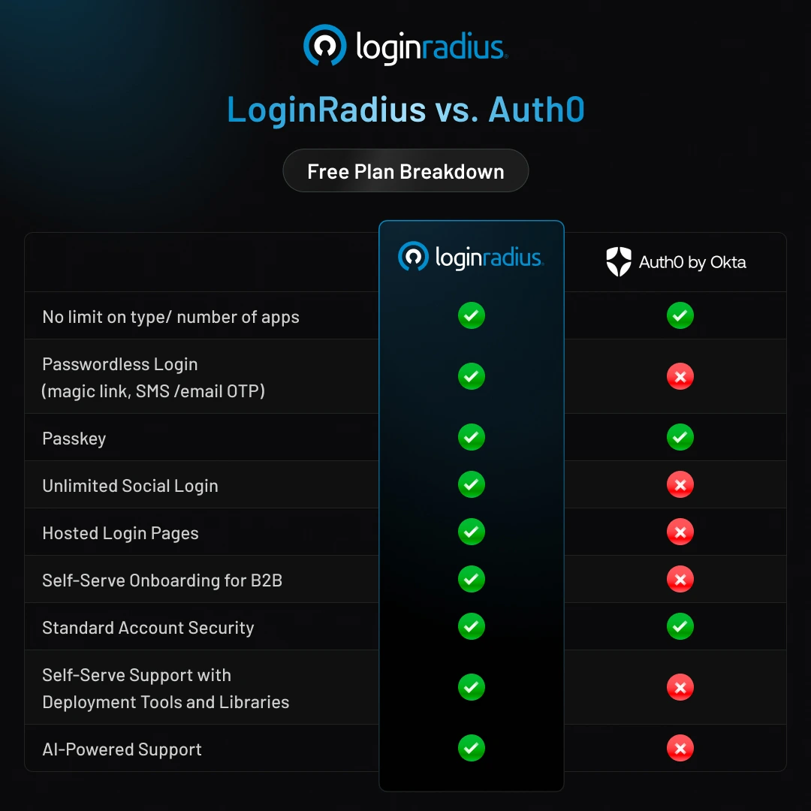

## Empowering the entire developer community with Enterprise-grade CIAM platform

We built the authentication solution we always wanted as developers: powerful enough for enterprise needs, but accessible to everyone. LoginRadius' Free Forever Developer Plan puts professional CIAM capabilities in your hands with zero financial barriers.

Most "free" authentication plans trap you with limited features—just enough to get you started, but forcing you to upgrade when you need anything substantial, then charge you a fortune. We took a different approach. Our Free Forever plan gives you complete authentication capabilities, including passwordless, passkey, unlimited social login, and B2B multi-tenancy—all with no hidden costs or artificial limitations.

You can check out our free forever plan [here](https://www.loginradius.com/pricing). 

In this blog, we will walk you through what’s included in our Free Forever plan, how it benefits your business, and why LoginRadius is the go-to choice for developers.

## Breaking the Authentication Barrier

We believe that authentication should be accessible from day one—whether you're launching a passion project or a startup to serve multiple businesses. That's why we've designed a truly Free Forever plan. No hidden fees. No expiring trials. Just powerful, developer-friendly authentication without the usual roadblocks.

"Security shouldn't be a luxury that only enterprise companies can afford," says Rakesh Soni, Founder & CEO of LoginRadius. "With our Free Forever Developer Plan, we're putting professional-grade authentication tools in the hands of every developer, because we believe that protecting user identities should be the foundation of any digital product, not an afterthought."

## Free Forever: Because Authentication Shouldn't Be a Bottleneck for Innovation

We’ve always believed that developers should be able to integrate authentication without unnecessary friction—without sales calls, complex onboarding, or paywalls.

That’s why our Free Forever plan isn’t just a feature-focused free tier. We have designed it as a fully functional authentication solution that grows with your application. Developers get to build, test, and take their apps to production without speaking to anyone at LoginRadius (unless they want to 😉).

<table>
  <tr>
   <td><strong>Free Forever</strong>
   </td>
   <td><strong>B2C </strong>
   </td>
   <td><strong>B2B </strong>
   </td>
  </tr>
  <tr>
   <td>Monthly Active Users (MAUs)
   </td>
   <td>25,000 MAU included
   </td>
   <td>10,000 MAU included
   </td>
  </tr>
  <tr>
   <td>Monthly Active Organizations  (MAOs)
   </td>
   <td>N/A
   </td>
   <td>10 MAOs & ≃ 10 members per organization
   </td>
  </tr>
  <tr>
   <td>Type/ Number of Apps
   </td>
   <td>No limit 
   </td>
   <td>No limit 
   </td>
  </tr>
  <tr>
   <td>Standard Login (password and username)
   </td>
   <td>Yes
   </td>
   <td>Yes
   </td>
  </tr>
  <tr>
   <td>Passwordless Login (magic link, SMS /Email OTP)
   </td>
   <td>Yes
   </td>
   <td>Yes
   </td>
  </tr>
  <tr>
   <td>Passkey
   </td>
   <td>Yes
   </td>
   <td>Yes
   </td>
  </tr>
  <tr>
   <td>Social Login
   </td>
   <td>Unlimited 
   </td>
   <td>18+ Options
   </td>
  </tr>
  <tr>
   <td>Hosted Login Pages
   </td>
   <td>Yes
   </td>
   <td>Yes
   </td>
  </tr>
  <tr>
   <td>Account Security
   </td>
   <td>Standard 
   </td>
   <td>Standard 
   </td>
  </tr>
  <tr>
   <td>Self-Serve Deployment Tools and Libraries
   </td>
   <td>Yes
   </td>
   <td>Yes
   </td>
  </tr>
  <tr>
   <td>AI-Powered Docs & Support
   </td>
   <td>Yes
   </td>
   <td>Yes
   </td>
  </tr>
</table>

### What’s Included: For B2C Use Cases

* **Zero-Cost Login Magic**: A complete authentication solution without paywalls guarding the key features that your business needs.

* **25,000 Monthly Active Users (MAUs)**: Start-up and then scale-up. Our free plan includes 25,000 MAU, so you can grow at your own pace and worry about billing later.

* **Unlimited Applications**: Build as many apps as you need. There are no restrictions on the number or type of applications you can secure with LoginRadius.

* **Flexible Authentication Methods**: We give you the freedom to choose how your users log in, whether it’s with passwords, passwordless authentication (Magic Link, SMS/Email OTP), or passkeys for a frictionless experience.

* **Unlimited Social Login**: Let your users sign in however they prefer. With support from a wide range of social providers, you get a smoother and faster onboarding experience.

* **Hosted Login Pages**: No need to build authentication from scratch. Our hosted login pages let you quickly deploy secure, brand-aligned login experiences without managing the infrastructure.

* **Standard Account Security: **We take security seriously. Your users’ data stays protected with built-in security measures, including encryption, secure session handling, and compliance-ready controls.

* **Self-Serve Deployment Tools and Libraries**: You can integrate LoginRadius into your app effortlessly with our developer-friendly SDKs, APIs, and pre-built integrations. No extra setup is required.

* **AI-Powered Docs and Support**: Get answers instantly with our AI-powered documentation and support so you can troubleshoot issues and integrate faster without waiting for a response.

### What’s Included: For B2B Use Cases 

We’ve made sure our Free Forever plan isn’t just for B2C. You get everything you need for B2B applications, too. It includes all the capabilities of our B2C platform, plus additional features designed for managing multiple organizations.

* **10,000 Monthly Active Users (MAU)**: You can scale your SaaS platform without upfront costs.

* **10 Monthly Active Organizations (MAO)**: We give you the flexibility to manage multiple business accounts seamlessly.

* **Up to 10 members per organization**: Your teams can collaborate securely with built-in access controls.

If you're ready to get started, [sign up for the free plan](https://accounts.loginradius.com/auth.aspx?return_url=https://console.loginradius.com/login&action=register) now!

## How Do We Compare to Other Platforms?

Not all free plans are built the same. While many CIAM providers offer free tiers, they often come with missing features. For instance, Auth0 provides authentication services too, but when you look closer, LoginRadius Free Forever offers more flexibility, better multi-tenancy support, and key authentication methods that their platform lacks.

Here’s how we compare:

### What Sets LoginRadius Apart from Auth0 by Okta?

* **Dedicated solution for B2C use cases**: Our platform is purpose-built for consumer apps. You get an authentication solution that’s built to scale with you. 

* **Stronger B2B Multi-Tenancy Support**: We provide 10 Monthly Active Organizations (MAOs), while Auth0 only includes 5, giving you more flexibility when building SaaS applications.

* **True Passwordless Experience**: LoginRadius supports Magic Links, SMS, and Email OTPs, while Auth0’s free plan lacks passwordless authentication options.

* **Unlimited Social Logins**: We don’t limit the number of social providers you can integrate.

* **AI-Powered Support**: Our documentation and support tools are enhanced with AI-driven assistance, so you can get answers instantly.

With the [LoginRadius Free Forever](https://www.loginradius.com/pricing) tier, you get all of these features at no cost and no forced upgrades.

## Ready to Build Without Limits 

Start building with LoginRadius Free Forever—no hidden fees, no forced upgrades.

## Empowering the Developer Community 

LoginRadius is a developer-first CIAM platform built for any app. With our Free Forever Plan, you can find the right authentication tools to enhance user experience, strengthen security, and scale without restrictions. Whether you're launching a new project or growing your business, we’re here to support you with flexible, no-cost authentication.

We’d love to hear your feedback and answer any questions.

Have an active CIAM project? Sign up for a free plan or talk to our experts and see how LoginRadius can help. 

