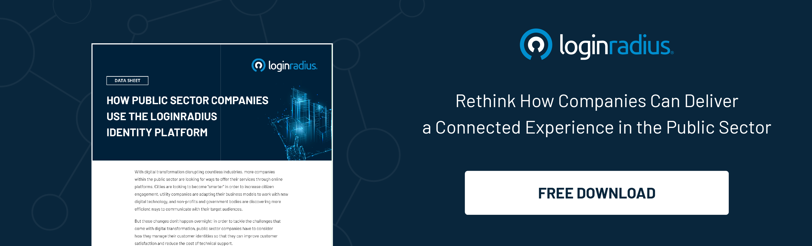

## Introduction

The modern digital landscape has offered plenty of opportunities to both government and the public sector to jump on the [digital transformation](https://www.loginradius.com/blog/identity/what-is-digital-transformation/) bandwagon.

Whether we talk about municipalities or government banking institutions, every organization can leverage the true potential of technology, data, and centralized identity to deliver unified and seamless digital experiences. 

Various technology organizations and government bodies work together as a part of GovTech to ensure the citizens can reap the maximum benefit through an interconnected network. 

GovTech refers to the efforts to digitally transform public administrations and various government and public sector organizations through innovative technological solutions. 

Let’s understand the aspects of GovTech and how it’s offering endless opportunities for the sake of citizens’ benefits. 

## What is GovTech? 

Every enterprise is putting every effort into getting maximum user engagement, and users already have up to snuff digital experiences from these enterprises; the public sector still lags. 

The private sector has taken a giant leap in digital transformation and user experience. However, the same is missing in the case of public sector and government organizations. 

To overcome the issues about standards that most leading organizations in the private sector have already set, GovTech was introduced to respond to the evident gap between the citizens and the public sector. 

GovTech, the word itself is made from two individual terms-Government and Technology. Considering all the private sector's transformations, GovTech emphasizes incorporating technological innovations to digitize the relationship between various administrations and citizens smartly. 

GovTech, in a nutshell, refers to the technological infrastructure that a government uses to modernize its public sector for better citizen engagement. 

Since we’ve gained enough knowledge about GovTech and its role, let’s understand its advantages for the public sector. 

## What are its Advantages?

### 1. Centralizing online services.

Cities need one unified self-service portal so that their constituents have a seamless, efficient experience as they access the services they need. The GovTech infrastructure lets cities centralize their customer-facing digital applications into one portal.

 \
This single locus of access delivers a connected experience across multiple touchpoints and channels. This infrastructure supports account summary, customer profiles, permit applications, bill payments, etc. 

### 2. Helping maintain one digital identity across all customer service.

What good is a centralized portal if citizens have to create multiple identities for individual web and mobile applications? Operating in this way creates identity silos that prevent a complete view of the customer’s journey and preferences, which means the customer experience can’t be optimized for each individual.

 \
Without a seamless user experience, engagement rates drop. But with GovTech incorporating [Single Sign-On](https://www.loginradius.com/single-sign-on/) (SSO),  cities and companies can allow customers to access all applications within their platform with a single set of unified credentials rather than register and log in to each service separately. 

### 3. Integrating with third-party applications.

Many public sector organizations have difficulty using customer data to improve the digital experience.  With GovTech offering third-party applications such as CRM, email marketing tools, online communities, payment systems and more, citizens can leverage the interconnected experience. They can quickly utilize any such integration for convenience in a single platform.  

 \
Moreover, third-party integrations enable organizations to use that customer data to understand their customers better, offer more helpful information and deliver that information more directly.

### 4. Risk-based authentication and MFA for another stringent layer of security.

Authentication in the public sector is crucial, which eventually requires a robust mechanism to ensure that user identities remain secured.

GovTech can leverage multi-factor authentication through SMS, automated phone calls, email, security questions, and authenticator apps, allowing them to customize the citizen experience. Depending on the diverse public sector needs, they can also opt to turn on Multi-Factor Authentication across all customer accounts.

On the other hand, GovTech can leverage Risk-based authentication as a non-static authentication system that considers the profile (IP address, Browser, physical Location, and so on) of a citizen requesting access to the system to determine the risk profile associated with that action.

The risk-based implementation allows diverse web applications to challenge the user for additional credentials only when the risk level is appropriate, [improving customer experience](https://www.loginradius.com/blog/identity/improving-customer-experience-public-sector/). 

## The Bottom Line 

The public sector is an integral part of any state’s overall development since much good work depends on these public sector organizations. 

Until now, most government bodies aren’t utilizing GovTech, but the trend is soon changing. Many public sector organizations and government bodies are already putting their best foot forward in adopting GovTech for digital transformation. 

Whether it’s authentication or delivering a consistent omnichannel experience, GovTech can help the public sector build a flawless citizen experience coupled with enhanced security that ensures the overall digital transformation of the public sector.

