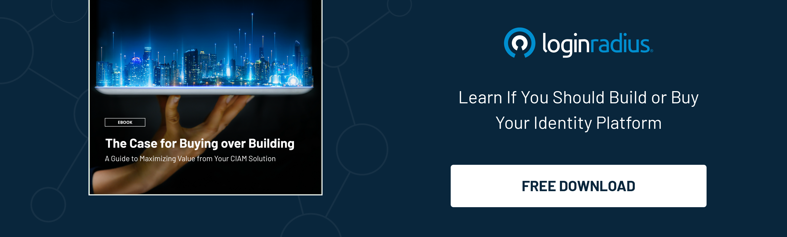

## Introduction

As businesses expand their digital presence and offer customers more personalized and delightful services, [managing customer identities](https://www.loginradius.com/user-management/) and ensuring secure access to services has become a critical issue. 

Additionally, adhering to the latest data privacy and security compliances is a big challenge since failing to do this could lead to severe consequences. 

Hence, many organizations are adopting customer identity and access management (CIAM) solutions to address these challenges. 

However, with the market for CIAM solutions rapidly evolving, choosing the right one for your organization's unique needs can take time.

## What is Customer Identity and Access Management (CIAM)?

Customer Identity and Access Management (CIAM) manages customers' digital identities and provides secure access to digital services. Let’s uncover some aspects of CIAM and how to choose the right CIAM provider per their organization’s needs. 

[CIAM solutions](https://www.loginradius.com/blog/identity/customer-identity-and-access-management/) provide a range of features, such as registration, authentication, authorization, single sign-on, and consent management, to help businesses create a seamless and secure customer experience across all digital touchpoints.

Moreover, a CIAM solution offers several benefits to organizations, such as improved security, reduced friction in the customer journey, increased engagement, and better insights into customer behavior. And they also help organizations comply with data protection regulations such as GDPR, CCPA, and HIPAA, which require businesses to protect customer data and privacy.

## Importance of Choosing the Right CIAM Solution

Choosing the right Customer Identity and Access Management (CIAM) solution is crucial for organizations aiming to provide a seamless and secure user experience. 

In today's digital landscape, where privacy concerns are paramount, a robust CIAM solution plays a vital role in safeguarding customer data and maintaining [regulatory compliance](https://www.loginradius.com/compliances/).

According to industry experts, the right CIAM solution ensures not only secure authentication and authorization processes but also offers valuable features like consent management, single sign-on (SSO), and [social login integrations](https://www.loginradius.com/social-login/). 

By implementing a comprehensive CIAM solution, businesses can not only protect customer data from unauthorized access but also streamline user registration and login experiences, thereby improving customer satisfaction and loyalty.

Furthermore, the right CIAM solution provides organizations with granular control over user access, enabling them to implement personalized user experiences, targeted marketing campaigns, and efficient customer support. 

This not only enhances customer engagement but also helps businesses gain valuable insights into user behavior and preferences, enabling them to deliver tailored experiences and drive business growth.

## Key Factors to Consider while Choosing a CIAM Solution

### 1. Security

Security is the most critical factor when choosing a CIAM solution. The solution should provide robust authentication and authorization mechanisms, sensitive data encryption, and user behavior monitoring and analysis to detect suspicious activities.

### 2. Scalability

The CIAM solution should be able to handle large volumes of user data and traffic and should be able to scale up or down based on demand. It would be best if you choose a CIAM provider offering auto-scalable infrastructure.

### 3. Flexibility

The solution should offer various customization options to meet your specific business needs. It should also integrate seamlessly with your existing technology stack and third-party applications.

### 4. Ease of Use

The solution should be easy for customers and administrators, with a simple and intuitive user interface.

### 5. Compliance

The solution should comply with [data protection regulations](https://www.loginradius.com/compliances/) such as GDPR, CCPA, and HIPAA and provide the necessary consent management and data privacy features.

### 6. Support

The customer identity solution should offer excellent customer support, with responsive and knowledgeable support teams and a range of support options such as phone, email, and chat.

## Features and Capabilities of CIAM Solutions

CIAM solutions offer a range of features and capabilities that enhance user experiences and strengthen security measures. When evaluating CIAM solutions, it is essential to consider key features such as:

### 1. Secure authentication and authorization mechanisms

Robust CIAM solutions employ industry-standard authentication protocols, like OAuth or SAML, to ensure secure access to digital assets while protecting against unauthorized access.

### 2. Consent management

With evolving data privacy regulations, CIAM solutions provide [consent management](https://www.loginradius.com/consent-management/) features that allow users to control how their data is collected, processed, and shared, ensuring transparency and compliance.

### 3. Single sign-on (SSO)

CIAM solutions with SSO capabilities enable users to access multiple applications and services using a single set of login credentials, simplifying the user experience and reducing password fatigue.

### 4. Social login integrations

CIAM solutions often include integrations with popular social media platforms, enabling users to register and log in using their existing social media accounts, improving convenience and eliminating the need for lengthy registration processes.

### 5. User self-service portals

CIAM solutions empower users to manage their profile information, preferences, and privacy settings through self-service portals, reducing the burden on customer support teams and enhancing user satisfaction.

### 6. Adaptive authentication

Advanced CIAM solutions incorporate [adaptive authentication](https://www.loginradius.com/blog/identity/adaptive-authentication/), which assesses risk factors such as device information, user behavior, and contextual data to apply appropriate security measures, offering a balance between security and user experience.

### 7. Advanced reporting and analytics

CIAM solutions equipped with robust reporting and analytics capabilities provide insights into user behavior, engagement patterns, and authentication trends, helping organizations make data-driven decisions to improve user experiences and identify potential security threats.

Choosing a CIAM solution with these features can significantly improve user satisfaction, enhance security, and enable businesses to effectively manage customer identities and access.

## CIAM Implementation Best Practices

Implementing a Customer Identity and Access Management (CIAM) solution requires careful planning and execution to ensure its effectiveness. Here are some best practices for a successful CIAM implementation:

### Define Clear Objectives

Before implementing a CIAM solution, define clear objectives and goals. Understand what problems you are trying to solve and how CIAM will benefit your organization.

### Assess Business Needs

Conduct a thorough assessment of your organization's current and future business needs. Consider factors such as user volumes, types of services offered, and desired customer experiences.

### Select the Right CIAM Solution

Choose a CIAM solution that aligns with your business requirements and objectives. Evaluate different ciam solutions and platforms to find one that offers the features and scalability your organization needs.

### Ensure Compliance

Compliance with data protection regulations such as GDPR, CCPA, and HIPAA is crucial. Ensure the CIAM platform provides robust consent management and data privacy features to meet these requirements.

### User Experience (UX) Design

Focus on providing a seamless and intuitive user experience. A well-designed CIAM platform should make registration, login, and account management easy and convenient for users.

### Integration with Existing Systems

Ensure smooth integration of the CIAM platform with your existing systems and applications. This includes CRM systems, marketing platforms, and other customer-facing tools.

### Training and Education

Provide training to employees who will be using the CIAM platform. Educate them on its features, best practices, and how to handle customer inquiries related to identity management.

### Monitor and Update

Continuous monitoring of the CIAM platform is essential for detecting and addressing any security threats or performance issues. Regularly update the platform to ensure it remains secure and up-to-date with the latest features.

## Security Challenges and Solutions in CIAM

Implementing a robust Customer Identity and Access Management (CIAM) platform comes with its set of security challenges. Here are some common challenges and solutions:

### Data Breaches

* **Challenge**: Data breaches can lead to unauthorized access to customer data, resulting in financial loss and damage to reputation.

* **Solution**: CIAM platforms should employ advanced encryption techniques to protect sensitive customer data. Implementing multi-factor authentication (MFA) adds an extra layer of security.

### Credential Stuffing

* **Challenge**: Attackers use stolen credentials to gain unauthorized access to user accounts.

* **Solution**: CIAM platforms should have mechanisms to detect and [prevent credential stuffing attacks](https://www.loginradius.com/blog/identity/prevent-credential-stuffing-attacks/), such as rate limiting, CAPTCHA, and monitoring for unusual login patterns.

### Identity Theft

* **Challenge**: Identity theft occurs when attackers steal personal information to impersonate customers.
* **Solution**: CIAM solutions can mitigate identity theft by verifying user identities through biometric authentication, email verification, and identity proofing processes.

### Insider Threats

* **Challenge**: Internal employees or contractors with access to the CIAM platform may misuse their privileges.

* **Solution**: Role-based access control (RBAC) ensures that employees only have access to the information and functionalities necessary for their roles. Regular audits and monitoring can detect any suspicious activities.

### API Security

* **Challenge**: CIAM platforms often integrate with various applications and services through APIs, which can be vulnerable to attacks.

* **Solution**: Implementing robust API security measures such as authentication tokens, encryption, and rate limiting can prevent API abuse and unauthorized access.

### Regulatory Compliance

* **Challenge**: Non-compliance with data protection regulations can result in hefty fines and legal consequences.

* **Solution**: CIAM platforms should have built-in features for consent management, data anonymization, and audit trails to ensure compliance with regulations like GDPR, CCPA, and HIPAA.

By addressing these security challenges and implementing best practices, organizations can ensure a secure and effective Customer Identity and Access Management (CIAM) implementation. Choosing the right CIAM platform that offers advanced security features and aligns with business objectives is key to successful CIAM deployment.

## How are the Requirements for CIAM Solutions Changing?

The requirements for CIAM solutions are evolving rapidly, driven by changes in customer behavior, regulatory requirements, and technological advancements. 

Hence, businesses must understand all the aspects of the CIAM landscape before putting their best foot forward in adopting a robust solution. 

Some of the key trends shaping the CIAM landscape include the following:

### 1. Increased focus on data privacy 

With data privacy regulations such as GDPR and CCPA in force, CIAM solutions must offer robust consent management and data privacy features.

### 2. Emphasis on customer experience

CIAM solutions must provide a seamless and frictionless customer experience across all digital touchpoints, with features like social login and [passwordless authentication](https://www.loginradius.com/passwordless-login/).

### 3. Adoption of AI and machine learning

CIAM solutions leverage AI and machine learning to improve security, detect fraud, and personalize customer experiences.

### 4. Integration with emerging technologies

CIAM solutions must integrate with emerging technologies such as blockchain and IoT to provide a secure and seamless customer experience.

## Questions you should ask potential CIAM providers

1. How does your solution ensure security and protect customer data?

2. Can your solution handle your specific scalability and customization requirements?

3. What compliance standards does your solution comply with, and what features does it provide for consent management and data privacy?

4. How does your solution provide a seamless and frictionless customer experience, with features like social login and passwordless authentication?

## Understanding Why Should You Buy Rather Than Build a CIAM Solution For Your Business

CIAM solutions enable businesses to manage customer data, streamline login processes, and provide personalized customer experiences. But the question is, should a company build or buy a CIAM solution? 

Here’s the list of benefits of buying a CIAM solution rather than building one from scratch:

### 1. Time and Cost Savings

Building a CIAM solution from scratch can be a lengthy and expensive process. Developing software requires significant investments of time and money, which can divert resources away from core business operations.

Buying a pre-built CIAM solution can save significant time and resources, allowing businesses to focus on their core competencies. This approach is typically more cost-effective, as the solution has already been developed and tested, so there is no need to invest in building and trying a solution from scratch.

You can use this [CIAM Build vs. Buy Calculator](https://www.loginradius.com/resource/ciam-build-vs-buy/) to see which option delivers the most value for your company.

### 2. Security and Compliance

CIAM solutions must be highly secure to protect sensitive customer data. A reputable CIAM solution vendor will have a team of experts dedicated to ensuring the solution meets the latest security standards and is compliant with relevant regulations such as GDPR and CCPA.

Building a secure CIAM solution from scratch can be daunting, and the risks of getting it wrong can be significant. In contrast, a pre-built CIAM solution from a reputable vendor will come with security and compliance certifications, ensuring the solution is secure and compliant.

### 3. Scalability and Flexibility

As businesses grow, their CIAM needs may change. A pre-built CIAM solution can be highly scalable and flexible, allowing companies to add or remove features as needed.

Building a CIAM solution from scratch may provide a different level of scalability and flexibility. Businesses may need to develop and test new features, which can be time-consuming and expensive.

## Conclusion

While businesses strive to deliver a great user experience backed with robust security, a CIAM solution is undoubtedly becoming the need of the hour. 

Whether we talk about delivering seamless experiences throughout the customer journey or ensuring robust security while authenticating users, a CIAM solution works like a breeze. 

However, choosing the right CIAM solution could be challenging if you’ve just jumped the digital transformation bandwagon. 

The aspects mentioned above could help you simplify things, so you make the right decision for your overall business growth.  

## Frequently Asked Questions (FAQs)

**1. What is CIAM used for?**

CIAM is used to manage customers' digital identities and provide secure access to digital services, enhancing security and improving customer experiences.

**2. What is the difference between IAM and CIAM?**

IAM (Identity and Access Management) focuses on internal users like employees, while CIAM is tailored for external customers, providing features like social login and customer consent management.

**3. What is identity and access management?**

A: Identity and Access Management (IAM) is a framework of policies and technologies that ensure the right individuals have appropriate access to resources in an organization.

**4. What is IAM's role in identity and access management?**

IAM plays a crucial role in managing internal users' access to systems and applications, enforcing security policies, and maintaining compliance within an organization's network.

