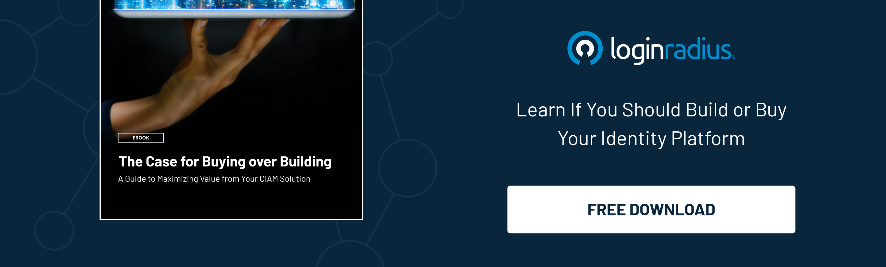

## Introduction

As businesses expand their digital presence and offer customers more personalized and delightful services, [managing customer identities](https://www.loginradius.com/user-management/) and ensuring secure access to services has become a critical issue. 

Additionally, adhering to the latest data privacy and security compliances is a big challenge since failing to do this could lead to severe consequences. 

Hence, many organizations are adopting customer identity and access management (CIAM) solutions to address these challenges. 

However, with the market for CIAM solutions rapidly evolving, choosing the right one for your organization's unique needs can take time.

## What is Customer Identity and Access Management (CIAM)?

Customer Identity and Access Management (CIAM) manages customers' digital identities and provides secure access to digital services. Let’s uncover some aspects of CIAM and how to choose the right CIAM provider per their organization’s needs. 

[CIAM solutions](https://www.loginradius.com/blog/identity/customer-identity-and-access-management/) provide a range of features, such as registration, authentication, authorization, single sign-on, and consent management, to help businesses create a seamless and secure customer experience across all digital touchpoints.

Moreover, a CIAM solution offers several benefits to organizations, such as improved security, reduced friction in the customer journey, increased engagement, and better insights into customer behavior. And they also help organizations comply with data protection regulations such as GDPR, CCPA, and HIPAA, which require businesses to protect customer data and privacy.

## Key Factors to Consider while Choosing a CIAM Solution

### 1. Security

Security is the most critical factor when choosing a CIAM solution. The solution should provide robust authentication and authorization mechanisms, sensitive data encryption, and user behavior monitoring and analysis to detect suspicious activities.

### 2. Scalability

The CIAM solution should be able to handle large volumes of user data and traffic and should be able to scale up or down based on demand. It would be best if you choose a CIAM provider offering auto-scalable infrastructure. 

### 3. Flexibility

The solution should offer various customization options to meet your specific business needs. It should also integrate seamlessly with your existing technology stack and third-party applications.

### 4. Ease of Use

The solution should be easy for customers and administrators, with a simple and intuitive user interface.

### 5. Compliance

The solution should comply with [data protection regulations](https://www.loginradius.com/compliances/) such as GDPR, CCPA, and HIPAA and provide the necessary consent management and data privacy features.

### 6. Support

The customer identity solution should offer excellent customer support, with responsive and knowledgeable support teams and a range of support options such as phone, email, and chat.

## How are the Requirements for CIAM Solutions Changing?

The requirements for CIAM solutions are evolving rapidly, driven by changes in customer behavior, regulatory requirements, and technological advancements. 

Hence, businesses must understand all the aspects of the CIAM landscape before putting their best foot forward in adopting a robust solution. 

Some of the key trends shaping the CIAM landscape include the following:

### 1. Increased focus on data privacy 

With data privacy regulations such as GDPR and CCPA in force, CIAM solutions must offer robust consent management and data privacy features.

### 2. Emphasis on customer experience

CIAM solutions must provide a seamless and frictionless customer experience across all digital touchpoints, with features like social login and [passwordless authentication](https://www.loginradius.com/passwordless-login/).

### 3. Adoption of AI and machine learning

CIAM solutions leverage AI and machine learning to improve security, detect fraud, and personalize customer experiences.

### 4. Integration with emerging technologies

CIAM solutions must integrate with emerging technologies such as blockchain and IoT to provide a secure and seamless customer experience.

## Questions you should ask potential CIAM providers

1. How does your solution ensure security and protect customer data?

2. Can your solution handle your specific scalability and customization requirements?

3. What compliance standards does your solution comply with, and what features does it provide for consent management and data privacy?

4. How does your solution provide a seamless and frictionless customer experience, with features like social login and passwordless authentication?

## Understanding Why to Buy Rather than Build a CIAM Solution for Your Business

CIAM solutions enable businesses to manage customer data, streamline login processes, and provide personalized customer experiences. But the question is, should a company build or buy a CIAM solution? 

Here’s the list of benefits of buying a CIAM solution rather than building one from scratch:

### 1. Time and Cost Savings

Building a CIAM solution from scratch can be a lengthy and expensive process. Developing software requires significant investments of time and money, which can divert resources away from core business operations.

Buying a pre-built CIAM solution can save significant time and resources, allowing businesses to focus on their core competencies. This approach is typically more cost-effective, as the solution has already been developed and tested, so there is no need to invest in building and trying a solution from scratch.

You can use this [CIAM Build vs. Buy Calculator](https://www.loginradius.com/resource/ciam-build-vs-buy/) to see which option delivers the most value for your company.

### 2. Security and Compliance

CIAM solutions must be highly secure to protect sensitive customer data. A reputable CIAM solution vendor will have a team of experts dedicated to ensuring the solution meets the latest security standards and is compliant with relevant regulations such as GDPR and CCPA.

Building a secure CIAM solution from scratch can be daunting, and the risks of getting it wrong can be significant. In contrast, a pre-built CIAM solution from a reputable vendor will come with security and compliance certifications, ensuring the solution is secure and compliant.

### 3. Scalability and Flexibility

As businesses grow, their CIAM needs may change. A pre-built CIAM solution can be highly scalable and flexible, allowing companies to add or remove features as needed.

Building a CIAM solution from scratch may provide a different level of scalability and flexibility. Businesses may need to develop and test new features, which can be time-consuming and expensive.

## Conclusion

While businesses strive to deliver a great user experience backed with robust security, a CIAM solution is undoubtedly becoming the need of the hour. 

Whether we talk about delivering seamless experiences throughout the customer journey or ensuring robust security while authenticating users, a CIAM solution works like a breeze. 

However, choosing the right CIAM solution could be challenging if you’ve just jumped the digital transformation bandwagon. 

The aspects mentioned above could help you simplify things, so you make the right decision for your overall business growth.  

