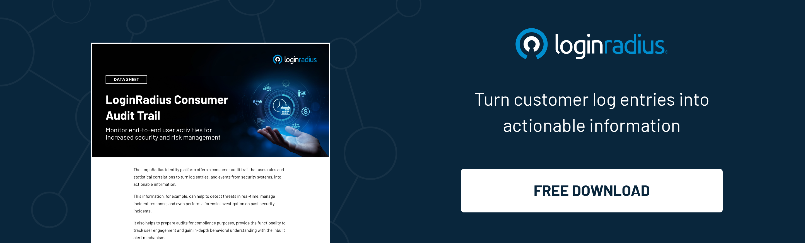

## Introduction

In today's cloud-driven world, cloud identity management has become critical in ensuring secure access to cloud-based resources and maintaining proper governance and control over user identities. 

As organizations increasingly [adopt cloud technologies](https://www.loginradius.com/blog/growth/business-advantages-cloud-computing/), it is essential to understand the key aspects of Cloud Identity Management.  

This blog explains the five A's that form the foundation of Cloud Identity Management: authentication, authorization, account management, audit logging, and accountability. Let’s explore. 

## The Five A's of Cloud Identity Management

### 1. Authentication: The First Line of Defense

Authentication serves as the initial gatekeeper, verifying the identity of a user or entity attempting to access cloud resources. It acts as the first line of defense against unauthorized access. 

Traditional password-based authentication has limitations, making it crucial for organizations to adopt stronger authentication methods such as multi-factor authentication (MFA) and [biometric authentication](https://www.loginradius.com/blog/identity/what-is-mob-biometric-authentication/). These mechanisms significantly reduce the risk of unauthorized access, bolstering cloud security.

### 2. Authorization: Granting the Right Permissions 

Once a user's identity is verified, the next step is determining the access level they should have within the cloud environment. 

The authorization ensures that users are granted appropriate permissions based on their roles, responsibilities, and the principle of least privilege. 

Implementing robust authorization mechanisms, such as [role-based access control](https://www.loginradius.com/role-management/) (RBAC) and attribute-based access control (ABAC), allows organizations to effectively manage user permissions, reducing the risk of data breaches and unauthorized activities.

### 3. Account Management: Centralizing Identity Governance

Account management involves creating, provisioning, and managing user accounts across various cloud services and applications. Centralizing this process enables organizations to streamline user onboarding, offboarding, and account maintenance activities. 

By adopting a centralized identity and access management (IAM) solution, organizations can enforce consistent policies, automate user provisioning processes, and ensure the timely revocation of access for employees who leave the organization or change roles. 

This approach not only enhances security but also improves operational efficiency.

### 4. Audit Logging: Tracking and Monitoring Activities 

Audit logging plays a critical role in Cloud Identity Management by capturing and recording user activities, system events, and access attempts within the cloud environment. 

These logs provide an audit trail for compliance purposes, incident investigation, and detecting potential security breaches. Organizations should implement comprehensive logging mechanisms, including user activity logs, system logs, and access logs, to maintain visibility into the activities occurring within their cloud environment. 

Regularly monitoring and analyzing these logs enable timely detection and response to security incidents.

### 5. Accountability: Establishing Responsibility and Oversight

Ensuring responsibility and oversight accountability is a crucial aspect of [cloud identity management](https://www.loginradius.com/blog/identity/what-is-cloud-identity-and-its-benefits/) that encompasses establishing responsibility and oversight for user actions.

Organizations need clear policies and procedures to hold individuals accountable for their actions within the cloud environment. This includes defining access control policies, conducting regular access reviews, and enforcing strong security practices. 

By promoting a culture of accountability, organizations can create a heightened sense of responsibility among users and maintain a secure cloud ecosystem.

## Conclusion

This comprehensive guide to cloud identity management reveals the significance of the five A's: Authentication, Authorization, Account Management, Audit Logging, and Accountability. Understanding these core components allows organizations to establish robust cloud identity frameworks that protect sensitive data, mitigate risks, and enable seamless access to cloud resources. 

By embracing these principles and remaining adaptable to emerging security challenges, organizations can confidently navigate the complex cloud security landscape and maintain a strong security posture in the cloud.

