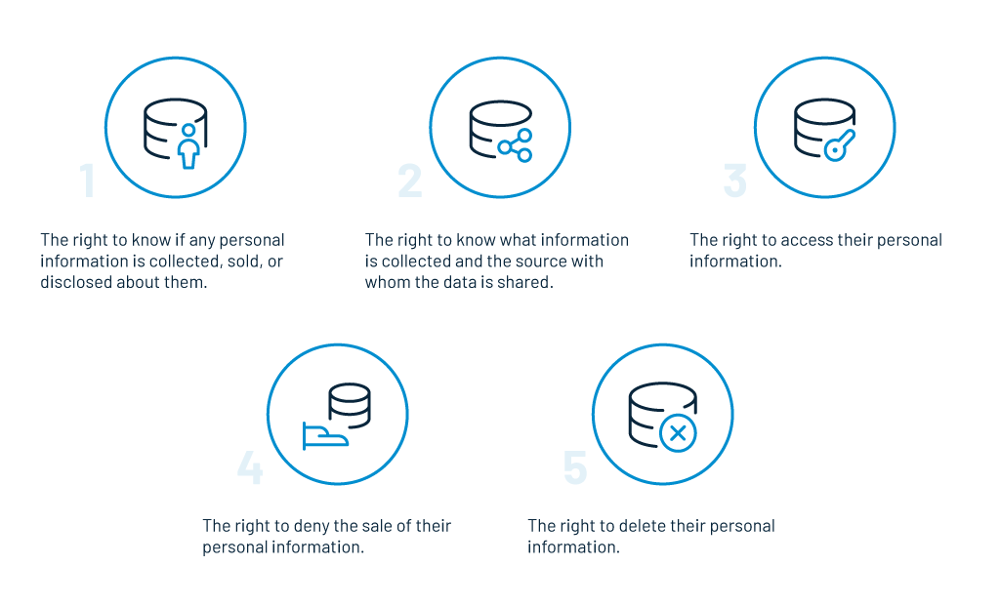
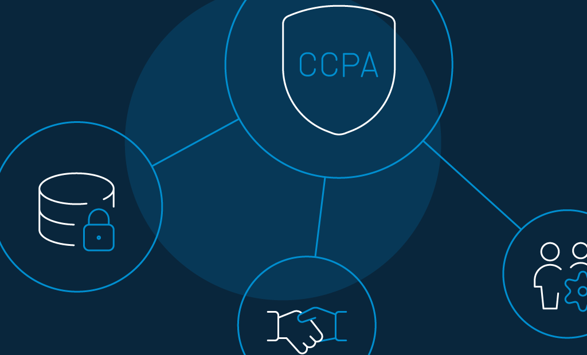
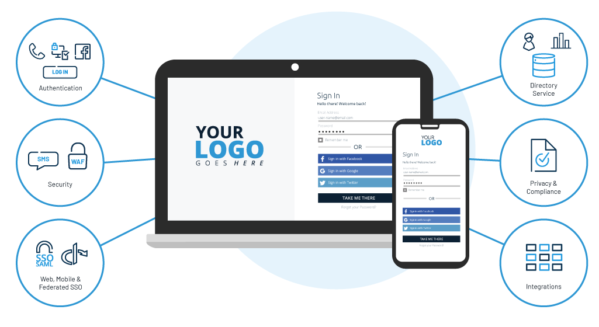

As the risk of data abuse is on the rise, more and more companies are seeking to adhere to the existing data privacy and regulatory compliances. 

From the EU’s General Data Protection Regulation (GDPR) to the recently released California's Consumer Privacy Act (CCPA), each regulation has a unique strategic imperative. 

- The European Union’s GDPR came into force on May 25, 2018, to protect the personally identifiable information (PII) of its citizens. 
- Likewise, on January 1, 2020, the California Consumer Privacy Act (CCPA) went live, affecting millions of companies with its share of new consumer rights.

Businesses cannot afford to ignore these new policies. From a financial point of view, the  [European supervisory authorities](https://www.itgovernance.co.uk/dpa-and-gdpr-penalties) imposed as many as 133 administrative penalties by the end of 2019, which sums up to a massive fine of approximately €400 million (£337 million).

Businesses need to understand that customers are the sole drivers of the economy, and a trusted relationship with them will lead to loyalty and boosted revenue generation.

On a similar note, enterprises are often curious if LoginRadius, as a customer identity and access management (CIAM) platform, meets regulatory requirements of the popular data protection laws.

Well yes, it does.

Not just the infamous GDPR, LoginRadius also helps enterprises adhere to the recently active [California Consumer Privacy Act (CCPA)](https://www.loginradius.com/blog/2019/05/ccpa-introduction/).

But before we go any further, let’s understand a few things about the CIAM platform and the CCPA compliance.

## What does it take to make the perfect CIAM platform?

Well, the driving force of CIAM lies in its ability to use data security as a tool for offering seamless customer experiences. 

Customer Identity and Access Management (CIAM) is a relatively new customer-focused business solution that collects, manages, and provides a secure and seamless access to customer's personal data.

An ideal [customer identity management platform](https://www.loginradius.com/blog/2019/06/perfect-ciam-platform/) should include all the crucial components that drives an enterprise – from customers, suppliers, contractors, partners, employees to systems, applications, and devices.

## What is the California Consumer Privacy Act (CCPA)?

The California Consumer Privacy Act is a relatively new consumer privacy right enacted by the State of California. It comprises groundbreaking laws relating to contemporary business practices and the role of citizens in securing their personal data in the Golden State.

[Like the GDPR](https://www.loginradius.com/gdpr-and-privacy/), these new regulations apply not only to California businesses but to all the companies that do business in the state.

### What does the CCPA offer?

- **Ownership:** Under CCPA, consumers will have the right to know what information businesses collect about them, and if need be, restrict them from sharing or selling their personal data.
- **No discrimination:** CCPA does not allow businesses to discriminate against consumers who haven't approved of selling their data. Consequently, enterprises cannot impose additional charges or offer services with low quality to those consumers.
- **Security and protection:** Under CCPA, companies are accountable for protecting the personal information of its consumers against potential data breaches.

### What rights do consumers enjoy under CCPA?

### What data is considered personal under the CCPA?

- **Direct identifiers** like name, address, e-mail id, social security numbers, passport information, driver's license, and signature.
- **Unique identifiers** like IP addresses, account id, cookies, pixel tags, beacons, and telephone numbers. 
- **Internet activity identifiers** like search history, advertisement, browsing history, etc.
- **Geolocation identifiers** like location history.
- **Sensitive data** like financial and medical history, religious or political views, sexual preferences, education data, etc.
- **Biometric identifiers** like voice recordings, fingerprints, facial recognition, etc. 
- **Commercial data** like property records, products or services purchased, purchasing histories, etc.

### Is CCPA a big deal?

Yes, CCPA is a big deal for companies that collect data from the residents of California – irrespective of where their business is located. 

Non-compliance may lead to hefty fines and rigid enforcements.

### What are the CCPA penalties?

The maximum penalty for unintentional violations is $2,500 USD, while for intentional violations, it may go as high as $7,500 USD. Consumers may also take legal action against companies and can sue them individually for each breach.

## Does CCPA apply to your business?

If your business or organization answers positively to any one of the following criteria, you are required to comply with the CCPA.

- Does your business earn annual gross revenue of more than $25 million USD?
- Do you buy, sell, or share data of 50,000 or more consumers for commercial intent?
- Does your business earn 50% or more of its revenue by selling consumers' personal information?

Remember: Non-profit or small companies that do not meet the income threshold do not require to comply.

## Can CCPA optimize user experience?

Today, consumers have a lot of control over how companies shape their brand image and retain their businesses. 

When it comes to CCPA, the Californian data privacy law provides some excellent opportunities to gain an advantage over customer experience. 

Wondering how? Let’s find out.

**1\. CCPA ensures improved data security.**

The repercussions of not adhering to international compliance protocols aren’t limited to privacy issues. Apart from the apparent loss of customer trust, it results in revenue losses and possible fines. 

A data protection law as stringent as the CCPA gives consumers the confidence and trust to share their sensitive data online. Simply because consumers can easily find out what data is collected, stored, and disclosed to others.

**2\. CCPA builds trust with consent management.**

With a plethora of cases on identity theft and data disclosure by big shot conglomerates, consumers find it challenging to trust enterprises with their personal data. 

Enterprises willing to build sustainable relations with their consumers need to understand the importance of privacy. 

Consumers should have the freedom to view or upgrade their consent approval. If the need arises, they should be allowed the right to withdraw their consent too.

As such, CCPA requires enterprises to display easy-to-understand consent requests, so consumers know what they are getting into.

**3\. CCPA allows frictionless identity management.**

When it comes to enterprise-class identity management, factors like compliance and security play a critical role. 

In the data-driven world, a CCPA-regulated customer identity and data management solution can seek consent and record permissions before processing any data.

## How LoginRadius’ Identity Solution assists enterprises with CCPA compliance

LoginRadius is a [customer identity and access management](https://www.loginradius.com/blog/2019/06/customer-identity-and-access-management/) solution that provides a 360-degree view of customers for a seamless collection, storage, management, and protection of personal data.

It helps companies meet CCPA regulatory requirements without compromising the user experience. Its one-of-a-kind data protection features include client registration, sign-in, authentication, single sign-on, data governance, and consent management, among others.

The following capabilities further help enterprises meet privacy compliance regulations.

- Clear and specific statement of consent.
- Registration and progressive profiling. 
- Data record and access permissions. 
- Deletion of data. 
- User identity and access management. 
- Management of centralized access control.
- Age verification mechanism.

There’s more.

LoginRadius enforces a set of policies, procedures, programs, and standards for effective security management. It aims to offer a risk-free organizational setup by safeguarding customer's data against potential breaches.

The identity solution is designed with a cloud-native architecture and complies with the [major security assurance programs](https://www.loginradius.com/compliances-list/) including:

1. OpenID - End-user identity verification supported by OAuth 2.0 protocol
2. PCI DSS PCI SSC administered standard for payment transactions
3. ISO 27001:2013 - Information security management system
4. ISO 27017:2015 - Information security for cloud services
5. AICPA SOC 2 (Type II) - System-level controls for Trust Services Criteria - security, availability, process integrity, confidentiality, and privacy 
6. ISAE 3000 - International attestation standard for assurance over non-financial information 
7. NIST Cybersecurity Framework - Standardized security framework to manage and reduce cybersecurity risk.  
8. CSA CCM Level 1, Level 2 - STAR Self-Assessment, STAR Certification, STAR Attestation, and C-STAR Assessment.
9. CIS Critical Security Controls Global standards for internet security
10. US Privacy Shield Complaint resolution for EEA citizens
11. ISO/IEC 27018:2019 - PII Protection

## Conclusion

Consumers expect the privacy and security of their personal data, and it is the responsibility of enterprises to build and maintain a trusted relationship. Recent data breaches and identity thefts highlight the importance of data protection laws and compliance like [CCPA and GDPR](https://www.loginradius.com/blog/2019/09/ccpa-vs-gdpr-the-compliance-war/). 

With an identity solution like LoginRadius, you can eliminate lengthy processes that ruin the user experience, and still maintain international governance over data privacy. 

