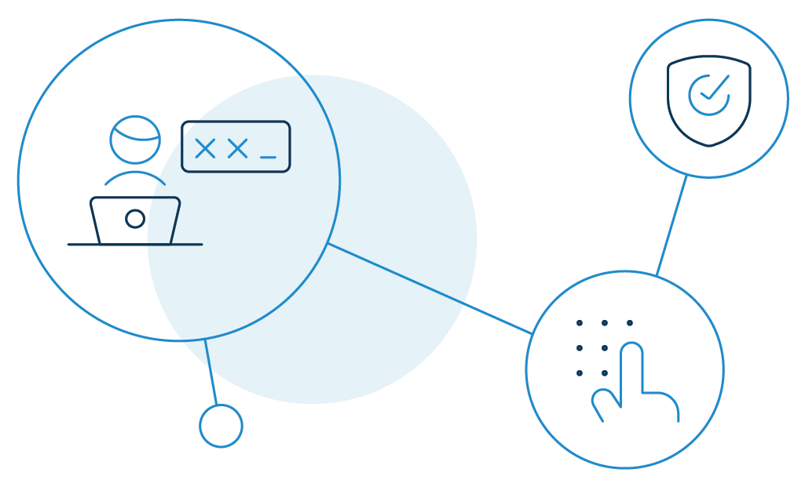
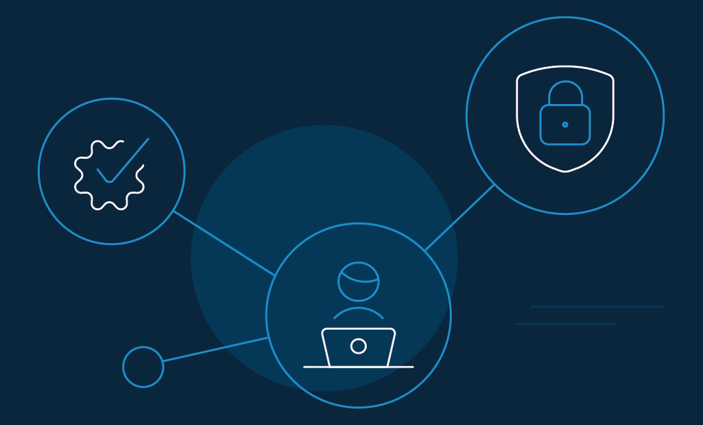

No conversation on digital security is complete without a well-rounded discussion on how to choose a strong password. 

Passwords are the digital keys to our daily lives. They are the gateway to our professional services, our network of friends, and all our financial applications. 

No wonder we want to keep our passwords private and secure! 

If someone gains access to your email ID, they can easily opt for the "forgot your password?" link on (for example, an online shopping or banking site) you use. 

Also, if a cybercriminal successfully hacks into your social media account, they can post fraudulent messages asking for money or sending out links to scammer websites. 

So, what's the solution? A good password. 

But before finding how to choose a strong password in 2021, let's first look at the most common methods of how passwords are being hacked today.    

## How Does a Password Get Hacked? Top 5 Threats 

Hackers utilize numerous techniques to crack your passwords. One technique is to gain access by guessing the password directly. 

They could do it by closely following your social media presence, security questions, and similar details. This is why industry experts do not favor the use of personal details on passwords. 

Other tactics that hackers use include: 

### 1. Phishing attacks

Phishing is a [social engineering attack](https://www.loginradius.com/blog/start-with-identity/2020/10/social-engineering-attacks/) that occurs when the hacker dupes a victim into opening an email using fraudulent ads or scareware tactics. 

Unfortunately, such attacks are no longer just an email problem. It has somewhat expanded to instant/ text messages, social networks, videoconferencing, and gaming applications. 

As phishing threats grew to over 50,000 a day around December 2020, [SlashNext Threat Labs reported](https://www.slashnext.com/blog/zero-hour-phishing-attack-on-googles-app-engine-targeting-office-365-users-pushes-holiday-spike-above-100/) a 30% increase throughout 2019. 

Both organizations and individuals should know how to choose a strong password and take a zero-trust approach beyond domain credibility. 

### 2. Dictionary attack

A dictionary attack is a method of attacking the victim's account by entering every word in a dictionary as a password. They usually run through a list of common words and phrases or easy to guess passwords. 

Users frequently reuse their passwords or do not change them even after a breaching attempt. That makes this form of attack easy to execute. 

In fact, the [2019 Verizon Data Breach Investigations Report](https://enterprise.verizon.com/resources/reports/dbir/2019/results-and-analysis/) (DBIR) reveals that compromised and reused passwords are involved in 80 percent of hacking-related breaches.

### 3. Brute force attacks

Similar to a dictionary attack, brute force uses trial-and-error to guess the victim's login credentials, find a hidden web page, or access network resources. 

Later, those tainted accounts are used to send phishing emails, sell credentials to third parties, or spread fake content. 

[Verizon's Data Breach Investigations Report 2020](https://enterprise.verizon.com/resources/reports/dbir/2020/introduction/) reveals that around 20% of breaches happening within SMBs involve brute force. The number is approximately 10% for large enterprises. 

The trend essentially remained unchanged in 2018 and 2019, but the coronavirus pandemic may have impacted the number last year.

### 4. Keystroke logging

Keystroke logging or keyboard capturing is the method of tracking and recording the keystrokes of the victim, thereby capturing any information typed during the session. 

The hacker uses tools to record the data captured by each keystroke, which are retrieved later on. Moreso, a majority of these tools can record calls, GPS data, copy-cut-paste clipboard, and microphone or camera footage. The recorded data are later used for phishing attacks, stalking, and identity theft. 

### 5. Man-in-the-middle attacks

In this attack, the hacker positions themselves in the middle of a conversation between a user and an application to eavesdrop or impersonate a website or application. 

In return, the hacker [steals the victim's login credentials](https://www.loginradius.com/blog/start-with-identity/2019/09/prevent-credential-stuffing-attacks/), account numbers, social security numbers, etc. 

SaaS businesses, e-commerce sites, and users of financial services majorly fall victim to man-in-the-middle attacks.  

## The Do's and Don't on How to Choose a Strong Password

What does a secure password look like? It is usually the one that cannot be guessed easily or cracked using software tools. 

Not that it should only be unique and complex, here is a collection of the do's and don't on how to choose a strong password to avoid being a victim of the attacks mentioned above.

### The Do's

 

**Use two-factor authentication (2FA)**: [2FA](https://www.loginradius.com/multi-factor-authentication/) adds an additional layer of security to your existing account. Even if the hacker is able to crack your password, they will still have an extra layer to authenticate. 

The following are a few types of layers that businesses choose to provide:

*   A PIN or password.
*   A physical asset such as the last 4 digits of your credit card.
*   An OTP sent to your mobile device.
*   A biometric authenticator such as a fingerprint or voiceprint. 

**Follow standard password rules**: There are a few basic rules on how to choose a strong password that you should closely follow.

*   Short passwords are very easy to crack. Use a minimum of 10 characters.
*   Include a mixture of numbers, capital letters, lower-case letters, and symbols to make the password difficult to crack. 

**Choose sufficiently random combinations of words**: Yes, it is possible to use an easy-to-remember password and make it secure at the same time. The following are a few ways to do that:

*   Pick a sentence that you probably won't forget, like "When I was fifteen, I had my first international trip." Then use the first letters, add the numbers, and punctuation to make "wIw15,ihmfit."
*   Pick any three random words like Jack Book Pen. Choose your birth date, put the words together, and split up the date like 1jackbookpen4. Next, capitalize each letter and add a few special characters like 1J@ckBookPen4!

**Pick something that does not make sense**: How to choose a [strong password](https://www.loginradius.com/blog/async/password-security-best-practices-compliance/)? Go for something that has no meaning. For example, it could be:

*   A familiar word using odd characters like phnybon instead of funnybone.
*   A deliberately misspelled term like Win-G8 (Wooden Gate)
*   Replace letters with the least expected symbols. Like for "O" use "()" instead of "0".
*   Use phonetically pronounceable words that make no sense, like good-eits.

**Change your passwords regularly**: Also, do not reuse the same password for a long time. The more sensitive your data is, the more frequently you should change your password.

**Always remember to log out** of websites and devices once you are done using them. 

### The Don’ts

*   Do not use your name in your passwords in any form - first, last, spelled backward, or nicknames.
*   Do not use passwords that are fewer than eight characters.
*   Do not use the name of your pets, friends, or close relatives.
*   Do not use special dates like your birthdays and anniversaries. 
*   Do not use your phone number or office number.
*   Do not use your user ID, even when spelled backward.
*   Do not use acronyms, technical terms, or names of places.
*   Do not use names from popular culture like Harry_Potter, Hogwarts. 
*   Do not use all numeric passwords like your license plate numbers.
*   Do not use dictionary words. 
*   Do not use commonly used passwords like 123456, qwerty, 11111111, asdfgh.
*   Do not write down your passwords or share them with anyone else.
*   Do not save your passwords in unfamiliar computers or browsers.
*   Do not use the secret question option. It does not make any sense to use a strong password and back it up with an easily guessable security question.
*   Do not use obvious substitutions like "H0me" for "Home" or "D00R8377" for "DOORBELL."

## The 20 Worst Passwords of 2020

[According to Nordpass.com](https://nordpass.com/most-common-passwords-list/), here are the 20 worst passwords of 2020. The list also offers an overview of how many times the password has been breached, among other parameters. 

Disclaimer: Stay away from these passwords. 

<table>
  <tr>
   <td><strong>Position </strong>
   </td>
   <td><strong>Password </strong>
   </td>
   <td><strong>Number of users</strong>
   </td>
   <td><strong>Time to crack it</strong>
   </td>
   <td><strong>Times exposed</strong>
   </td>
  </tr>
  <tr>
   <td>1
   </td>
   <td>123456
   </td>
   <td>2,543,285
   </td>
   <td>Less than a second
   </td>
   <td>23,597,311
   </td>
  </tr>
  <tr>
   <td>2
   </td>
   <td>123456789
   </td>
   <td>961,435
   </td>
   <td>Less than a second
   </td>
   <td>7,870,694
   </td>
  </tr>
  <tr>
   <td>3
   </td>
   <td>picture1
   </td>
   <td>371,612
   </td>
   <td>Three hours
   </td>
   <td>11,190
   </td>
  </tr>
  <tr>
   <td>4
   </td>
   <td>password
   </td>
   <td>360,467
   </td>
   <td>Less than a second
   </td>
   <td>3,759,315
   </td>
  </tr>
  <tr>
   <td>5
   </td>
   <td>12345678
   </td>
   <td>322,187
   </td>
   <td>Less than a second
   </td>
   <td>2,944,615
   </td>
  </tr>
  <tr>
   <td>6
   </td>
   <td>111111
   </td>
   <td>230,507
   </td>
   <td>Less than a second
   </td>
   <td>3,124,368
   </td>
  </tr>
  <tr>
   <td>7
   </td>
   <td>123123
   </td>
   <td>189,327
   </td>
   <td>Less than a second
   </td>
   <td>2,238,694
   </td>
  </tr>
  <tr>
   <td>8
   </td>
   <td>12345
   </td>
   <td>188,268
   </td>
   <td>Less than a second
   </td>
   <td>2,389,787
   </td>
  </tr>
  <tr>
   <td>9
   </td>
   <td>1234567890
   </td>
   <td>171,724
   </td>
   <td>Less than a second
   </td>
   <td>2,264,884
   </td>
  </tr>
  <tr>
   <td>10
   </td>
   <td>senha
   </td>
   <td>167,728
   </td>
   <td>Ten seconds
   </td>
   <td>8,213
   </td>
  </tr>
  <tr>
   <td>11
   </td>
   <td>1234567
   </td>
   <td>165,909
   </td>
   <td>Less than a second
   </td>
   <td>2,516,606
   </td>
  </tr>
  <tr>
   <td>12
   </td>
   <td>qwerty
   </td>
   <td>156,765
   </td>
   <td>Less than a second
   </td>
   <td>3,946,737
   </td>
  </tr>
  <tr>
   <td>13
   </td>
   <td>abc123
   </td>
   <td>151,804
   </td>
   <td>Less than a second
   </td>
   <td>2,877,689
   </td>
  </tr>
  <tr>
   <td>14
   </td>
   <td>Million2
   </td>
   <td>143,664
   </td>
   <td>Three hours
   </td>
   <td>162,609
   </td>
  </tr>
  <tr>
   <td>15
   </td>
   <td>000000
   </td>
   <td>122,982
   </td>
   <td>Less than a second
   </td>
   <td>1,959,780
   </td>
  </tr>
  <tr>
   <td>16
   </td>
   <td>1234
   </td>
   <td>112,297
   </td>
   <td>Less than a second
   </td>
   <td>1,296,186
   </td>
  </tr>
  <tr>
   <td>17
   </td>
   <td>iloveyou
   </td>
   <td>106,327
   </td>
   <td>Less than a second
   </td>
   <td>1,645,337
   </td>
  </tr>
  <tr>
   <td>18
   </td>
   <td>aaron431
   </td>
   <td>90,256
   </td>
   <td>Three hours
   </td>
   <td>30,576
   </td>
  </tr>
  <tr>
   <td>19
   </td>
   <td>password1
   </td>
   <td>87,556
   </td>
   <td>Less than a second
   </td>
   <td>2,418,984
   </td>
  </tr>
  <tr>
   <td>20
   </td>
   <td>qqww1122
   </td>
   <td>85,476
   </td>
   <td>Fifty two minutes
   </td>
   <td>122,481
   </td>
  </tr>
</table>

## 5 Tips on How to Choose a Strong Password Manager

A password manager helps you auto-generate strong passwords and stores them in encrypted, centralized locations on your behalf. You can access all your passwords with a master password. 

A lot of password managers are free to use and provide optional features such as synchronizing new passwords across several devices. If allowed, they also audit users’ actions to ensure that they are not repeating their passwords in multiple locations. 

So, (to be on the right track), how to choose a strong password manager? Well, it should at least have the following core features:

*   **Storage**: While some password managers store passwords in a local hard-drive, some others use cloud storage. The latter is usually preferable if your employees or users use multiple devices. They can access their account credentials from any device with an internet connection. Also, if their devices are stolen, they won't lose their passwords. 
*   **Encryption**: Go for a strong [encryption standard](https://www.loginradius.com/blog/async/encryption-and-hashing/). The next time you wonder how to choose a strong password manager, go for the one that uses 256-bit Advanced Encryption Standard (AES) encryption.  
*   **Easy-to-use**: The password manager you choose should have an intuitive interface so that it's easy to use. Otherwise, your users or employees will stick to their old habits of creating weak, familiar passwords. Some managers also offer automated password changers that automatically change old passwords to new stronger ones.
*   **Security**: It should support two-factor authentication, track password usage, and generate audit reports. The password manager should also end sessions when a device is idle for a predefined amount of time. Also, ensure it has a built-in VPN and the ability to restrict access to blacklisted Internet sites. 
*   **Value**: The password manager should also have additional nice-to-have features:
    *   Automated support for directory services integration.
    *   The ability to generate a portable vault.
    *   An account recovery feature in case of forgotten master passwords.
    *   The ability to encrypt and store sensitive files in secure vaults. 

## Reduce Password Vulnerabilities Using the LoginRadius Password Management Solution

To answer the popular question "how to choose a strong password in 2021", LoginRadius offers a range of robust Password Policy features. 

[The CIAM platform](https://www.loginradius.com/) captures the following categories of password management in the LoginRadius Admin Console:

*   **Password Expiration**: You can customize how often you want your consumers to reset their passwords. There's a password expiry configuration setting to help you out.
*   **Password History**: You can configure the number of unique passwords a consumer must set before allowing them to reuse one of their older passwords. 
*   **Password Complexity**: You can configure the password complexity for your consumer's account by forcing validation rules, preventing them from using common passwords and dictionary words.
*   **Password Compliance Check**: You can identify which consumers are abiding by your password complexity requirements and flag those who aren't. 

## Conclusion 

By now, you know how to choose a strong password. However, hackers will still try to crack your passwords, no matter how secure you are trying to make them. 

Follow the steps listed above to make your passwords as strong and unique as possible. Remember, if your password is too easy to remember, it is probably not secure at all.

