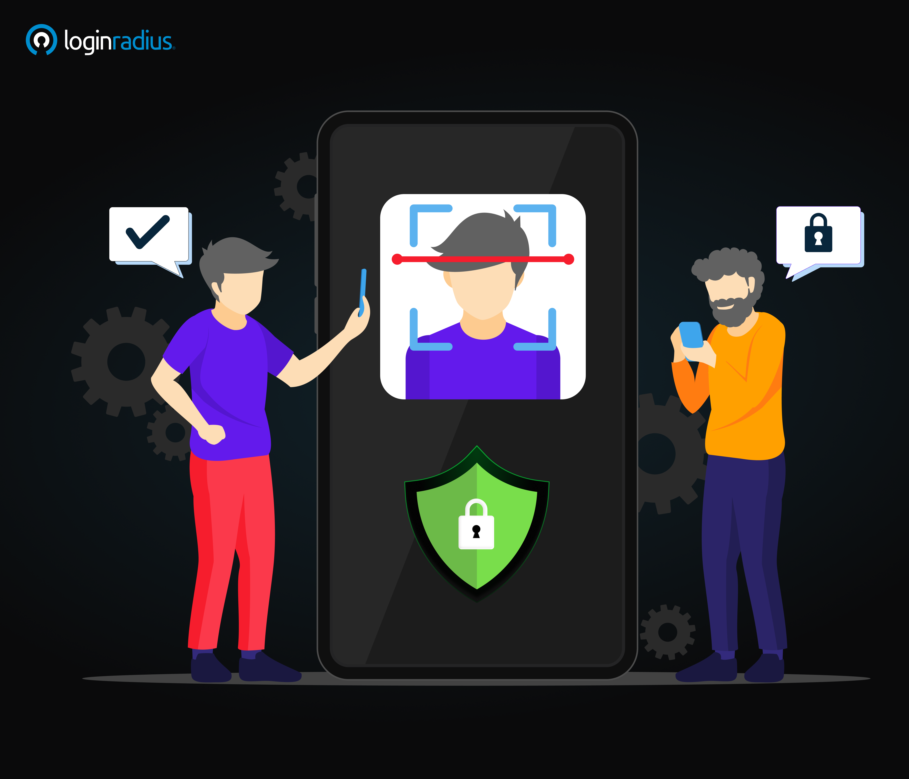
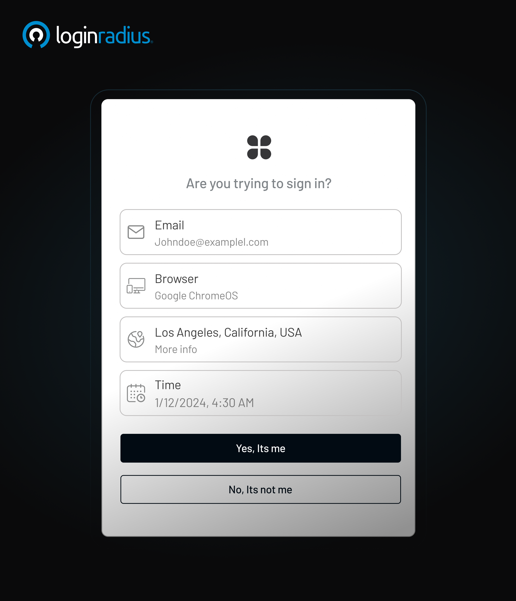
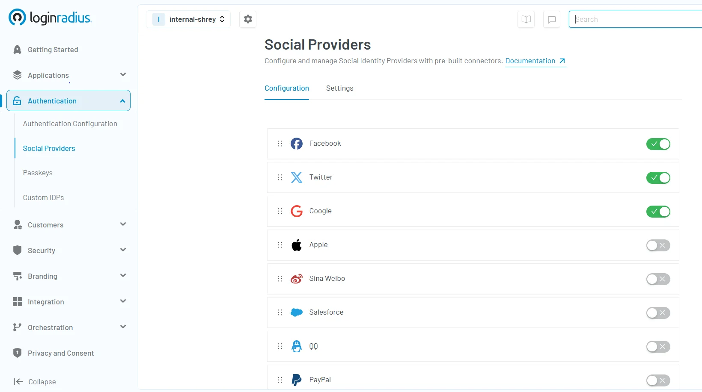
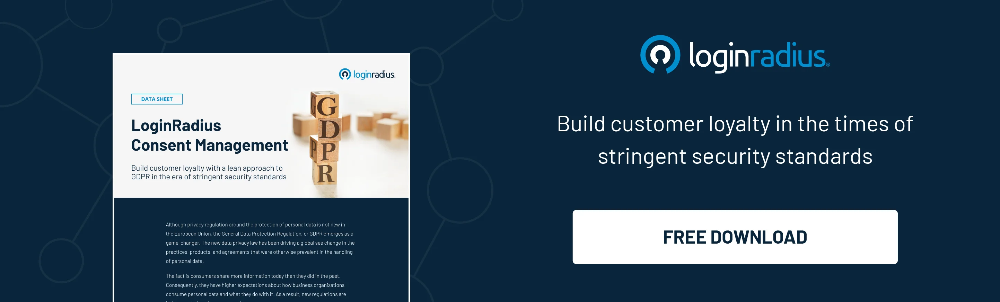

## Introduction

In today's digital world, ensuring secure access to systems and data is more than a technical requirement—it's a business necessity. 

Whether you're managing user access for a mobile app, an enterprise platform, or a customer-facing portal, choosing the right authentication methods plays a critical role in safeguarding sensitive information and delivering seamless user experiences.

This guide breaks down the core authentication types, why they matter, and how to choose the right fit for your needs. It also explains how modern user authentication methods and authentication protocols work together to secure digital ecosystems.

## What Is User Authentication?

[User authentication](https://www.loginradius.com/blog/identity/what-is-authentication/) is the process of verifying that a user is who they claim to be. It's the first line of defense in any digital environment, determining whether someone can access a system, app, or resource.

At its core, user authentication compares credentials entered by the user (like a password or fingerprint) with the stored data to verify identity. If the information matches, access is granted.

Modern user authentication techniques go far beyond just passwords. Today, businesses use a wide range of authentication mechanisms, including one-time passwords (OTPs), biometrics, smart cards, and more. These methods provide varying levels of security and user convenience.

Authentication also plays a foundational role in digital transformation. As businesses shift to cloud environments and remote work, secure authentication methods help ensure users access the right systems at the right time—without compromising security.

## Why Is User Authentication Important?

Cyber threats are evolving every day, and attackers constantly look for weak points in your digital systems. Without proper user authentication methods, sensitive data, intellectual property, and customer information are at risk.

Here are a few reasons why user authentication is so crucial:

* **Security**: Strong security authentication methods reduce the risk of unauthorized access and data breaches.

* **Compliance**: Regulations like [GDPR](https://www.loginradius.com/compliance-list/gdpr-compliant/), [HIPAA](https://trust.loginradius.com/), and [CCPA ](https://www.loginradius.com/compliance-list/ccpa/)often require robust authentication protocols to ensure data protection.

* **User Trust**: Customers feel more secure using platforms that implement secure authentication methods.

* **Business Continuity**: Preventing unauthorized access reduces downtime and reputational damage.

* **Scalable Protection**: As businesses grow, the use of adaptive and advanced authentication methods becomes key to mitigating dynamic risks.

Without effective methods for authentication, even the most robust infrastructure can become vulnerable. Authentication supports everything from user onboarding to transaction security.

## Common Authentication Types

There are several authentication types used today, ranging from basic to advanced. Each comes with strengths and trade-offs. Here's a breakdown of the most widely used authentication methods:

### 1. Password-Based Authentication

Still the most common method, password authentication involves users entering a secret password. While simple to implement, it's also the least secure if not paired with additional factors.

Best practices include enforcing password complexity, expiration policies, and using hashing algorithms for storage. However, as threats like credential stuffing rise, relying solely on passwords is no longer advisable—something we’ve covered in detail in our guide on[ username and password authentication best practices](https://www.loginradius.com/blog/identity/best-practices-username-password-authentication/).

### 2. Multi-Factor Authentication (MFA)

[Multi factor authentication](https://www.loginradius.com/blog/identity/what-is-multi-factor-authentication/) requires users to provide two or more credentials from different categories:

* Something you know (password or PIN)
* Something you have (smartphone or hardware token)
* Something you are (biometrics like fingerprint or face scan)

Secure authentication methods like MFA greatly reduce the likelihood of a breach. Organizations often deploy MFA for admin logins, financial transactions, and high-risk user activities.

### 3. Risk-Based / Adaptive MFA

[Risk-based or adaptive MFA](https://www.loginradius.com/blog/identity/risk-based-authentication/) analyzes the context of each login attempt and adjusts authentication requirements accordingly. It considers factors like user location, device type, IP reputation, and time of access to assess risk in real time.

For example, if a user logs in from an unfamiliar location or device, the system may prompt for additional verification (like a biometric scan or OTP). In contrast, if the login is from a known device in a trusted environment, the user may face fewer authentication steps.

This is one of the most intelligent and advanced authentication methods, as it improves both security and user experience by minimizing unnecessary friction while responding dynamically to threats.

### 4. Biometric Authentication

Uses physical characteristics like fingerprints, facial recognition, or retina scans. These user authentication techniques are harder to spoof and offer a seamless experience.

As a form of advanced authentication methods, biometrics are increasingly used in smartphones, airports, banking apps, and secure corporate systems.

### 5. Token-Based Authentication

Users receive a unique token (often time-sensitive) that must be entered to access the system. Common in banking and high-security environments.

[Token-based authentication ](https://www.loginradius.com/blog/identity/what-is-token-authentication/)systems, such as JSON Web Tokens (JWT), are widely used in APIs and microservices architecture. They support stateless authentication and secure session management.

### 6. Certificate-Based Authentication

This method uses digital certificates issued by a trusted authority to verify identity. It's common in corporate and government environments, particularly in environments requiring [machine-to-machine ](https://www.loginradius.com/blog/engineering/using-m2m-authorization-for-apis-and-apps/)trust.

### 7. Single Sign-On (SSO)

With [SSO](https://www.loginradius.com/blog/identity/what-is-single-sign-on/), users log in once to access multiple services. It's one of the most user-friendly methods for authentication, often paired with MFA for added security.

SSO helps reduce password fatigue, streamlines access across enterprise systems, and enhances productivity.

These are just some of the different types of authentication. Choosing the right one depends on several factors we’ll explore next.

### 8. Push Notification-Based MFA

[Push-notification MFA](https://www.loginradius.com/blog/identity/push-notification-authentication/) sends an approval request to a user’s registered mobile device during login. Instead of manually typing a code, the user simply taps “Approve” or “Deny” in an authentication app (such as LoginRadius Authenticator or other TOTP apps with push support).

This method is highly user-friendly and significantly reduces the risk of phishing compared to traditional SMS or email codes. It’s widely used for its speed, convenience, and strong security, making it a popular option among secure authentication methods for both enterprises and consumer-facing platforms.

### 9. Social Login

[Social login](https://www.loginradius.com/blog/identity/what-is-social-login/) allows users to authenticate using their existing accounts from third-party platforms like Google, Facebook, Apple, or LinkedIn. This method simplifies registration and login by eliminating the need to create new credentials.

Here’s how to quickly set up social login in the[ LoginRadius console](https://accounts.loginradius.com/auth.aspx?return_url=https://console.loginradius.com/login&action=register): 

From a user experience perspective, social login reduces friction and improves conversion rates. From a security standpoint, it delegates authentication to trusted identity providers that follow strong authentication protocols.

It’s an ideal choice for consumer apps, ecommerce platforms, and services aiming to provide quick access while leveraging existing user authentication methods.

## Factors to Consider When Choosing an Authentication Method

Every organization has different security needs, user bases, and compliance requirements. When evaluating authentication methods, here are key considerations:

### 1. Security Level Required

Does your platform deal with highly sensitive data or personal information? If so, consider advanced authentication methods like MFA or biometrics. High-risk sectors like healthcare and finance often mandate these protocols.

### 2. User Experience

Security shouldn’t come at the cost of usability. Opt for authentication mechanisms that are easy to use and don’t create friction for end users. For instance, biometrics offer both security and convenience.

A poor authentication experience can lead to user frustration and churn. Always [balance security with user-centric design.](https://www.loginradius.com/blog/identity/security-ux-can-coexist/)

### 3. Scalability

Will your authentication protocols support a growing user base and adapt to future needs? Ensure the solution is scalable and can integrate with new technologies.

Organizations expanding to new markets or deploying cross-channel platforms should ensure their user authentication methods can scale accordingly.

### 4. Compliance and Industry Standards

Different sectors have different compliance needs. Financial institutions, for example, may need specific security authentication methods to meet regulatory standards like PCI-DSS.

Check for support for industry standards like OAuth 2.0, OpenID Connect, and SAML in your authentication provider.

### 5. Integration Capabilities

Your chosen method should work seamlessly with existing infrastructure, third-party services, and CIAM platforms like [LoginRadius](https://www.loginradius.com/).

Modern businesses rely on multiple SaaS tools and backend systems. Interoperability is essential for effective authentication mechanisms.

### 6. Risk Profile of the User Base

For higher-risk users (like admins or those accessing financial systems), apply stricter authentication mechanisms. Use contextual authentication to adapt based on location, device, or behavior.

Understanding your organization’s needs and matching them with the appropriate user authentication methods ensures both protection and performance.

## To Conclude 

Selecting the right authentication methods is no longer optional—it’s fundamental to digital trust, user satisfaction, and organizational resilience. Whether you’re looking at advanced authentication methods like biometrics or standard authentication protocols like passwords and tokens, the goal is to find the right balance of security, usability, and compliance.

As threats become more sophisticated, your choice of authentication mechanisms can make or break your security posture. Make informed decisions that serve both your users and your business.

When done right, authentication becomes invisible yet secure, empowering users to interact with your brand confidently and securely. 

Need help implementing secure and scalable authentication? [Contact LoginRadius](https://www.loginradius.com/contact-us?utm_source=blog&utm_medium=web&utm_campaign=how-to-choose-authentication) to speak with an expert.

## FAQs

### **1.** Which methods can be used to implement multifactor authentication?

**A.** Common methods include:

* Password + OTP via SMS or authenticator app
* Password + biometric scan
* Smart card + PIN These combinations offer a blend of secure authentication methods for added protection. MFA implementations vary based on risk profiles and user roles.

### **2.** What are examples of biometric authentication methods?**

**A.** Biometric user authentication techniques include:

* Fingerprint scanning
* Facial recognition
* Voice recognition
* Retina or iris scans These authentication types are commonly used in mobile apps, banking, and secure facilities. They fall under advanced authentication methods due to their high accuracy and low risk of impersonation.

### **3.** What are the common methods of authentication for network security?

**A.** In network environments, popular security authentication methods include:

* Password-based logins
* Digital certificates
* Two-factor authentication (2FA)
* Token-based systems These methods for authentication ensure only authorized users access your network. They are foundational for VPNs, remote desktop access, and zero trust architectures.

