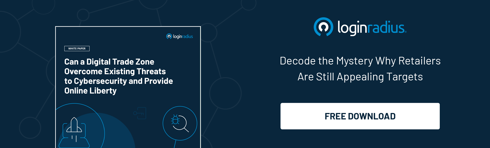

## Introduction

A deepfake is a portmanteau of fake and deep learning. The consequences of it causing people to doubt their reality: recordings, pictures and videos that have been manipulated in such a way as to make it appear that someone said and did things they never said or did. 

Nowadays the use and the possibility of such types of attacks are gaining a lot of concern, due to the potential consequences related to law, politics, and many other public issues. In this post, you'll read all about deepfakes and how to avoid them. So, without wasting any time, just start reading! 

## Concept of Deepfakes: What Is It? 

Have you ever come across the following news? 

* Barack Obama calls Donald Trump a "complete jerk".
* Mark Zuckerberg boasts about having "absolute control of billions of people's stolen data"

If your answer is yes, then you've witnessed a deepfake. 

Deepfakes, the twenty-first century's equivalent to photoshopping, employs a type of artificial intelligence known as deep learning to create photographs of fictitious events, hence the name deepfake. 

Now that you know what deepfakes are, let's look at how they've become a new threat to all of us and how we can protect ourselves from them.

## Deepfake Attacks: A Cancer In The Society

Deepfake technology advancements have made it more difficult to discern between actual and fake content, posing a real threat to businesses.

Aside from the evolution of technology, the risk of deepfake attacks is heightened by the fact that businesses have gone virtual overnight as a result of COVID-19. This type of [digital transformation](https://www.loginradius.com/resource/customer-identity-the-core-of-digital-transformation/) boosts the usage of video conferencing and other digital workplace tools, which means more access to deepfake material and more opportunities to be duped.

You can look at the below-mentioned points and understand how deepfake attacks are extremely dangerous:

* In recent years, deepfakes have been aggressively exploited to subvert democracy in the United States. Fake videos of politicians were circulating on social media, prompting Facebook to prohibit the use of deepfakes.
* Cyber predators are also using Deepfake technology. With the ability to change anyone's face in a video or a picture, people began utilizing it to make sexual content without the victim’s knowledge.
* Deepfake technology was unexpectedly used to create sexual content such as revenge porn, assisting cyberbullies in finding [new methods to victimize people](https://www.loginradius.com/blog/identity/cybersecurity-attacks-business/).

Doesn't that sound terrible? It's as though people are using these tools to exploit one another. As these deepfake attacks** **have become common, it's time for us to learn ways to mitigate them. You must be wondering how, right? Well, continue reading! 

## How To Detect Deepfakes

You should know that tools and best practices can assist in mitigating the attempts of fraudsters. Yes, you heard it right! And the most critical factor is vigilance. Fraudsters are relentless and continuously on the lookout for gaps or weak areas.

The first step is to examine the current state of deepfake videos. If you know what to look for, you can typically spot a deepfake video at this stage. The warning indicators are the following:

* Abrupt movements
* Brightness shifts from frame to frame
* Skin color shifts
* Weird blinking or no blinking at all
* Terrible lip-sync 

Algorithms are also emerging to assist video creators in authenticating their videos. A cryptographic technique, for example, can be used to insert hashes at predetermined intervals across the movie. The hashes will change if the video in question is changed.

Similarly, security practices can help to deter fraudsters. Deepfake attacks, as an emerging threat, thrive on the degree of technology available to fraudsters, particularly machine learning and advanced analytics. Businesses can fight fire with fire by employing the same capabilities. 

**Also Download**: 

## How to Prevent Deepfake Attacks

### 1. Proper training and awareness

Through sufficient training and raising awareness, an extra line of defense can be formed. Training should emphasize how technology is used in hostile attempts and how this may be recognized, such as enabling staff to detect deepfake-based [social engineering attempts](https://www.loginradius.com/blog/identity/social-engineering-attacks/). 

### 2. Detection 

Although total risk prevention is unattainable, spotting false media early can help reduce the impact on your firm. 

### 3. Prepare response strategy

Ascertain that you are prepared to respond appropriately to a deepfake. Prepare a plan that can be activated when a deepfake is spotted. Individual duties and needed actions must be stated in this strategy.

## Get Ready To Fight Deepfakes!

You must have realized by now that the constant growth of cybercrime has culminated in deepfakes, which significantly exacerbate the threats posed by typical frauds. 

Deepfakes continue to pose a variety of threats, including political propaganda, fraud, and evidence manipulation in court. In fact, you can implement technical solutions to prevent deepfake attacks. 

However, these methods are not the only measures to address the issue of deepfakes. Hence, it is vital to engage in awareness and training to detect early symptoms of deepfake attacks. 

Additionally, technological companies and governments should consider enacting legislation that criminalizes the usage of deepfakes with the goal of damaging individuals' reputations. In this way, we can stop this rising threat. 

