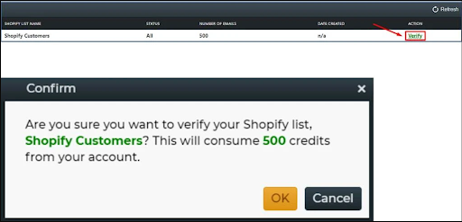

## Introduction

Customer verification is the process of authenticating a customer's identity. It can come in many forms, including email verification, address verification, and phone verification, but it always involves confirming that a person is who they say they are.

The primary reason customer verification is needed is to prevent fraud. It's especially important to verify customers in industries with high risk for fraud like banking and finance or retail.

In the wake of recent data breaches, many companies are realizing that they need to improve their customer verification process. It's no longer enough to simply check a customer's name against a list of approved names at the time of purchase. 

Today, you need to [verify your customers' identities](https://www.loginradius.com/blog/identity/what-is-identity-verification/) in more creative ways if you want to keep your business safe from hackers and thieves.

In this post, you’ll learn some top ways to improve your customer verification process. But first, let’s quickly understand the types of customer verification.

## Types of Customer Verification

Here are the primary forms of verification businesses incorporate today:

* **Two-factor or multi-factor authentication:** It requires your customers to add extra layers of protection to the sign-in process. For example, the need to enter a code sent to their email or mobile phone number. 
* **Knowledge-based authentication:** It is used to verify a person’s identity by requiring an answer to security questions. The question should be simple for the user to answer but difficult for others to guess.
* **Age verification:** It helps online businesses verify a customer’s age before allowing them to purchase a product online. 
* **A credit bureau-based authentication:** It relies on data from one or more credit bureaus. These companies store extensive credit info of consumers, including names, add, and social security numbers. 
* **Online document verification:** It involves verifying the authenticity of identity documents, including a passport, driving license, or identity card issued by the government. 
* **One-time password:** It is an automatically generated numeric or alphanumeric series of characters that verifies users for a single login session or transaction.

With the right [eCommerce website builder](https://www.wix.com/ecommerce/website), the process is made easy, saving you time and money.

Now, check out these top ways to improve and streamline your customer verification process.

### 1. Explain the 'what' and 'why' behind the process to your customers.

For instance, if you are doing email validation integration for Shopify with ZeroBounce, after a few initial steps, you will be asked to click the verification link to begin the verification process.

[Source](https://www.zerobounce.net/docs/api-integrations/shopify)

Notice how they explain that verifying their Shopify list will consume 500 credits from their accounts to their customers. But 500 credits are needed for the verification process. 

Have a look at some best practices and examples to [make verification emails effective](https://www.loginradius.com/blog/fuel/best-practices-verification-emails-effective/). 

At the same time, the more you know about your customers, the more effectively you can weed out potentially fraudulent behavior through patterns of inconsistent information or other red flags. 

For example, if someone places an order using an email address that isn't associated with their shipping address or payment information (or worse yet, if they use a temporary email address), that's a glaring inconsistency you should investigate before approving the purchase.

### 2. Reduce manual processes and automate.

As per [The Baymard Institute](https://baymard.com/lists/cart-abandonment-rate), 24% of respondents in the US said the reason for cart abandonment during checkout was because the site wanted them to create a new account, while 17% said the checkout process was too long and complicated.

Automating specific processes like account creation and form fills could considerably increase sales. 

For instance, you can use behavioral biometrics.

Biometrics is one of the most effective methods of customer verification because physical traits like fingerprints and retina scans cannot be faked. Behavioral biometrics go one step further by considering how a person types or handles their mouse or mobile device as well as their physical characteristics.

### 3. Speed things up with SSO.

[Single sign-on](https://www.loginradius.com/blog/identity/what-is-single-sign-on/) (SSO) lets users log in with a single set of credentials like their Facebook account or Google account. Using information from trusted sources allows your customers to get verified faster and with less friction over the process. Some examples are Facebook Connect, Google Sign-In, and Twitter Login.

SSO can reduce password fatigue, simplify username and password management, increase identity protection, prevent errors, and cut down help desk workloads, among others.

For instance, if you log in to a Google service like Gmail, you get automatically authenticated to YouTube, Google Analytics, and other Google apps. 

### 4. Give customers something to do while they wait.

Just like in restaurants where customers are made to play games or browse through other menu items while they wait for the order, you can apply the same strategy online.

When they call, give customers something to do while they wait in the queue.

You can entertain them with witty illustrations or, better yet, educate them with snippets of information that are relevant to their needs. You’ll make a better first impression by engaging your customers right away instead of putting them on hold.

Advertising and sharing your latest deals and links to your YouTube channel are also great ideas.

Another way to minimize frustration and improve the user experience during the verification phase is by providing them with a task such as answering a security question or providing additional demographic details (e.g., driver's license number, email address).

### 5. Use identity verification software.

If you're looking for ways to improve your customer verification process, identity verification software could be a smart addition to your business. Using such software can help you reduce the risk of fraud and identity theft, ensure compliance with KYC regulations and other requirements, and verify the identities of customers in real-time.

While choosing your identity verification software, focus on addressing your business needs. Besides, it should be able to verify customers worldwide, offer real-time verification, provide geolocation services and customization.

Also, see that your solution is compliant with the global regulations and is secure. You should start looking up [security tips from experts](https://www.loginradius.com/blog/identity/tips-from-loginradius-security-expert-2022/) to strengthen your security.

## That’s a Wrap!

In summary, there are many ways eCommerce retailers can improve the customer verification process. One way is to tailor the process to your business to get the greatest return on investment for your specific needs. 

Whether you choose to [develop your own system](https://www.loginradius.com/blog/identity/build-vs-buy-securing-customer-identity/) or purchase a verification solution from a third-party vendor, ensuring this process is seamless for customers, and free of errors will go a long way towards ensuring that both merchants and buyers have a trusted and satisfying shopping experience every time.

