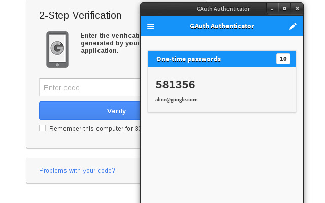
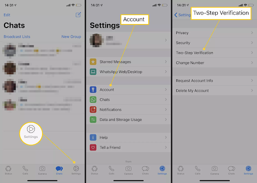
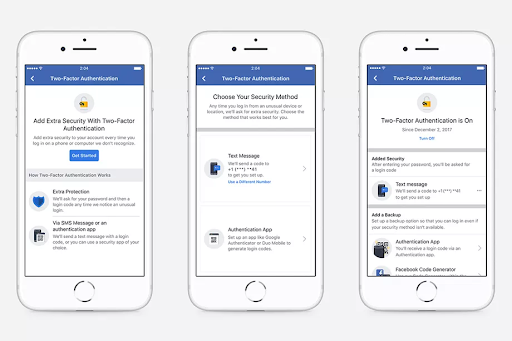
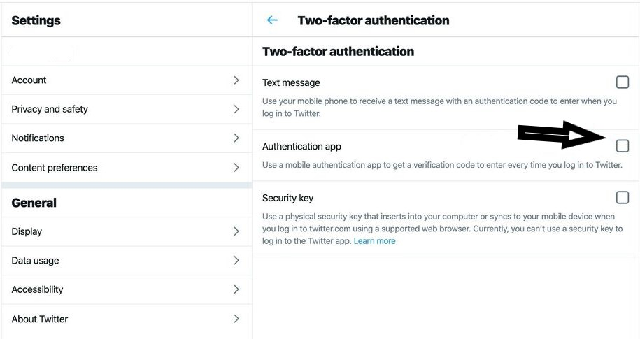
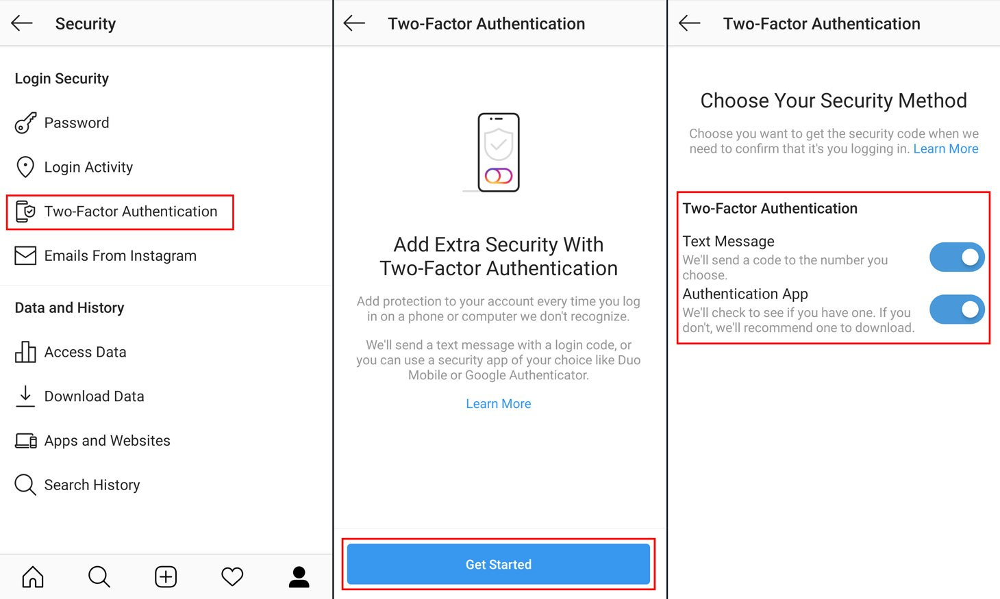

## Introduction

How to set up 2FA on your accounts? And why is it important in the first place? As social media is becoming increasingly popular, security is becoming something of supreme importance. 

Even though choosing a [strong password](https://www.loginradius.com/blog/identity/2021/01/how-to-choose-a-secure-password/) helps you in certain ways, by adopting 2FA, you can improve and enhance security further. So, let's know more about this extra layer of protection and how to set up 2FA on your accounts. 

First stop. 

## **What is Two-Factor Authentication?**

2FA is one of the best security methods that use two layers to verify a consumer's identity. This means, rather than simply entering the password to log into an account, two-factor authentication requires a code to be sent via text message to the consumer's phone number or generated through an app.

This type of verification code helps and ensures that only the authorized consumer can access their account. Similarly, [multi-factor authentication (MFA)](https://www.loginradius.com/blog/identity/2019/06/what-is-multi-factor-authentication/) offers two or more authentication layers to approve account access for consumers. 

## Types of 2FA Methods

SMS Verification is one of the most common forms of 2FA. It involves sending a one-time code via text message to the user's registered phone number. While widely accessible and requiring no internet connection, it is vulnerable to SIM swapping attacks and relies on the reliability of the cellular network.

Authenticator Apps, such as Google Authenticator, Microsoft Authenticator, and Authy, generate time-based codes for authentication. These apps provide offline functionality, making them useful in areas with no network coverage. They are also less susceptible to phishing attacks compared to SMS. However, they require installation and setup on a smartphone, and there is a risk of losing access if the device is lost or reset.

Hardware Tokens, like YubiKey or RSA SecurID, are physical devices that generate codes for authentication. They offer a high level of security since they are not connected to the internet, providing protection against phishing attacks. However, they can be costly to implement for individuals, and there is a risk of losing the hardware token.

Biometric Authentication uses features like fingerprint, face, or iris scans for verification. It offers convenience and a high level of security. However, it requires compatible devices and there is a risk of compromising biometric data.

Backup Codes are pre-generated codes used as a backup when the primary 2FA method is unavailable. They provide access in emergencies but are limited in use and must be securely stored to prevent unauthorized access.

## **What are Authenticator Apps?**

Authenticator apps are meant to be installed on your smartphones to obtain passcodes to sign in to your accounts. They are intended to be more secure than texting; they provide[ flexibility if you are traveling to a place where there is no mobile service](https://www.loginradius.com/blog/identity/2018/12/use-multi-factor-authentication-dont-cell-phone-access/).

Some of the options include [Google Authenticator](https://support.google.com/accounts/answer/1066447?co=GENIE.Platform%3DAndroid&hl=en), [Microsoft Authenticator Authy](https://authy.com/guides/microsoft/), or HDE OTP. 

All these apps follow the same procedure - when you are adding a new user account, you need to scan a QR code associated with the account, and it is saved in the app. 

The next time you sign in to your app or service, it will ask for a numerical code. You need to open up the authenticator app and check the randomly generated authentication code to access your account securely.

## **How to Set up 2FA on Your Social Media Accounts?**

A lot of applications offer 2FA currently, especially if you are storing important and sensitive data, financial information, emails, social media, files, contact details, etc. 

2FA needs more than one factor to login. This might include parameters like "something you are," for example, biometrics in the form of iris scan or fingerprints, "something you know," a password, and "something you have," like a smartphone or hardware key. 

Find out how to set up 2FA on your accounts: 

### 1. Google

If you want to set up an authenticator on the Google account, first you need to download the Google Authenticator app available on the Play Store. Once downloaded, do the following:

*   Go to Gmail and click the profile icon.
*   Choose My account and click on Sign-in & Security. 

You can add the two-**step verification** process here.

Source: Google

### 2. Snapchat

To set up 2FA on your Snapchat account, you will need to:

*   Go to the app’s main camera screen and tap on the profile icon. 
*   Find the gear icon to access Settings.
*   Tap on Two-Factor Authentication and choose whether to obtain verification via a text message or an authenticator app. 

You can add trusted devices or request a recovery code for when you intend to be somewhere without cellular coverage once 2FA has been activated on your Snapchat account. Safety key logins do not currently appear to be supported by Snapchat.

### 3. Whatsapp

To set up 2FA on your WhatsApp account, you will need to:

*   Open WhatsApp on your device. 
*   Under the upper-right hamburger icon, find the Settings menu.
*   Go to Look under Account > Two-step verification > Allow.
*   You will be prompted to end a six-digit PIN to verify your account. If you forget your PIN, you can optionally add an email address.  

Source: lifewire

It is important to have an associated email with your WhatsApp account as the service will not allow you to reverify yourself if you have used WhatsApp and forgotten your PIN within the last seven days. 

### 4. Outlook

To set up 2FA on your Outlook account, you will need to:

*   Sign in to your Outlook account.
*   Click on your name and then click View Account. 
*   Under the Basic Options, click on the link that says Explore more security options.

If you have not set up 2FA yet, you can click on the link and proceed with that. You can switch to Microsoft Authenticator by clicking the Set up identity verification app if you already have it.

### 5. Facebook

To set up 2FA on your Facebook account, you will need to:

*   Sign in to your Facebook account.
*   Click on Settings and choose Security and Login.
*   Check for the use of two-factor authentication in the Setting Up Extra Security section. 
*   Enable the code generator.

You can also use the Facebook mobile app for approving sign-ins on the web or set up a third-party authentication app for generating codes.

Source: Facebook

### 6. Twitter

To set up 2FA on your Twitter account, you will need to:

*   Sign in to your Twitter account.
*   Click on your Profile Icon and then click Settings and Privacy.
*   Click the checkbox next to Verify login requests, under the Security heading.
*   Verify your mobile number and then click Set up a code generator app. 
*   Scan the QR code with the third-party authenticator app. 

### 7. Apple iCloud

*   You can log in to your account at [https://appleid.apple.com/](https://appleid.apple.com/), then search for Two-Factor Authentication under Security.
*   The next step would be to verify your location, and it will send a code to your other Apple devices.

*   **iOS**

To set up 2FA on your iOS account, the steps will be a bit different. Majorly, it will depend on how you have updated your iOS software. 

*   For users using iOS 10.3 or later versions, click on Settings > your Name > Password & Security. 
*   You can turn on 2FA to receive a text message with a code every time you log in. 

For users using iOS 10.2 or earlier versions, go to Settings under iCloud > Apple ID > Password & Security.

*   **macOS**

Similar to iOS, a few of the steps may vary depending on the version of macOS.

*    If you are using Catalina, click the Apple icon, then click System Preferences > Apple ID. 
*   The next step would be to click on Password & Security under your name and finally click Turn On Two-Factor Authentication.

### 8. Instagram

In 2017, two-factor authentication was added by Instagram to the mobile app, which can be activated via the web. If you want to activate 2FA on your mobile device, you need to go to Profile and click on the menu and look for Settings & Security. There you will find two-factor authentication. 

With Instagram, you also get to choose between SMS-based verification and a code sent to the authentication app. 

Source: Kaspersky

## **Why is 2FA important?**

As cybercriminals are getting smarter, 2FA has become more mandatory than ever. Without it, you might end up leaving your [accounts vulnerable to hackers](https://www.loginradius.com/blog/identity/2020/12/login-security/) for sealing your personal information, hacking your online credit card details, and accessing your bank account. By adding the additional step to your account, you get the edge to prevent hackers from accessing your account. 

## Common 2FA Mistakes to Avoid

Using SMS as the Sole Method is a common mistake, as SMS codes are vulnerable to interception through SIM swapping attacks. It is advised to use authenticator apps or hardware tokens for added security.

Not Storing Backup Codes Securely renders them useless if lost or compromised. It is crucial to store backup codes in a secure location, such as a password manager or a locked safe.

Using Predictable Codes is another mistake, as codes generated by apps can be predictable if not set up correctly. It is important to ensure apps are configured for random, time-based codes rather than sequential ones.

Ignoring Biometric 2FA Options is a missed opportunity for added security. Biometric methods offer high security but may not be utilized if available on devices.

Sharing 2FA Codes undermines the purpose of 2FA. Users should be educated not to share codes with anyone, including family and friends, to maintain security.

## Comparison of Popular Authenticator Apps

Google Authenticator is known for its simple setup with QR codes and offline functionality. However, it lacks backup or sync options and does not support multi-device use.

Microsoft Authenticator supports both Microsoft accounts and third-party apps. It offers cloud backup for easy recovery. However, it requires a Microsoft account and may not be as straightforward for non-Microsoft services.

Authy provides multi-device support and offers cloud backup and sync for easy recovery. However, it requires an account for backup, and some users prefer fully offline solutions.

HDE OTP (One-Time Password) is secure and easy-to-use, working offline for added convenience. However, it is less widely adopted than other options and offers limited additional features.

YubiKey, a Hardware Token, boasts high-security standards and does not rely on mobile devices. However, it can be costly for individual users and poses a risk of being lost or damaged.

Users can consider these factors when choosing the most suitable authenticator app based on their needs for security, convenience, and compatibility with various services.

## **Setting Up 2FA Login with LoginRadius Adaptive 2FA/ MFA solution**

LoginRadius provides multi-factor authentication via SMS, email, automated phone calls, account [security questions](https://www.loginradius.com/blog/identity/2019/01/best-practices-choosing-good-security-questions/), and authenticator apps to allow you a customized user experience.  

Based on your business, you can choose to use LoginRadius's Identity Platform's Multi-factor authentication, which is an easy process. 

Currently, LoginRadius provides its support authentication methods via SMS workflow and Google Authenticator workflow.

### For SMS Workflow

You can enable 2FA [SMS verification](https://www.loginradius.com/docs/api/v2/customer-identity-api/multi-factor-authentication/sms-authenticator/mfa-validate-otp/) from the LoginRadius admin console. There's also an option to choose your preferred SMS template and SMS provider.

As the first step, you'll need to apply a first verification factor, like standard email and password login, username and password, automated phone call, or access token. The second factor can be a one-time password or code sent via SMS. 

### Google Authenticator Workflow

For enabling Google Authenticator, the [first step will be](https://www.loginradius.com/integrations/google-authenticator/) to set up your ID in the admin console for Google to identify your website or application on the authenticator.

Next, you will need to set up your QR code specifications or make MFA mandatory. 

Similar to the SMS workflow, you can select standard email and password login, username, password, automated phone call, or access token as the verification factor.

## Final Thoughts

With [cybercrimes on the rise](https://www.loginradius.com/blog/identity/2019/10/cybersecurity-attacks-business/), it is essential to make your online security measures more robust. Hence, to protect your account and the history, you need to learn how to set up 2fa login on your accounts for an additional safety cover. It not only protects your online social accounts but other accounts as well.

## Frequently Asked Questions (FAQs)

**1. How do I enable 2FA login?**

2FA login can be enabled once you have a reliable identity management solution. In the system dashboard, under authentication, you can find 2FA and enable the same.

**2. How do I activate my 2FA code?**

Choose your method (SMS or authenticator app) during setup, then link the code to your account.

**3. What is 2FA and how do you set it up?**

2FA adds a second verification step (like a code from an app). Set it up by downloading an authenticator app, scanning a QR code, and entering the code generated.

**4. Is 2FA easy to use?**

Yes, 2FA is user-friendly. It involves entering a code or approving a notification on your phone during logins.

