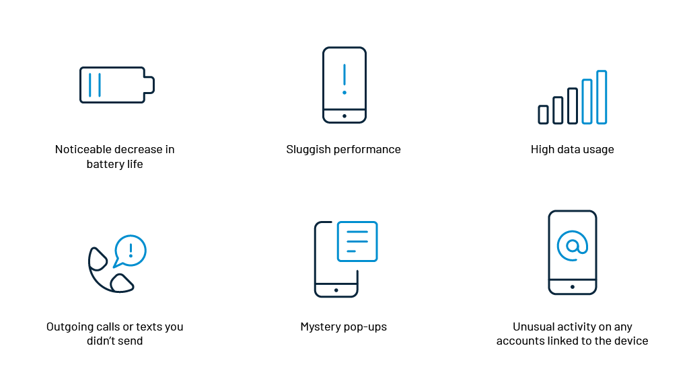
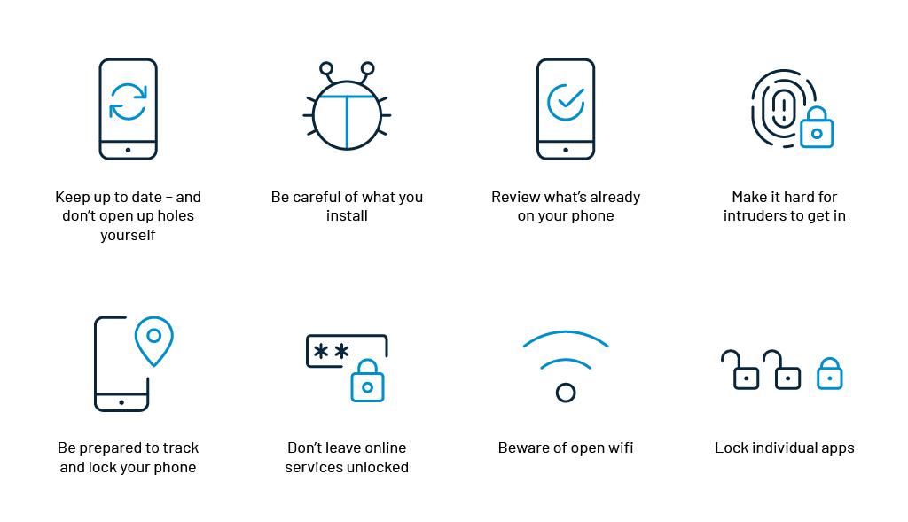

Today, smartphones have become a mini replica of a fully functional computer. A smartphone has wifi connectivity, web browsing capabilities and the ability to run applications that provide a wide range of functions. That's great news for consumers who have active online lifestyles.

But there's bad news too—smartphones have become a data treasure for hackers. It's a target that's hard for them to ignore. For example, hackers use smartphones as “entry points” to attack banks or other organizations for data. They send malicious messages from the victim’s phone - making the user accountable for the theft.

Hackers do not even have to steal the victim's phone to download malware. They just have to plant viruses on websites designed to infect the smartphones and wait for the user to simply click a link on their phone. Such hidden mobile applications accounted for [half of consumer mobile threats](https://www.mcafee.com/content/dam/consumer/en-us/docs/2020-Mobile-Threat-Report.pdf) in 2019.  

## 6 Signs That Confirm Your Smartphone Has Already Been Hacked

If your smartphone is displaying one or more of the following unusual behavior, there is a possibility that your device has already been hacked.

### 1. Noticeable decrease in battery life

If your phone has been compromised by malware, the battery will drain faster than usual. This is because the malware uses the phone's resources to transmit sensitive information back to the hackers' server. So, if the phone usage habits have remained the same, but a noticeable and constant decrease in battery life is seen, then hacking may be the reason. 

### 2. Sluggish performance

Malware and other hacking tools work in the background while using the smartphone's resources and battery power. This reduces performance significantly. Unexpected freezing of apps or crashes, phone restarting, or device heating up are also the signs that you need to keep an eye out for.

### 3. High data usage

Unusually high data usage by a smartphone can be a sign of hacking. Malicious software might be using data in the background to record activities and send information to the hacker.

### 4. Outgoing calls or texts you didn’t send

Strange behavior like outgoing calls or texts, which have not been sent by the smartphone user, can be hackers tapping into the phone.  These calls or texts could be premium-rate numbers that malware is forcing your smartphone to contact. The earnings would be directed to the hacker’s account. 

### 5. Mystery pop-ups

Constant pop-up alerts could indicate that the smartphone has been infected with adware, a form of malware. Hackers use adware to force users into viewing web pages that drive revenue through clicks. While all pop-ups are not necessarily malware attacks, some may also be [phishing](https://www.loginradius.com/blog/identity/phishing-for-identity/) attempts to attract users to give away sensitive information.

### 6. Unusual activity on any accounts linked to the device

If the phone has been hacked, hackers would be able to access social media, email, or apps, putting you at risk for identity fraud. Activities such as resetting passwords, [emails being sent or read](https://www.loginradius.com/blog/identity/2020/12/what-to-do-when-email-hacked/) without the users' knowledge, or new account sign-ups are all signals which indicate that the phone is in the wrong hands. 

## What to Do if Your Phone Is Hacked

If you witness any of the above signs on your smartphone, there is a high possibility that your phone has been hacked. You need to take the appropriate steps to eliminate the malware that has attacked your phone. Some of the steps which you can follow are:

*   Download a mobile security app from a trusted site, which not only scans for malware but offers additional features like a call blocker, firewall, VPN and a feature to request [PIN](https://www.loginradius.com/blog/2020/04/loginradius-pin-based-authentication/) for accessing sensitive apps like online banking.
*   Change passwords as soon as possible.
*   Remove suspicious apps.
*   Inform friends and contacts that you have been hacked. This warning would help your contacts ignore suspicious messages sent by the malware to their phones.
*   Carry out an in-depth maintenance check from your smartphone store. 
*   If everything fails, a factory reset will help to sort the problems. 

## 8 Ways To Stop Someone From Hacking Your Phone Again

Many smartphone users believe that their mobile service providers should deploy [cyber-protection](https://www.loginradius.com/blog/identity/2019/10/cybersecurity-best-practices-for-enterprises/). However, it is also the responsibility of the users to protect themselves from hackers. There are many different ways a hacker can get into your phone and steal personal and critical information. 

Here are a few safety tips to ensure that you do not become a victim of phone hacking:

### 1.   Keep up to date – and don’t dig in holes yourself.

Phones work on the same principle as a computer operating system. Whenever software updates for phone operating systems are available, users need to get their phones updated directly from the manufacturer's website. Hackers exploit vulnerabilities in out-of-date operating systems. Therefore, downloading the latest patches would be of great help in keeping your phone safe. 

### 2.   Be careful of what you install.

Installation of any smartphone app requires users to grant permissions, including reading files, access the camera, or listening to the microphone. There are legitimate uses for these capabilities, but they're potentially open to misuse. Users need to be careful before approving such requests. Always download apps from a trusted source.

### 3.  Review what’s already on your phone.

Users need to keep track of the apps already downloaded on their smartphones. It may have been safe when installed the first time, but subsequent updates could have infected the smartphone. Always keep track of what [permissions have been given to the apps](https://www.loginradius.com/blog/identity/2020/08/securing-enterprise-mobile-apps/) while accessing the operating system of the smartphone. Various security apps would have helped provide an overview of the permissions, but users need to download such apps from trusted sites. 

### 4.   Make it hard for intruders to get in.

Users should ensure that they keep their phone locked when not in use and also set a strong passcode. Smartphones are basically like computers, and hence, need antivirus and malware protection. Install a good antivirus package onto your smartphones to make it difficult for hackers to get in.  Use lock patterns, facial recognition or voice recognition to add an extra level of access security for your smartphone.

### 5.   Be prepared to track and lock your phone.

Services like ‘find my device’ are provided by smartphone manufacturers to help users locate their stolen phone on a map and remotely erase their data. All users need to do is set their phone to automatically erase itself after a certain number of incorrect access attempts.  It is also possible to make a phone ring even if it is kept on silent. It is helpful in tracking down phone that was just stolen. 

### 6.   Don’t leave online services unlocked.

Auto-login is a convenient feature that automatically logs in without entering the password as they are already saved in the browser. It is a huge security risk because hackers simply need to open the browser to access all the online accounts. Instead of using auto-login features, users should use a password manager app that requires them to re-enter a master password regularly. 

### 7.   Beware of open wifi.

Using an open wireless network allows anyone in the vicinity to snoop on what you are doing online. At times, hackers open their own free wireless "hotspots" to attract users to access their wifi.  Once connected, they can easily hack into phones. 

So, whenever you are not sure about the security of the wireless network, use your phone’s mobile internet connection. It will be a much safer and secure option. Users can also opt for VPN tools which route the traffic through a private encrypted channel. Turning on [two-factor authentication for online accounts ](https://www.loginradius.com/blog/identity/2018/12/use-multi-factor-authentication-dont-cell-phone-access/)will also help protect your privacy on public wifi. Users should turn off bluetooth and personal hotspot functions when not required. 

### 8.   Lock individual apps.

Locking your phone is important but as a secondary security measure, lock individual apps too. This capability can be implemented by using apps from a trusted source as they are not an inbuilt feature of the operating system. 

## Conclusion

Smartphones have become an essential part of our daily lives. Once you know about how your phone can be hacked, you can take various safety precautions to protect it from data theft. Furthermore, it will also keep your data secure from opportunist thieves or state-sponsored spies!

