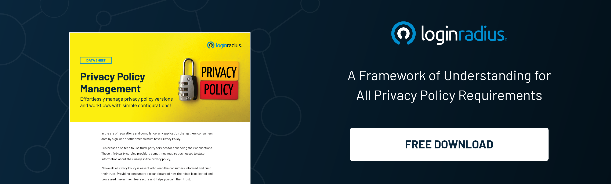

## Introduction

Off late, identity and access management have changed the way organizations manage heaps of customer and workforce identities securely and efficiently. 

Whether we talk about organizations utilizing IAMs internally for managing employees’ identities or using the same solution for handling a limited number of customers, the identity management has been an integral part of business growth. 

However, the conventional IAMs aren’t potent enough to handle peak loads, especially when taking millions or billions of customer identities in real time. 

Here’s where the critical role of CIAM ([customer identity and access management](https://blog.loginradius.com/identity/customer-identity-and-access-management/)) in customer management comes into play! 

A CIAM can be scaled in real-time depending on the load and number of users accessing the services from a single platform. On the other hand, the traditional IAM can’t deliver results for large-scale deployments. 

Let’s understand why organizations should switch to customer IAM and how it’s helping businesses stay ahead of the curve. 

## IAM: Is it Worth for Your Businesses in 2022 and Beyond? 

We’re in a digital-first era where we interact with numerous online platforms daily. Or we can say that multiple applications and media have become integral to our modern lifestyle. 

And hence, we’re always expecting great user experiences reinforced by stringent security since no one would ever wish to sacrifice their identity and personal details. 

The conventional IAM was initially designed to handle a limited number of accounts and users working within an organization. It helped provide secure and restricted access to specific resources based on several parameters. 

However, these services were entirely secure and worked flawlessly within an organization with limited users but needed a great user experience. 

Hence, the exact mechanism for managing many users typically on an online platform won’t work since everyone expects a great user experience, robust security, and accessibility. 

CIAM, on the other hand, delivers exceptional user experience and great accessibility with robust security. Businesses can easily rely on a CIAM when scaling growth by offering a seamless and secure [onboarding experience](https://blog.loginradius.com/growth/smooth-onboarding-positive-user-impression/). 

Let’s understand how a CIAM helps businesses stay ahead of the curve in 2022 and beyond. 

### #1. Strengthened security

In an age where sensational hacking and malicious attacks have become the order of the day, enhanced safeguard against ever-looming threats is indispensable.

By adding multiple layers of shields, new-age CIAM brings into effect strengthened security. Thus, the entire cluster of data remains protected from the prying eyes or, for that matter falling prey to data trackers.

### #2. Strong privacy management

Compliance with local data protection laws can be a chore, especially given their constant evolution. A good customer identity platform should enable you to keep up with local laws anywhere in the world where you do business.

With country-specific or regional control over storing and managing personal data, you’ll always meet legal requirements, saving you compliance management costs each year.

These aren’t the only potential costs you can save—legal fees can run high when privacy management fails. 

Presenting customers with easily self-managed privacy choices and a solid privacy policy also shows them that their data is safe and shows your company is competent and professional in handling these issues. This reputation will encourage customer loyalty in the long run.

### #3. Scalability and uptime

With just one customer identity management system fully managed for you, reliability is maximized, and the need for resources is kept to a minimum. A centralized login system for all of your apps and services makes it easy to add new services as they come online. 

A cloud implementation can [quickly scale up](https://www.loginradius.com/blog/identity/handling-scalability-security-loginradius/) or down depending on your usage, and automated failover can cut downtime to virtually zero.

### #4. Better customer experience

All told, your CIAM platform needs to boost customer experience in every possible way. A reduced initial entry threshold that leverages social login or passwordless login is just the start.

Advanced analytics, effective self-service options, and integration with all of your customer-facing functions should all work to improve the way customers access your systems. 

And storing everything about one customer in the same place—data, analytics, preferences, and browsing/purchase history—will make it much easier for employees to manage customer accounts. 

## In Conclusion 

With increasing customer expectations, businesses need to think out of the box and ensure they offer a great customer experience without compromising security. 

The conventional IAM isn’t the right choice for handling many customers, especially when the peak load changes in real time. 

The aspects mentioned above of leveraging a CIAM shouldn’t be ignored by businesses thinking to accelerate overall growth. 

