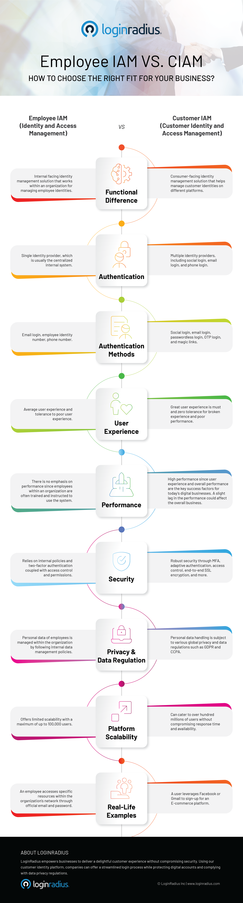

The conventional employee identity and access management (IAM) systems were initially designed to manage employee identities. And they aren’t potent enough to cater to customers' diverse needs pertaining to user experience and security. 

Apart from this, employee IAM also doesn’t help when the needs of consumers are growing with every passing year, and internal identity management systems are not built to keep up.

Users now expect a seamless and secure customer experience across multiple platforms, devices, and touchpoints. And the conventional IAM will always struggle to meet these requirements. 

[Customer Identity and Access Management](https://blog.loginradius.com/identity/customer-identity-and-access-management/) (CIAM) solutions help to improve the customer experience, reduce security risks, shrink costs, and increase the availability of applications.

CIAM solutions are becoming more commonly used in organizations today because they provide several benefits. For example, a customer identity and access management (CIAM) solution can improve the customer experience by increasing the flexibility and customization of applications. 

CIAM solutions can also reduce security risks by allowing users to access only those applications they need for their work tasks. 

Finally, these solutions can be very cost-effective because they allow companies to scale their technology needs by providing an easy way to manage all users with one set of tools.

This is where customer IAM solutions come in. These solutions have been built to handle customer [authentication requirements](https://www.loginradius.com/authentication/), scalability, privacy and data regulations, user experience, and integration.

Compared to employee IAM, a customer identity and access management (CIAM) solution improves the customer experience, reduces security risks, shrinks costs, and increases the availability of applications.

In this infographic, we compare the following features of both an IAM and CIAM solution:

* Functional Difference
* Authentication
* Authentication Methods
* User Experience
* Performance 
* Security
* Privacy & Data Regulation
* Platform Scalability
* Real-Life Examples

