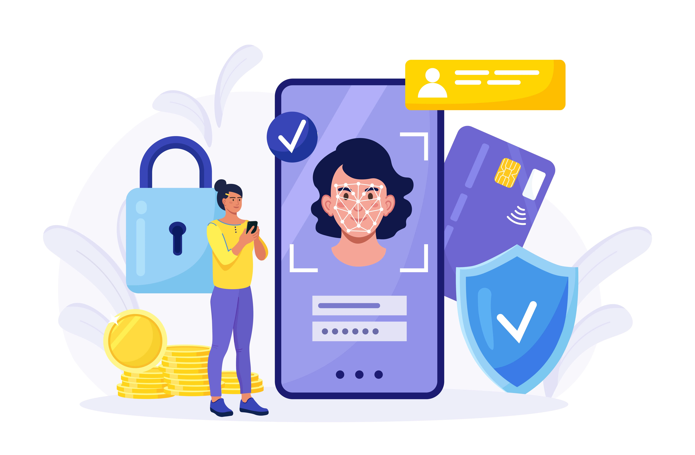

## Introduction 

In the ever-evolving digital ecosystem, maintaining robust access control is more than a security best practice—it's an organizational imperative. At the core of this protection lie three fundamental concepts: identification, authentication, and authorization.

While often used interchangeably, they each serve a distinct role in enabling security identification and safeguarding sensitive information. If misunderstood, organizations risk authentication vulnerabilities, access loopholes, and regulatory non-compliance.

Let’s break down these concepts, explore their differences, and learn how they work together in real-world applications.

## What is Identification?

User identification is the process of stating or declaring who you are to a system. It’s the first checkpoint in [access control](https://www.loginradius.com/products/roles-and-permissions)—providing a unique identifier like a username, email address, or user ID.

In terms of identification in cybersecurity, it's about defining an identity for every human, device, or software system that interacts with an organization’s digital ecosystem. Whether you’re an employee logging into an internal HR system or a customer signing into a mobile app, access identification starts the session.

For instance, imagine a hospital using badge-based RFID systems. A nurse taps their badge on a reader—this act is identification. The system recognizes the badge as belonging to a specific user.

## What is Authentication?

[Authentication ](https://www.loginradius.com/blog/identity/what-is-authentication/)confirms the identity that was presented. Once you've said, “I’m John Doe,” the system demands proof—your password, a biometric scan, or a token from your phone. This is what identity and authentication boil down to: establishing and proving trust.

Modern authentication also involves layered verification. This includes [multi-factor authentication (MFA)](https://www.loginradius.com/blog/identity/what-is-multi-factor-authentication/) or behavioral biometrics to counter emerging threats like authentication vulnerabilities.

Real-life example: You access your cloud storage by entering your password (knowledge factor) and approving a notification on your phone (possession factor). The system now trusts you are indeed who you say you are.

## What is Authorization?

Once a user is both identified and authenticated, authorization comes into play. It determines what the user can do within a system—like viewing data, making edits, or initiating transactions.

In enterprise environments, authorization often maps to roles:

* A regular employee may view internal documents 

* A manager may also approve budgets 

* An IT admin may configure entire networks 

Without proper authorization, even authenticated users can pose risks. For example, a software developer shouldn’t have access to payroll data. This is where [Role-Based Access Control (RBAC) ](https://www.loginradius.com/blog/identity/what-is-rbac/)becomes essential. 

RBAC assigns permissions based on a user’s role within the organization—ensuring that access is granted strictly according to job responsibilities. This minimizes exposure to sensitive information and enforces the principle of least privilege. 

Such role-driven access strategies not only reduce authentication vulnerabilities but also strengthen security identification and ensure robust governance in user access.

## Identification vs Authentication vs Authorization

To build a secure and user-friendly system, it’s critical to understand the roles of these three layers of access control.

<table>
  <tr>
   <td><strong>Feature</strong>
   </td>
   <td><strong>Identification</strong>
   </td>
   <td><strong>Authentication</strong>
   </td>
   <td><strong>Authorization</strong>
   </td>
  </tr>
  <tr>
   <td><strong>Definition</strong>
   </td>
   <td>Claiming an identity
   </td>
   <td>Proving that identity
   </td>
   <td>Granting access to resources
   </td>
  </tr>
  <tr>
   <td><strong>Example</strong>
   </td>
   <td>Entering your username or email
   </td>
   <td>Typing your password or scanning fingerprint
   </td>
   <td>Accessing files based on user role
   </td>
  </tr>
  <tr>
   <td><strong>When it Occurs</strong>
   </td>
   <td>First step of login
   </td>
   <td>Second step—verification
   </td>
   <td>After successful authentication
   </td>
  </tr>
  <tr>
   <td><strong>Used In</strong>
   </td>
   <td>Login forms, registration, device pairing
   </td>
   <td>MFA systems, biometrics, 2FA
   </td>
   <td>Role-based access, permissions frameworks
   </td>
  </tr>
  <tr>
   <td><strong>Failure Risk</strong>
   </td>
   <td>Misidentification
   </td>
   <td>Credential theft, phishing
   </td>
   <td>Privilege escalation
   </td>
  </tr>
</table>

By clearly separating these, businesses can build systems that are secure, user-friendly, and compliant with identification security protocols.

## Real-World Applications of Identification, Authentication, and Authorization

To truly appreciate the difference between identification and authentication, it’s helpful to see where each protocol fits in the real world. These mechanisms don’t exist in isolation—they operate sequentially to protect systems at every stage of a user’s interaction.

Let’s break it down:

### 1. Identification – “Who are you?”

This step is the user’s digital introduction. It typically takes place on login screens or at the beginning of a session. Users enter a unique identifier such as a username, email, or phone number. In more advanced systems, device identifiers or API client IDs may be used to identify machines (through [M2M authorization](https://www.loginradius.com/blog/engineering/using-m2m-authorization-for-apis-and-apps/)) or services instead of humans.

**Used in:**

* Login forms 

* Device pairing 

* API calls (e.g., passing client ID for system access) 

This is the first gate in access identification, helping the system associate incoming actions with a known identity.

### 2. Authentication – “Prove it.”

Once a user claims an identity, the system demands evidence. This could be a password, biometric data, a smart token, or a combination in a multi-factor authentication setup. The aim is to eliminate impostors and ensure the system is engaging with a verified individual.

**Used in:**

* Password logins 

* OTP verifications 

* Biometric scans (fingerprint, facial recognition) 

* Hardware tokens or authenticator apps 

Strong authentication mechanisms protect against common authentication vulnerabilities, such as phishing, credential stuffing, or session hijacking.

### 3. Authorization – “What can you access?”

After successfully identifying and authenticating the user, the system moves to authorization—defining what that verified user can do. This stage enforces access rules based on roles, privileges, or policies.

**Used in:**

* Access to admin tools or dashboards 

* Viewing vs. editing data 

* API permission scopes 

* Role-based access to internal apps 

This step ties directly into identification security and ensures compliance with internal and regulatory access policies.

## To Conclude

The trio of identification, authentication, and authorization is essential to securing digital interactions.

* **Identification** introduces the user. 

* **Authentication** proves the user is genuine. 

* **Authorization** ensures users can  access only what they're allowed. 

Each layer supports the others, and missing even one—identification, authentication, or authorization—can leave systems vulnerable to exploitation, ranging from data breaches to account compromise. 

To stay ahead of evolving threats, organizations must implement strong identification and authentication workflows, mitigate authentication vulnerabilities using [multifactor authentication](https://www.loginradius.com/platforms/multi-factor-authentication) and behavior-based detection, and ensure airtight identification security with audit trails and device-level recognition. 

Whether managing a mobile app, enterprise platform, or IoT network, adopting intelligent identity and authentication strategies is no longer just a technical upgrade—it’s a critical business decision that protects trust, compliance, and long-term resilience.

## **FAQs**

### Q1. What is an identification vs authentication example? 
**A.** Identification: A user enters their email address to log in. 
 Authentication: They then enter their password or fingerprint to verify that identity.

### Q2. Why is verification needed in addition to authentication? 
**A.** Verification adds a secondary check to ensure the person authenticating is genuine. For instance, a phishing attacker may steal a password—but device fingerprinting or behavior-based verification can still detect an anomaly.

### Q3. What is the difference between identifier and authenticator? 
**A.** An identifier is what the system uses to recognize a user (username, email). An authenticator is what the user provides to prove their identity (password, token, biometric scan).

### Q4. How to prevent identification and authentication failures?
**A.** Here’s what you can do to prevent identification and authentication failure: 

* Use adaptive authentication based on risk levels 
* Rotate and encrypt credentials 
* Educate users about phishing and spoofing 
* Implement access identification controls and logging 
* Leverage platforms like LoginRadius for seamless and secure identity and authentication

