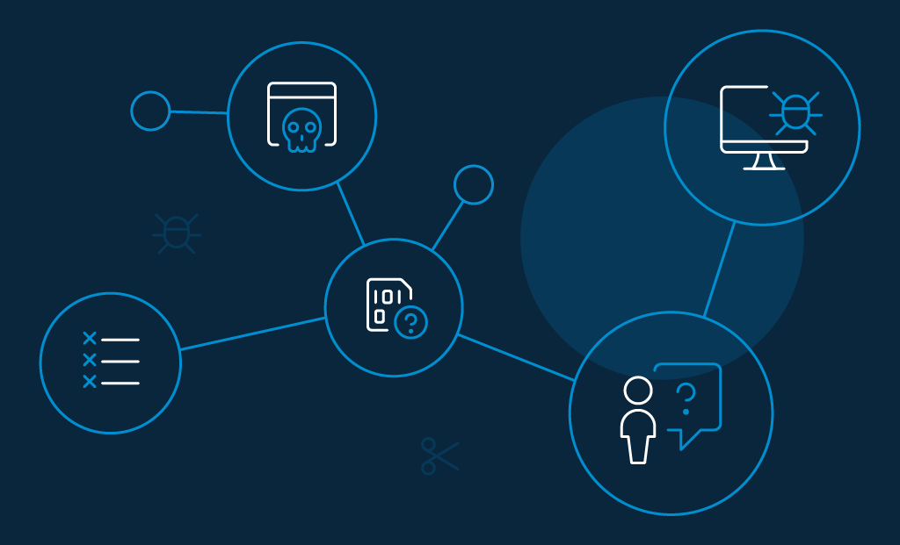
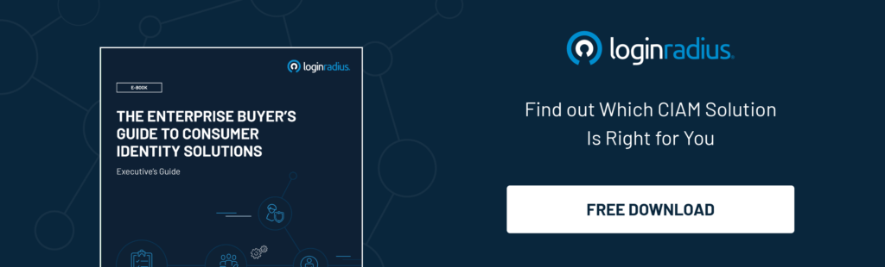

Planning to work out some identity management best practices for 2021? 

2020 has not been a good year in the history of cybersecurity and identity management. With the pandemic forcing many organizations to shift their workforce to remote environments abruptly, security and business continuity concerns hit real hard for the majority of IT stakeholders. 

Not surprisingly though, external threat actors sought COVID-19 as the perfect opportunity to facilitate large-scale cyber attacks. Speaking of figures, [cyber insurance and security company](https://info.coalitioninc.com/download-2020-cyber-claims-report.html?utm_source=pr-newswire&utm_medium=web-referral&utm_campaign=dlc-2020-cyber-claims-report&utm_term=download&utm_content=press-release), Coalition observed a 47% increase in the severity of ransomware attacks and a whopping 100% increase in the count from 2019 to Q1 2020.

The dust is still settling. With compromised credentials remaining a key component in most cyberattacks, it is time for business leaders to reevaluate their identity and access management best practices for 2021 and start executing. 

## Some Current Global Cybersecurity Challenges That Corporates Face

- **Phishing attacks**: [Phishing attacks](https://www.loginradius.com/blog/phishing-for-identity/) are getting more and more sophisticated. Nowadays, because employees have grown to become more aware of hackers' phishing tactics, the latter has up their game. For example, cybercriminals are leveraging AI and machine language to deliver believable false messages in the expectation that recipients will unintentionally breach their organizations’ networks, systems, and corporate databases. 
- **Electronic Medical Records**: With hospitals and medical facilities digitalizing patient records, Electronic Medical Records or EMRs are fast becoming the next big target for cybercriminals. Hackers are exploiting the multiple flaws in their security defenses. And now that the medical records of patients are almost all public, EMRs are gradually turning into breeding grounds for hackers, due to the confidentiality of the records they hold. 
- **Cloud vulnerability**: Due to the versatility & costs associated with the legacy data center, businesses are rapidly shifting their confidential data from legacy data centers to the cloud. According to a prediction by `Forbes.com`, 83% of enterprises' workload will be on the cloud by 2020. But then, it will be creating new challenges and worsening the existing ones for businesses. Among the top cloud security vulnerabilities in this row include account hijacking, DDoS attacks, data breach insecure interfaces and APIs, malicious insider threats, and misconfiguration. 
- **BYOD-related challenges**: Bring Your Own Device or BYOD turns out to be carrying its own set of advantages and [cybersecurity challenges](https://www.loginradius.com/blog/2019/10/cybersecurity-attacks-business/) for enterprises. On the one hand, businesses enjoy a great deal of cost-cutting by letting employees work on their own devices. But on the other, it has been increasing the strain on security systems. Numerous data leaks and malware infections are already detected. It has turned out to be much harder to track and manage different types of devices.
- **Internet Of Things (IoT)**: With the adoption of IoT, companies are becoming more dependent on interconnected technology. As a result, attackers are exploiting the vulnerabilities in the IoT infrastructure. Security threats like DDoS and ransomware are becoming a common occurrence. 

## What Is Identity and Access Management

[Identity and access management](https://www.loginradius.com/blog/identity/what-is-iam/) (or IAM) enables businesses to define the roles and privileges of individual users within the network. They request consumers to provide relevant information, automate identity management, accounts, and credentials. 

IAM improves the overall consumer experience by ensuring compliance with corporate policies and government regulations using security tools like multi-factor authentication (MFA), consent and preference management services, [single sign-on (SSO)](https://www.loginradius.com/blog/2019/05/what-is-single-sign-on/), and more. 

As we move into a new decade, the consumer identity and access management market will not only be more critical than ever but look different than it was a few years ago. In fact, it is also expected to grow from USD 7.6 billion in 2020 to [USD 15.3 billion by 2025](https://www.marketsandmarkets.com/Market-Reports/consumer-iam-market-87038588.html#:~:text=The%20global%20consumer%20identity%20and%20access%20management%20market%20size%20is,15.1%25%20during%20the%20forecast%20period.). 

By 2021, your business must incorporate the following identity and access management best practices to succeed. 

## 9 Identity and Access Management Best Practices That Every Corporate Should Follow

### 1\. Implement zero-trust security

The best strategy in the dynamic setting of modern business networks is to presume that no one is trustworthy unless proved otherwise. 

The zero trust model is focused on continuously authenticating consumers—activities are tracked, and risk levels are evaluated during each session. Zero trust equips a device to identify abnormal behaviors that suggest a breach or violation of the law.

### 2\. Use multi-factor authentication

[Multi-factor authentication](https://www.loginradius.com/multi-factor-authentication/) or MFA is the first step in building layers of trust for your consumers' accounts. Apart from the password, it offers two additional layers of authentication.

- Something your consumers have.
- Something your consumers have inherited. 

The former could be a key or a security pass. While the later means biometrics, for example, retina scans, fingerprints, or voice recognition that your consumers have inherited. 

MFA ensures that even if one layer is compromised, the hacker still has to break in another layer of security to access your system. 

### 3\. Avoid privileged accounts

The Principle of Least Privilege (also known as The Principle of Least Authority) applies to the practice of assigning minimum levels of access – or permissions to a consumer that is essential to accomplish their roles and corresponding duties. 

Though privileged accounts are necessary for some tasks, it should not be followed as an everyday practice. Because if a data breach happens to such accounts, the result may be catastrophic. 

An efficient way to reduce the possibility of internal and external data breaches is through [role-based access control (RBAC)](https://www.loginradius.com/role-management/) or the restriction of non-essential access to sensitive information. 

You can apply this identity and access management best practice by offering access to a consumer for a specific timeframe (for example, 30 minutes) and then automatically revoking access. Micromanaging access in this way can improve the overall cybersecurity quotient. 

### 4\. Enforce a strong password policy

Strong passwords have always been one of the pillars of an impactful IAM strategy. The best ones should be easy to remember and hard to guess. Here are a few best practices for password creation recommended by NIST.

- The ideal length should be between eight to at least 64 characters.
- Use special characters.
- Avoid sequential and repetitive characters like (e.g., 12345 or zzz).
- Set-up a password expiration policy.
- Restrict the use of dictionary words as passwords. 

### 5\. Self-serve onboarding procedures

Self-serve onboarding is enabling your consumers to onboard themselves. The onboarding journey often starts with a registration page. Your job is to drive your consumers past the registration page and then onto activation. It also, ultimately, helps you retain them.

The more you can adapt your approach to their needs, the easier it will be to win loyal consumers. A few other areas you can successfully deliver include passwordless login, password reset, profile management, [consent management](https://www.loginradius.com/blog/2020/05/consent-management/), and preference management. 

### 6\. Adhere to regulatory compliances

Another identity and access management best practice are to roll out [data security policies](https://www.loginradius.com/blog/2020/06/consumer-data-privacy-security/) and procedures wherever possible and practically. Ensure that you adhere to global regulatory compliances like the General Data Protection Regulation (GDPR), [California Consumer Privacy Act](https://www.loginradius.com/blog/2020/03/how-loginradius-helps-enterprises-stay-ccpa-compliant-in-2020/) (CCPA), and other security standards like Health Insurance Portability and Accountability Act (HIPAA).

Consumers worry about the safety of their data the most. Adherence to regulatory enforcement reaffirms that their data is safe and in trustworthy hands. 

### 7\. Go passwordless

As the name suggests, [passwordless login](https://www.loginradius.com/blog/2019/10/passwordless-authentication-the-future-of-identity-and-security/) is the method of authenticating consumers without the need to enter a password. The benefits of going passwordless are many— it improves overall consumer experience as consumers no longer need to memorize any credential, saves time and productivity, more robust security against attacks like phishing, credential stuffing, and brute force, and greater ease of access.

Passwordless login can be implemented through different approaches. A few of the common ones include:

- **Email-based login**: Consumers can log in through a unique code sent to the associated email ID.
- **SMS-based login**: Consumers can log in through a unique code sent to the associated phone number.
- **Biometrics-based login**: Consumers can log in through biometric technologies like fingerprint, face, or iris scans.
- **Social login**: Consumers can log in through their existing social media accounts like Facebook, Twitter, or Google.

### 8\. Conduct routine audits

There may be times when you provide access to someone; it stays in the same condition even if the access isn't required anymore. Anyone with malicious intent can access this data and conduct a breach.

Therefore, it is always safe to opt for routine [access audits](https://www.loginradius.com/blog/2020/07/loginradius-consumer-audit-trail-data-analysis/). You can review the given accesses and check if those accesses are still required. When a consumer needs additional access or wants to revoke access, you can take care of such requests accordingly in a timely fashion. 

### 9\. Choose LoginRadius as an ideal IAM provider

Data is powerful, so it must be available to only the right people. One of the key tools you can use to ensure corporate cybersecurity is identity and access management. There are several IAM providers in the market, but how do you know which is your organization's best solution? 

LoginRadius offers just the right framework (including the ones mentioned above) to go beyond consumer expectations—which is all that matters. 

As an ideal [CIAM solution](https://www.loginradius.com/blog/2019/06/customer-identity-and-access-management/), LoginRadius is scalable and easy to deploy. It offers advanced MFA solutions, third-party vendor management using federated SSO protocols, zero-trust security architecture, and robust access management so that consumer workflow is duly specified and streamlined. 

## Conclusion 

Enforcing identity and access management best practices require that you understand who can access your sensitive data and under what circumstances they can access it. 

You also need a comprehensive overview of your organization’s IT infrastructure so you can monitor all your elements for potential and existing threats. Staying updated on the latest industry trends will help you improve your current IAM environment.

