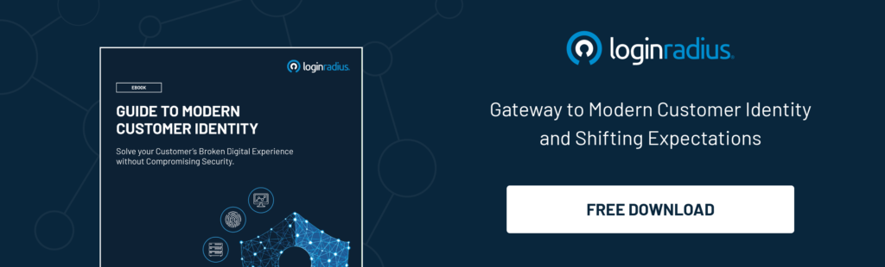
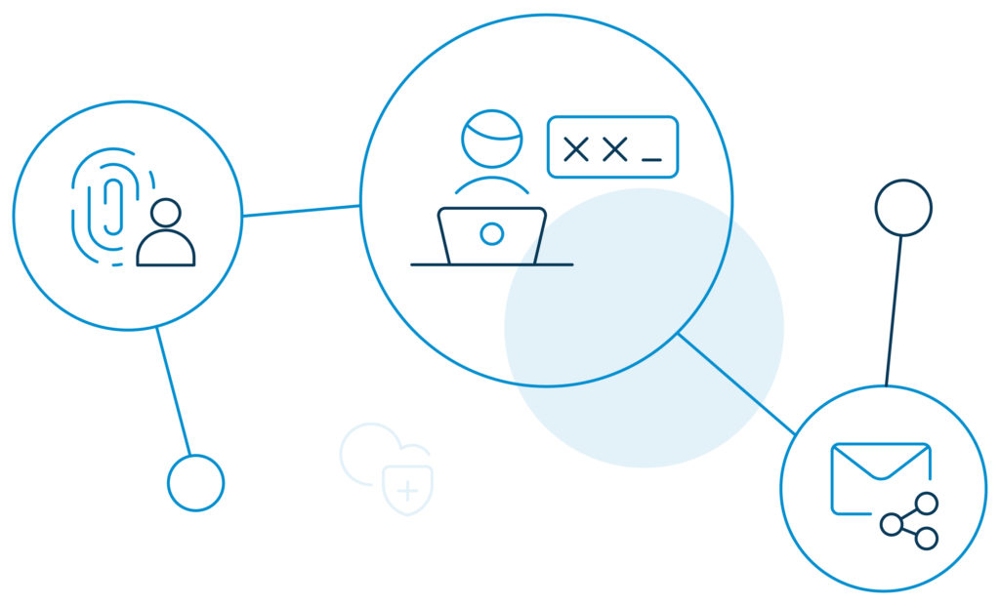
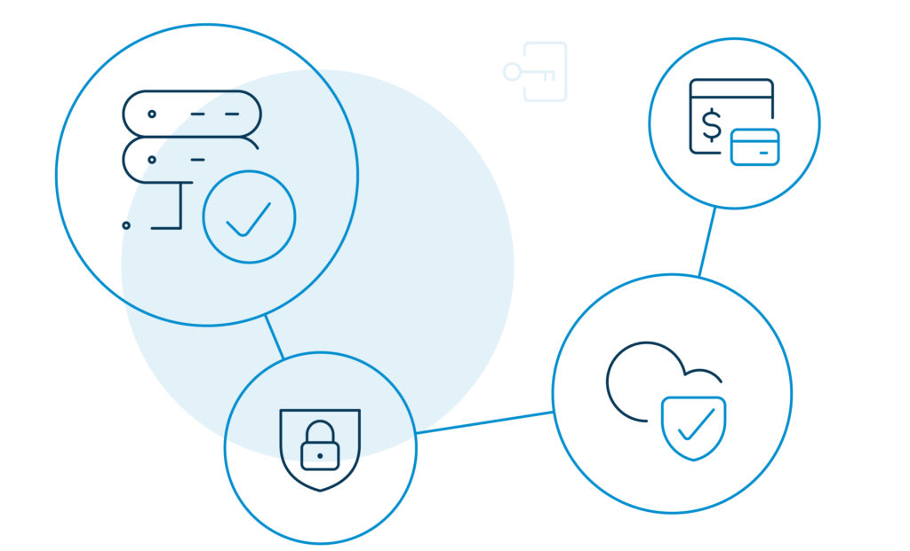

Identity as a Service (IDaaS) can be a game-changer for your business—but only if you know how to play it right. 

Speaking of which, the term identity refers to characteristics that make an entity recognizable. Likewise, [digital identity refers](https://www.loginradius.com/blog/2019/10/digital-identity-management/) to attributes that identify people, organizations, or other entities online.

With more and more businesses migrating to the cloud, the demand for [seamless authentication of digital identities](https://www.loginradius.com/authentication/) has reached a critical point.

Experts predict a massive change in the way enterprises handle [customer identity and access management](https://www.loginradius.com/blog/2019/06/customer-identity-and-access-management/) (CIAM) within the next decade. 

By 2022, Identity as a Service (IDaaS) solutions is expected to grow the identity and access management space to a [$13.42 billion property](https://www.gartner.com/account/signin?method=initialize&TARGET=http%253A%252F%252Fwww.gartner.com%252Fdocument%252Fcode%252F369430). Hence, _now_ is the best time to invest in a secure, highly accessible, simplified, low-risk solution like IDaaS.

## What is Identity as a Service (IDAAS)? 

Identity as a service (IDaaS) refers to identity and access management services that are offered through the cloud or via SaaS (software-as-a-service) systems. It offers cloud-based authentication delivered and operated by third-party providers on a subscription basis.

In short, IDaaS helps manage digital identities so that the right users can access the resources that are meant for them.

IDaaS is a win-win for both businesses and their customers. With modern IDaaS access features, there’s no need for end-users to remember multiple account credentials. Likewise, system administrators can reduce the number of user accounts they have to manage. 

## 3 Benefits of Identity as a Service (IDAAS) for Developers

As an application developer, you must see features like registration, authentication, and account recovery as opportunities to [better customer experiences](https://www.loginradius.com/customer-experience-solutions/). But, that’s not it. The following are three important benefits of IDaaS for developers.

### Decentralization of identity

IDaaS allows application developers to decentralize the user identity from the application. This leads to the following advantages for developers.

- If there is no need for the user identity information any longer, there's no point in storing it in their databases.
- The identity of a user does not resonate with the application, and all developers should care about is a unique identifier.
- The [CIAM platform](https://www.loginradius.com/blog/2019/06/perfect-ciam-platform/) will also manage the non-feature work like user CRUD, password CRUD, etc. That's another burden of the load.

By letting an external service handle identity and authentication, developers can focus on bringing more value to the business. 

### IDaaS is API-based 

One of the core competencies of IDaaS is that they are API-first. Interestingly, most of these third parties provide on-demand expertise that would otherwise become more time-consuming and resource-heavy, if developed in-house.

By leveraging APIs, developers can add them to their existing technology and save a significant amount of time.

### Bridge the gap between developer and security teams

With developers constantly bugged to build revenue-generating apps in shorter deadlines, IDaaS allows them to get the job done quickly, and simultaneously create high quality and secure output. 

Furthermore, IDaaS has the potential to deliver a secure, streamlined on-demand identity expertise. Such strategies can also do a great deal to reduce internal tension and eventually bridge the gap between developers and the security workforce.

## 3 Benefits of Identity as a Service (IDaaS) for Businesses

A comprehensive IDaaS solution brings a plethora of benefits to the entire business environment. There's agility, security, and efficiency, to name a few. Some other advantages include:

### Freedom to choose

IDaaS allows businesses the freedom to choose the right IT resources that fit them and their customers. When they have the best tool to get their job done, that leads to better agility and increased speed. The outcome? A competitive position in the market.

### Increase in productivity

IDaaS offers the liberty to businesses to manage their IT environment from a single platform. There's less scope for human error too. With a comprehensive identity solution, they can let their customers access multiple web properties with a [single set of credentials](https://www.loginradius.com/blog/2019/11/benefits-single-sign-on-sso/). This leads to increased productivity and better security. 

### Stronger security

A modern IDaaS solution secures identities and protects your IT environment. With features like MFA, SSO, and password complexity, businesses can control access and increase security. Needless-to-say, with identities being the epicenter of every cyberattack, identity security features such as these are instrumental in [safeguarding your digital properties](https://www.loginradius.com/blog/2019/12/digital-privacy-best-practices/). 

## 7 Core Components of IDaaS in an Enterprise Environment 

The features and functionalities of an Identity as a Service solution vary across all market segments but generally include digital identity access and management. Here are some of the most common components.

### 1\. Cloud-based and multi-tenant architecture

A typical IDaaS vendor will operate a [multi-tenant service](https://www.loginradius.com/multi-tenant-cloud/) delivery model. The vendor will issue updates and performance enhancement requests whenever these become available. 

### 2\. Password management and authentication

IDaaS service taps all the points of an ideal identity and access management platform. It includes maintaining features like multi-factor authentication and biometric access across all access points. 

### 3\. Single Sign-On (SSO)

When it comes to customer identity and access management, [single sign-on](https://www.loginradius.com/blog/2019/05/what-is-single-sign-on/) is a vital feature. 

SSO is designed to maximize the end-user experience while simultaneously maintaining the security of a network. With SSO, users are encouraged to use strong password combinations to access their everyday IT services. 

In an Identity as a service environment, SSO allows [enterprises to secure authentication](https://www.loginradius.com/single-sign-on/) for third-party services without requiring an internal IT department’s involvement.

### 4\. Multi-factor authentication

[Multi-factor authentication (MFA)](https://www.loginradius.com/blog/2019/06/what-is-multi-factor-authentication/) is associated with Identity as a Service and is occasionally referred to as two-factor authentication. Using multiple factors for authentication helps prevent data breaches, making it one of the best ways to protect digital identities.

Other examples of how MFA works include Google 2-Step Verification and Microsoft Authenticator. Both work on the TOTP (time-based one-time password) mechanism. 

Biometrics uses the "inheritance" as a means of verification—meaning something the user is. 

SMS and voice verifications are also popular multi-factor authentication methods. Iris or retina recognition, fingerprint, hand, thumbprints, full facial recognition, and DNA usage are catching up too. 

### 5\. Automated approval workflows

Identity as a Service also utilizes automated approval workflows. These workflows help IT admins to:

- Offer access privileges to multiple apps.
- Enforce GUI-based configuration capabilities. 
- Manage user-account provisioning.
- Follow [governance frameworks](https://www.loginradius.com/data-governance/) for risk assessment.

### 6\. Analytics and Intelligence

Using analytics and intelligence capabilities in IDaaS lets enterprises report misuse related to access privileges. This makes it easier to detect anomalies in user functions and data usage. 

### 7\. Governance and Compliance

Enterprises can leverage the intelligence capabilities of an Identity as a Service platform to manage [governance and compliance](https://www.loginradius.com/blog/2020/07/data-governance-best-practices/)\-related workflows. Real-world authentication processes can be aligned with governance policies to mitigate security risk.

## Some new regulations that are protecting identities include:

**1\. General Data Protection Regulation (GDPR)**

GDPR is the core of Europe's [digital privacy legislation](https://www.eugdpr.org/). It requires businesses to safeguard the personally identifiable information (PII) of the European Union citizens for transactions that occur within the member states. Failure to comply may cost dearly. Individual rights include: 

- Right to be informed.
- Right of access.
- Right to rectification.
- Right to erasure.
- Right to restrict processing.
- Right to data portability.
- Right to object.

**2\. California Consumer Privacy Act (CCPA)**

The CCPA is a state-level law that [mandates that businesses](https://www.loginradius.com/blog/2020/03/how-loginradius-helps-enterprises-stay-ccpa-compliant-in-2020/) inform customers of their plan to monetize their data, and provide them with a clear means of opting out, whenever required. Any violation can lead to hefty fines. A few other requirements include:

- Businesses must disclose what information they collect.
- Businesses must delete customer data upon request. 
- Customers can opt-out of their data being sold.

## 5 Reasons Why LoginRadius IDaaS Is the Right Fit for Your Enterprise

In a world that’s swiftly migrating to the cloud, the LoginRadius IDaaS provider is positioned to [combine both security](https://www.loginradius.com/security/) and ease-of-use in solving emerging business needs for enterprise-level organizations. 

Here’s what LoginRadius IDaaS can do for your digital enterprise. 

### 1\. Faster implementation

LoginRadius IDaaS implementation in the cloud is fast and straightforward. Since servers are already [installed in the cloud](https://www.loginradius.com/identity-api/), you only need to configure your chosen platform according to your IT protocols to get it up and running.

### 2\. Easy third-party integrations

A cloud-based Identity as a Service platform like LoginRadius easily integrates with [3rd-party apps](https://www.loginradius.com/cloud-integrations/). You can also add or remove any feature from your existing CIAM environment at any time, such as MFA, SSO, or [Progressive Profiling](https://www.loginradius.com/blog/2019/02/presenting-progressive-profiling-loginradius/).

### 3\. Seamless data migration 

Transferring identity data to a new environment in the cloud may seem daunting to the uninitiated. LoginRadius provides customers with [data migration software](https://www.loginradius.com/blog/2020/07/loginradius-identity-import-manager-data-migration/), and sets up and executes the migration for a seamless, hassle-free transfer.

### 4\. Passwordless Authentication 

[Passwordless Authentication](https://www.loginradius.com/blog/2019/10/passwordless-authentication-the-future-of-identity-and-security/) deters cybercriminals by reducing the risk of password sprawl. With the LoginRadius IDaaS platform, you can set up secure, passwordless authentication and secure password resets.

### 5\. No need for CIAM experts

CIAM experts are an asset to any company when it comes to implementing IDaaS and securing customer identities. Luckily, onboarding a CIAM expert isn’t necessary when using Identity as a Service. With LoginRadius CIAM, we are with you every step of the way in your digital transformation.

## Conclusion

There is a lot of anticipation about Identity as a Service in solving real-world business problems. It is important, and no, you cannot mess it up. Because then, you will be out of business. No wonder, IDaaS has already entered the mainstream and will continue growing from here.

