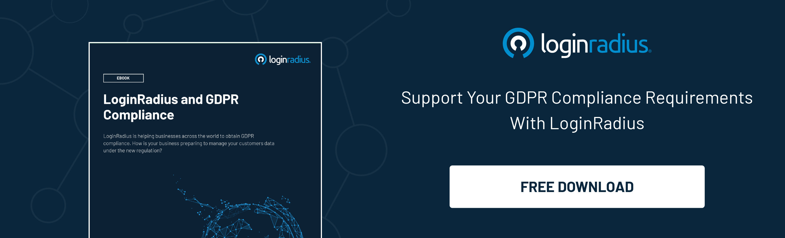

## Introduction 

Digital transformation has revolutionized how organizations operate, allowing them to achieve new levels of efficiency, scalability, and innovation. However, this transformation comes with some undeniable challenges, including managing and securing an ever-increasing number of user identities and access privileges. 

This is where a culture of identity governance emerges, providing the foundation for unlocking digital transformation success. 

By prioritizing identity governance as a critical aspect of their [digital transformation strategy](https://www.loginradius.com/blog/identity/enterprise-needs-digital-business-transformation-strategy/), organizations can ensure that they are effectively managing user identities and access, both of which are critical to the success of any digital initiative.

Let’s have a deeper look at the aspects of leveraging identity governance and how it paves the way for the digital transformation of a business. 

## What is Identity Governance?

[Identity governance](https://www.loginradius.com/blog/identity/identity-governance/) refers to the policies, processes, and technologies that enable organizations to manage user identities and access rights. It  helps organizations to ensure that access to digital resources and data is granted only to authorized users while preventing unauthorized access.

## The Power of a Culture of Identity Governance

A culture of identity governance is a mindset that emphasizes the importance of managing identities and access rights in all aspects of digital transformation. It means prioritizing identity governance and embedding it into all processes and technologies. 

This culture can drive success in digital transformation in several ways:

### 1. Better Security

A culture of identity governance ensures that access to digital resources and data is granted only to authorized users while preventing unauthorized access. This enhances security and protects sensitive data from potential breaches.

### 2. Great User Experience

CIAM solutions, part of an identity governance culture, can provide a seamless and personalized user experience. By leveraging user data, [CIAM solutions](https://www.loginradius.com/blog/identity/customer-identity-and-access-management/) can provide customized experiences that meet individual needs and preferences.

### 3. Increased Efficiency

Identity governance helps organizations to streamline access management processes and reduce manual intervention. This improves efficiency and reduces the risk of errors.

### 4. Compliance

Identity governance ensures that organizations comply with regulatory requirements around data privacy and security. For instance, the GDPR and the CCPA data privacy and security regulations require businesses to implement identity governance. 

## How a Cutting-Edge CIAM Fulfills the Identity Governance Criteria?

A CIAM solution can provide a centralized platform for managing identities, access controls, and security policies, ensuring only authorized users can access sensitive data and resources. And hence, reassuring identity governance. 

A robust identity governance culture through a CIAM solution ensures enhanced business and customer data security. With the proliferation of digital devices and applications, managing identities and access privileges has become increasingly complex. 

And a little loophole in managing these identities could be fatal for a business. CIAM addresses all the issues about customer identity security by incorporating multiple layers of authentication and authorization. 

Apart from this, one of the primary benefits of implementing cutting-edge Customer Identity and Access Management (CIAM) is its improved user experience. CIAM solutions allow organizations to provide personalized, seamless user experiences across all touchpoints, from login to checkout and beyond. 

By [simplifying the login process](https://www.loginradius.com/authentication/) and allowing users to access the resources they need quickly, organizations can increase engagement and loyalty while reducing churn.

## Benefits of Cutting-edge CIAM like LoginRadius 

A robust CIAM like LoginRadius is critical in ensuring a seamless and secure user experience. And it offers a variety of business benefits, including: 

### 1. Single Sign-On

LoginRadius offers [single sign-on](https://www.loginradius.com/single-sign-on/) (SSO) capabilities, allowing users to access multiple applications with single credentials. This improves user experience and reduces the risk of password-related security issues.

### 2. Multi-Factor Authentication

LoginRadius’ multi-factor authentication (MFA) capabilities enhance security and reduce the risk of unauthorized access.

### 3. Consent Management

Cutting-edge CIAM solutions provide consent management capabilities, enabling users to control the use of their data. This helps organizations comply with data privacy regulations and enhances trust between users and organizations.

### 4. Personalization

LoginRadius CIAM leverages user data to provide personalized experiences. This improves user engagement and loyalty.

## In Conclusion 

A culture of identity governance and cutting-edge CIAM solutions are critical to unlocking success in digital transformation. 

By prioritizing identity governance and leveraging a robust CIAM solution, organizations can enhance security, improve user experience, increase efficiency, and ensure compliance with regulatory requirements. 

