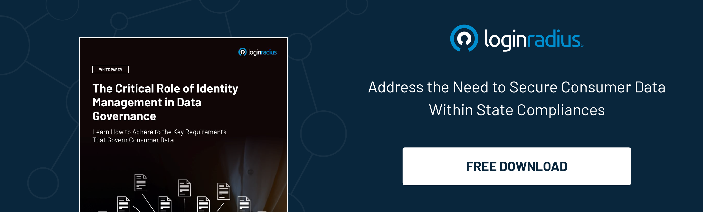

## Introduction

The modern digital identity landscape is ever-evolving. And hence, securing customer identities becomes an increasingly complex task. Though most businesses leverage cutting-edge technologies, including a customer identity and access management (CIAM) solution, they aren’t sure what identity management and identity governance is. 

And understanding the fundamental differences between [identity governance](https://www.loginradius.com/blog/identity/identity-governance/) vs. identity management is undoubtedly the initial step for organizations to embark on a journey to secure billions of customer identities. 

But why do organizations need to know the difference between the two aspects of digital identity? As organizations strive to balance enabling seamless user access and fortifying their defenses against cyber threats, understanding the key differences becomes paramount.

Let’s explore the differences between identity management and identity governance and how implementing both can pave the way for a seamless and secure user experience. 

## Understanding Identity Governance vs. Identity Management

### Identity Governance

Often abbreviated as IG, it represents a strategic framework that ensures the right individuals have the appropriate access to resources while abiding by regulatory standards. It's akin to an overseer, monitoring and enforcing compliance across the organizational spectrum. With an emphasis on transparency, IG tackles the 'who, what, when, and why' of access privileges. This proactive approach prevents data breaches and assists in meeting compliance mandates like [GDPR, HIPAA](https://www.loginradius.com/blog/identity/stay-compliant-with-data-privacy-laws-2023/), and more.

### Identity Management

Identity Management (IDM) focuses on the practical aspect of granting, altering, and revoking access to resources for organizations serving many customers. IDM is your gatekeeper, streamlining the user lifecycle from onboarding to offboarding. Its main goal is to facilitate efficient access provisioning and de-provisioning while ensuring users have the tools to perform their roles effectively. IDM systems often involve authentication mechanisms like single sign-on (SSO) and [multi-factor authentication](https://www.loginradius.com/multi-factor-authentication/) (MFA) to enhance security.

## Navigating the Differences

### 1. Scope and Purpose 

Identity Governance zooms out to view the bigger picture—ensuring alignment between access controls and business objectives. It's all about strategy, compliance, and risk management. Conversely, Identity Management takes a hands-on role, managing the technicalities of [access provisioning](https://www.loginradius.com/provisioning/) and user authentication.

### 2. Reactive vs. Proactive 

Identity Management primarily responds to immediate access needs, adapting to user requirements. Identity Governance, however, adopts a proactive stance, setting the stage for controlled and compliant access from the get-go.

### 3. Compliance as a Driving Force

Identity Governance is intrinsically tied to regulatory compliance, making it an essential component for sensitive data industries. While [supporting compliance](https://www.loginradius.com/compliances/), Identity Management is more concerned with optimizing access for efficiency.

### 4. Holistic View vs. Operational Efficiency 

IG examines access controls from a comprehensive viewpoint, connecting the dots between access rights, business roles, and policies. IDM, in contrast, focuses on ensuring access efficiency, convenience, and security.

### 5. Strategy vs. Execution 

Think of Identity Governance as the strategist who defines access policies and ensures they align with the organization's mission. On the other hand, Identity Management is the executor, ensuring that the defined strategies translate into effective access management.

## Why Businesses Need a Perfect Blend of Identity Management and Identity Governance in 2023 & Beyond?

In today’s modern digital landscape, where information is a prized asset and cyber threats are a constant concern, organizations face the challenge of maintaining robust security measures while ensuring efficient operations. 

As we step into 2023 and beyond, the significance of harmonizing Identity Management and Identity Governance has never been more apparent. These concepts, each with distinct roles, can be likened to the gears that drive an organization's cybersecurity engine. But why is it essential to strike the right balance between them?

### 1. Operational Efficiency and Strategic Alignment

Identity Management, focusing on user access and authentication, streamlines the user experience and ensures that the right individuals access resources appropriately. It's about optimizing processes and enhancing operational efficiency. 

On the other hand, Identity Governance casts a broader net, encompassing strategic oversight, compliance adherence, and [risk management](https://www.loginradius.com/blog/identity/risk-management-with-holistic-apis/). By blending the strengths of both IDM and IG, businesses can achieve a dual advantage: they enhance operational efficiency while ensuring that these efficiencies remain within the boundaries of compliance and risk management strategies.

### 2. Agility in an Evolving Landscape

The digital landscape is ever-changing, with new technologies, threats, and compliance requirements emerging frequently. Businesses need to be agile and adaptable to thrive in such an environment. 

The combination of Identity Management and Identity Governance provides the agility necessary to respond to these changes effectively. IDM ensures quick and secure access to resources, while IG sets the stage for adjustments that align with evolving compliance and security demands. 

This blend empowers businesses to stay ahead of the curve while maintaining a secure posture.

### 3. Data Privacy and Compliance

In an era of stringent data protection regulations, organizations must ensure their operations align with privacy mandates like GDPR, CCPA, etc. Identity Governance plays a pivotal role in this realm by governing access controls and permissions, ensuring that only authorized users handle sensitive data. 

Paired with Identity Management, which enables secure authentication and access, businesses can establish a robust defense against potential breaches while upholding [data privacy principles](https://www.loginradius.com/blog/identity/digital-privacy-best-practices/). 

## To Conclude 

In the fast-paced digital world of 2023 and beyond, getting the right balance between Identity Management and Identity Governance is like putting together the puzzle pieces. 

Think of Identity Management as the gatekeeper, ensuring the right people can access what they need. At the same time, Identity Governance is the wise overseer, ensuring everything follows the rules and stays secure.

By blending these two approaches through a reliable CIAM solution, businesses can work smoothly and keep their sensitive information safe from prying eyes and cyber threats.

