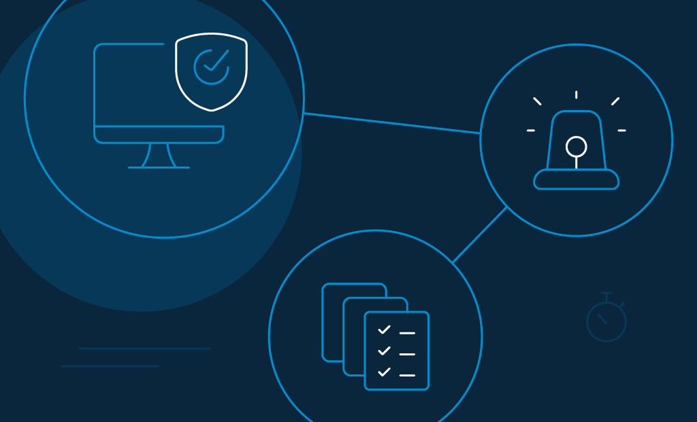
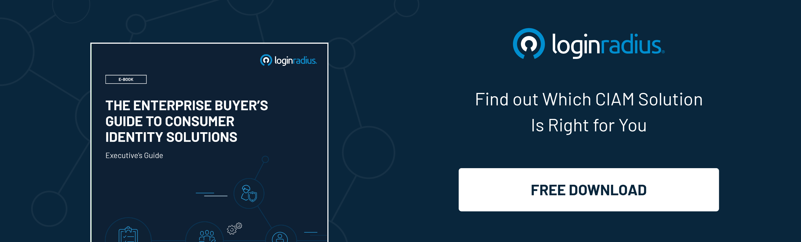
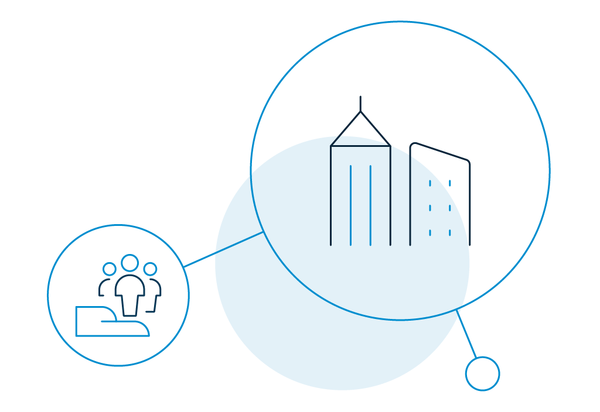

Identity Governance and Administration (IGA) is defined as the branch of Identity and Access Management (IAM) responsible for making these access approvals while aiding in auditing and meeting compliance standards of some industries.

# What is Identity Governance

In its essence, Identity Governance is about automating the process of giving relevant data access levels to varying stakeholders. Identity Governance is based on the Identity Governance Framework, a project that aimed to standardize the treatment and facilitation of identity information usage in enterprises. 

At present, IGA is used by several entities across different industries to improve data security of their systems and meet regulatory compliance such as the [Health Insurance Portability and Accountability Act (HIPAA)](https://www.cdc.gov/phlp/publications/topic/hipaa.html), the [Sarbanes-Oxley Act (SOX)](https://www.congress.gov/bill/107th-congress/house-bill/3763), and the [Gramm-Leach-Bliley Act (GLBA)](http://Gramm-Leach-Bliley%20Act%20|%20Federal%20Trade%20Commission%20(ftc.gov)).

## 5 Most Common Misconceptions About Identity Governance

### 1. “Only the businesses that fall under regulatory compliance need identity governance.”

While it goes without saying that it should be any business’s priority to safeguard classified information on itself as well as the sensitive and personally identifiable information (PII) of its consumers, that isn’t what IGA is all about. 

Among other merits, IGA is also important for retaining efficiency through a seamless transition in access rights when an employee switches departments or gains privilege access when he or she gets promoted to an administrative position.

### 2. _“_Small-medium enterprises need not employ Identity_ _Governance and Authorisation.”

User identities are an essential factor in the protection and monitoring of data. In a predominantly tech-intensive world, enterprises of all sizes need to do their best at safeguarding classified and personal information from [cyber-attacks](https://www.loginradius.com/blog/start-with-identity/2019/10/cybersecurity-attacks-business/). 

No matter how big or small, a firm needs to protect its cyber existence and the trust that its consumers placed in it.

### 3. “IGA solutions are not relevant or implementable to cloud ecosystems.”

Like most of the tech space, IGA has been moving towards cloud governance as well. Leaders in the field integrate their Identity Governance solutions with cross-domain capabilities, hence, allowing administration of cloud as well as on-premises applications.

### 4. “Our internally made manual IG solutions allow satisfactory control over IT systems.”

Manual control of user access, i.e., manually altering the provisioning or deprovisioning of access to data, is inefficient and tedious. Not to mention, it is susceptible to human error. It also distracts the IT staff from other intensive tasks that demand effective human intervention. 

Using an automated and specialized access certification issuing system frees up human capital for core business activities.

### 5. “IGA and identity management are the same.”

IGA adds more functionality to the mainstream Identity Management systems. IGA enables an entity to audit access reports for compliance requirements. IGA solutions automate the process of [provisioning](https://www.loginradius.com/provisioning/) and deprovisioning the access to certain data by a stakeholder throughout their Access Lifecycle.

## 5 Benefits of Identity Governance

### 1. Consumers can get timely access to the data they want.

In the digital age of immediacy and the consequent instant availability of information, we’re no longer used to waiting for hours or even minutes to have access to the information needed. Identity Governance can be a key contributor to [improving CX](https://www.loginradius.com/blog/start-with-identity/2019/11/improve-customer-experience-ecommerce/) (Consumer Experience).

### 2. You can handle access requests and track danger requests.

The Identity Administration part of a typical IGA system would allow for a centralized or designated approval location to be set for different data sets. Hence your stakeholders can conveniently ask for approvals. 

This, at the same time, also allows you to track activity that may seem suspicious and hence kick out the perpetrator before any breaches.

### 3. Flexible access and hence greater productivity.

The ongoing pandemic has made the importance of flexibility clear. Always working on-premises and using safe and secured corporate devices and networks is unrealistic in the new context. 

This restates the importance of IGA, through which the firm can allow remote access, albeit limited for security, on employees’ personal devices for the operations to keep running.

### 4. Helpful in meeting regulations.

Since IGA was essentially built to meet corporate regulations on data accessibility, it might seem obvious that it helps an entity meet these regulations. However, you will at first need to make sure that the necessary controls are in place to [comply with the security and privacy standards](https://www.loginradius.com/blog/start-with-identity/2020/03/how-loginradius-helps-enterprises-stay-ccpa-compliant-in-2020/) set out by data-laws.

### 5. Support to auditing

Applications, devices, data, and stakeholders are all linked through the IGA solutions. Consequently, the system can determine who has access to which information, device, and/or application, hence, helping it in making access reports that are relevant to the questions that come up during regulatory auditing.

## Empower Your Business Using LoginRadius Identity Governance Solution

The fundamental factor underpinning IGA is [data governance](https://www.loginradius.com/blog/start-with-identity/2020/07/data-governance-best-practices/). LoginRadius offers world-class data governance, which, consequently, bolsters your organization’s cybersecurity and the virtual security of your consumers.

Here’s how LoginRadius’ data governance solutions are remarkably effective at aiding identity governance in your organization:

*   **A network of data regions**: LoginRadius allows you to serve consumers globally and, at the same time, meet the regional data privacy regulations like [GDPR](https://gdpr-info.eu/) through its worldwide network of data centers.
*   **Comprehensive Encryption**: All data moving from one server to another does so over HTTPS tunnels that are encrypted using industry-standard ciphers.
    *   LoginRadius’ data solutions also let you encrypt data within the LoginRadius Cloud Directory. Depending on your needs, the encryption of user data can be one-way or two-way.
    *   Critical data, such as passwords, are hashed one-way by default. Thereby disallowing anyone, even database managers, from viewing this data.
*   **Transparent data consent and preference management dashboard**: 
    *   The system actively asks for consent from new and existing consumers. You can customize the consent you request from them and thereby conveniently manage their data accordingly with the help of LoginRadius’ tracking system.
    *   The system also manages and remembers consumers’ preferences. Amongst other things, this includes their preferred mode of communication (e.g., emails, texts, notifications, etc.) and the privacy policies accepted and the ones not accepted.

## Conclusion

The demand for [IGA is growing year on year](https://dagorettinews.com/identity-governance-and-administration-market-overview-manufacturing-industry-statistics-analysis-top-trends-present-history-future-and-forecast-2028/). The increased agility granted by introducing IGA in a company’s application ecosystem and elsewhere has logical merit. 

Needless to say, so does the issue of relevant access certification to designated stakeholders. With the automation of policy management and auditing, adding to its favor, identity governance seems immensely important in an increasingly agility-demanding and virtual work environment.

