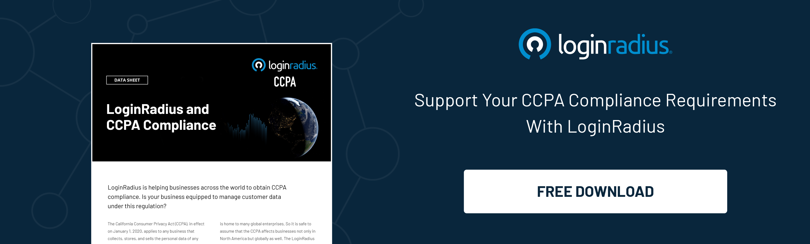

In the rapidly evolving digital landscape, managing identities has become more complex than ever before. With the proliferation of online services, cloud applications, and remote work, businesses are constantly facing challenges in securing their sensitive data and ensuring seamless access for authorized users. 

This is where Identity Lifecycle Management (ILM) steps in as a crucial solution, playing a pivotal role in safeguarding organizational assets while enhancing productivity and efficiency. 

In this blog post, we will dive deep into the depths of Identity Lifecycle Management, exploring its significance, components, and the key role it plays in modern cybersecurity.

## Defining Identity Lifecycle Management (ILM)

Identity Lifecycle Management, often abbreviated as ILM, is a comprehensive framework that encompasses processes and technologies used to create, manage, and retire [digital identities](https://www.loginradius.com/blog/identity/what-is-iam/) within an organization. 

These identities could belong to employees, partners, customers, or any entity that interacts with the organization's IT infrastructure. The primary goal of ILM is to ensure that the right individuals have access to the right resources at the right time while also addressing security concerns and regulatory compliance.

## Components of Identity Lifecycle Management

### 1. Identity Provisioning

This involves creating and managing user accounts and their associated access privileges. Provisioning ensures that new employees receive the necessary access rights when they join an organization, enabling them to perform their job roles effectively.

### 2. Access Control

[Access control mechanisms](https://www.loginradius.com/role-management/) define the permissions and restrictions associated with each user identity. This component ensures that users can only access the data and applications relevant to their job responsibilities, thereby minimizing the risk of unauthorized access.

### 3. Authentication and Authorization

Authentication verifies the identity of users, confirming their credentials before granting access. Authorization, conversely, determines what actions authenticated users are allowed to perform within the system. These two components work hand in hand to maintain security and privacy.

### 4. Lifecycle Governance

Lifecycle governance involves managing identities throughout their entire lifecycle, from onboarding to retirement. This process ensures that access rights are modified or revoked as users change roles departments, or leave the organization, reducing the likelihood of security breaches.

### 5. Compliance Management

Compliance management ensures the organization's identity management practices align with industry regulations and internal policies. It involves regular audits, monitoring, and reporting to guarantee adherence to legal requirements and data protection standards.

## The Role of ILM in Modern Cybersecurity

### 1. Enhanced Security

ILM strengthens security by enforcing strict access controls, reducing the risk of unauthorized access, and ensuring that identities are verified before granting access to sensitive information.

### 2. Improved Productivity

By automating the process of user onboarding, provisioning, and access management, ILM streamlines administrative tasks, allowing IT teams to focus on strategic initiatives rather than manual identity management.

### 3. Adaptability to Change

ILM allows organizations to adapt to changes seamlessly. As employees join, move within, or leave the organization, their access rights are adjusted accordingly, ensuring continued security and compliance.

### 4. User Experience

Efficient ILM processes lead to a [better user experience](https://www.loginradius.com/customer-experience-solutions/). Authorized users can access the necessary resources without unnecessary barriers, fostering a positive work environment.

## To Conclude

Identity Lifecycle Management is the cornerstone of modern cybersecurity strategies. By implementing robust ILM practices, organizations can mitigate security risks, ensure regulatory compliance, and empower their workforce to thrive in a digitally connected world. 

As businesses continue to embrace digital transformation, embracing Identity Lifecycle Management is not just a choice but a necessity in safeguarding sensitive data and maintaining a competitive edge in the market.

