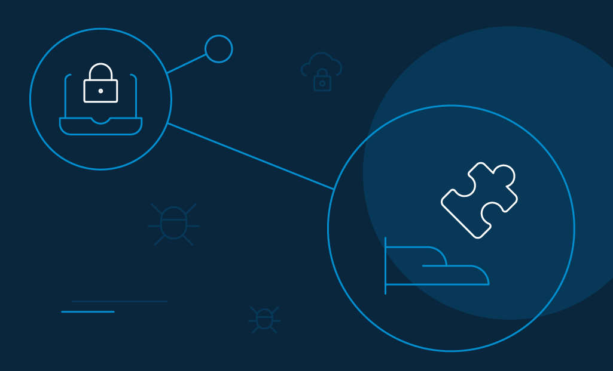
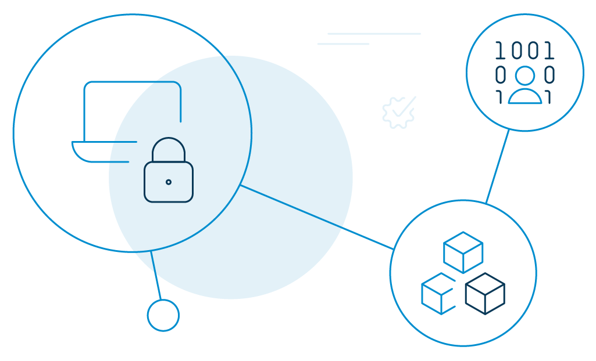
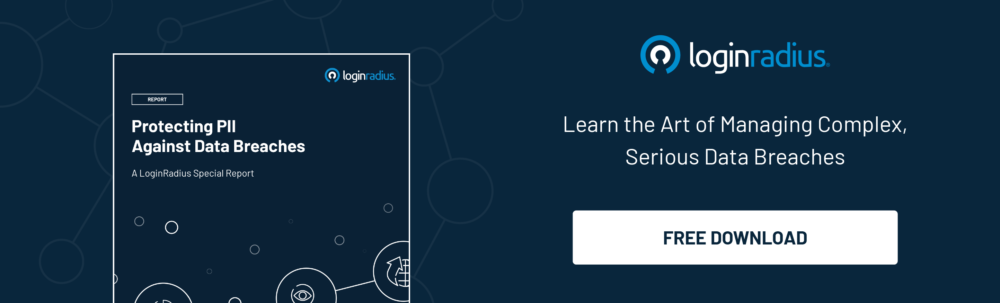
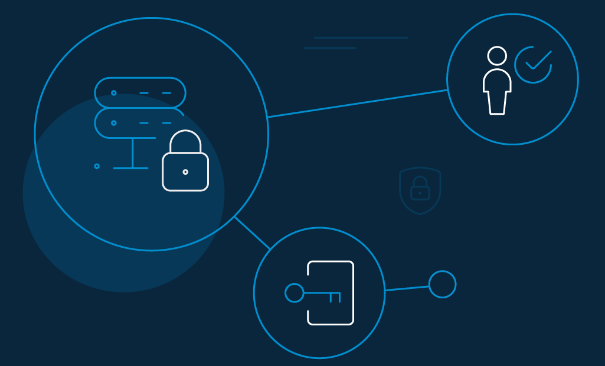

Identity management for developers isn't a tough nut to crack, especially if you know how to play your cards right. 

As a creator of front-end or back-end applications, you will eventually experience the need to collect and store consumer information like their identities and other profile details. 

At the same time, you'll also need to design a new user registration workflow, enable omnichannel experience, configure authentication methods like social login, provision or deprovision consumers, partner to a third party application or secure the API of your web services.

Learning the basics of identity management for developers can place you in a strong position to communicate what you need and why.

## Current Security Challenges That Developers Face

Risk-Based Security, a cyber threat intelligence company, stated in its report that more than [15.1 billion records were compromised](https://www.riskbasedsecurity.com/2020/02/10/number-of-records-exposed-in-2019-hits-15-1-billion/) in 2019—that sums up to 284% year-over-year growth! 

Data security is the need of the hour. The developer's responsibility is to build security within applications right from the first stage of development. 

Working with identity access management, particularly CIAM, when designing customer-facing solutions, is a fantastic idea. It mitigates various application threats that may otherwise prove fatal for consumers. 

Some of the common ones include: 

### Brute force attack

Brute force is a popular password-guessing attack that web developers face. Hackers use automated software to guess every possible combination of letters, numbers, and symbols until they successfully crack the password. So, if your application or website requires [authentication](https://www.loginradius.com/authentication/), there is a good chance you may be a target for brute force attacks. 

One of the most obvious ways to block brute-force attacks is to automatically lock out accounts after a predefined number of incorrect password attempts. You can keep the accounts locked for a specific duration or until an administrator manually unlocks them.

### Injection attack

An injection attack is a malicious code injected by the attacker into a network. The input is interpreted as a part of a command or query. This, in essence, modifies the execution of the program. Injections are amongst the oldest attacks in the book aimed at data theft, data loss, denial of service, and even full system compromise.

However, mitigating injection flaws isn't very difficult. Developers should make it a point to stop writing dynamic queries and also prevent user-supplied input with malicious SQL from affecting the executed query.

### Man-in-the-middle attack

A man-in-the-middle attack happens when the hacker intercepts a conversation between a consumer and an application. The hacker may eavesdrop or impersonate one of the parties and steal [passwords](https://www.loginradius.com/blog/2018/12/infographic-the-death-of-passwords/) or credit card information. 

To mitigate such spoofing attacks, developers can utilize secure communication protocols like TLS and HTTPS. They can also keep consumers logged out of their applications when not in use. Encrypting and authenticating transmitted data is another way to steer clear of man-in-the-middle attacks. 

### Social engineering attack

[Social engineering attacks](https://www.loginradius.com/blog/2020/10/social-engineering-attacks/) involve the hacker manipulating human emotions to attack the victim. They utilize common phishing scams through email and text message campaigns to impose urgency, curiosity, or fear in the victim, hoping that the user will download malware or click unsolicited links that host the malware.

Backing up files regularly, keeping software updated, and always scanning executable files before running them are a few ways to avoid social engineering attacks. 

### Security misconfiguration 

Security misconfiguration happens when the network administrator fails to implement all security controls for a server or implement security controls, but with errors. It could happen with legacy applications when they try to communicate with applications that do not exist anymore. Hackers may replicate these applications and try to establish connections. 

One of the best ways to fight security misconfiguration is through increased visibility. Make sure you have an accurate, real-time map of your entire ecosystem, so you are always focused on your critical assets. 

## Developers are on the front foot

What can prevent someone from breaking into an application or online software system and stealing information or [accessing sensitive credentials](https://www.loginradius.com/blog/2019/09/prevent-credential-stuffing-attacks/)? Both the challenges and the solutions rely on software, and the situation is well known to many developers. After all, they are the first line of defense.

Gathering and evaluating evidence is a critical step in ensuring that a safety-first culture is being developed within the development team. They should conduct proper assessment, identify the progress of the team in real-time, and benchmark their strengths and weaknesses for continuous improvement. The inclusion of identity management for developers can also help. 

## Application Security Regulations

According to Forrester's study, [42% of external attacks](https://www.whitesourcesoftware.com/forrester-state-of-application-security-report/) happen due to software exploitation, and 35% is a result of web application vulnerability. As applications become more complex, different laws have been enacted to ensure their security. 

To help developers prepare better, we come up with a list of the best application security regulations that's been mitigating the threat landscape to a large extent. 

- **Open Web Application Security Project (OWASP):** It is a security project that also lists the ten most critical web application security risks.
- **Payment Card Industry Data Security Standard (PCI DSS)**: It is an information security framework for handling data security processes of major credit cards. 
- **Consortium for IT Software Quality (CISQ):** It establishes international guidelines for the automation of software size and structural quality assessment from the source code

## Integrating Security in DevOps

The business IT infrastructure of today is more varied, diverse, and complex than ever before. Environments there were earlier confined to on-premises and are not hosted on multiple clouds and IoT devices. 

However, this modern open perimeter has been posing fundamental challenges for cybersecurity. It requires a [zero-trust environment](https://www.loginradius.com/blog/2019/10/cloud-computing-security-challenges/) to thrive in the development and operations (DevOps) life cycle. It takes not only the right tools and technology to bring this approach into effect, but a shift in philosophy focused on the holistic integration of security within the DevOps lifecycle.

The safety mechanisms embedded in DevOps offers the following benefits (but not confined to): 

- Greater pace and agility for development and security teams.
- The ability to adapt quickly to change.
- Better cooperation and coordination between teams. 
- More options for automated construction and quality assurance assessments. 
- Early vulnerability detection in code.

## How LoginRadius Provides Ideal Identity Management for Developers

Identity is the cornerstone of the modern consumer experience. A good, scalable [CIAM solution](https://www.loginradius.com/blog/2019/06/perfect-ciam-platform/) allows you to manage consumer identity and access securely.

LoginRadius' admin-friendly UI seamlessly implements identity management and balances the skills of your developers. Consequently, it will significantly reduce the developer's effort. For example, you can easily control who is allowed to sign in to your site, how they can do it, and what they can access once they have successfully signed in. 

Here are the core capabilities of LoginRadius identity management for developers. 

- **Low-friction consumer registration**: LoginRadius offers flexible account setup choices like standard login, social login, and self-serve registration for hassle-free entry into your web properties.
- **Multi-factor authentication (MFA):** LoginRadius offers identity management for developers by making it easier to safeguard consumer data with [extra protection layers.](https://www.loginradius.com/blog/2019/06/what-is-multi-factor-authentication/) The CIAM provider allows a plethora of authentication methods including, phone calls, SMS/text messages, email verification, time-based code, hardware token, security questions, biometrics, Google Authenticator, etc. each time they want to access their accounts.
- **Single Sign-On (SSO)**: SSO can provide easy access to multiple websites or applications using a single set of credentials. LoginRadius offers different ways to integrate via the web, mobile, and federated SSO. Developers can create connections with external identity providers by implementing OAuth 2.0, SAML, or OpenID Connect standards.
- **Compliance management**: Developers can add authorization policies through LoginRadius. The CIAM provider is well compliant with formal data protection regulations across the globe, like the [EU's GDPR and California's CCPA](https://www.loginradius.com/blog/identity/ccpa-vs-gdpr-the-compliance-war/).
- **Data privacy and security**: LoginRadius follows safety protocols to safeguard consumer data and avoid illicit intrusions. The identity provider is compliant with regulatory bodies like AICPA SOC 2, ISAE 3000, Cloud Security Alliance, Privacy Shield, and more.

## Conclusion

Identity management for developers is required more than ever. It should be seamless, simple, and secure. The development team is under extreme pressure to build digital experiences that disrupt their industry or differentiate their business. 

No wonder meeting the demands of both businesses and consumers is an uphill ride. The right CIAM solution comes with improved data security and identity management features that meet the developers' need for top-notch experiences.  

