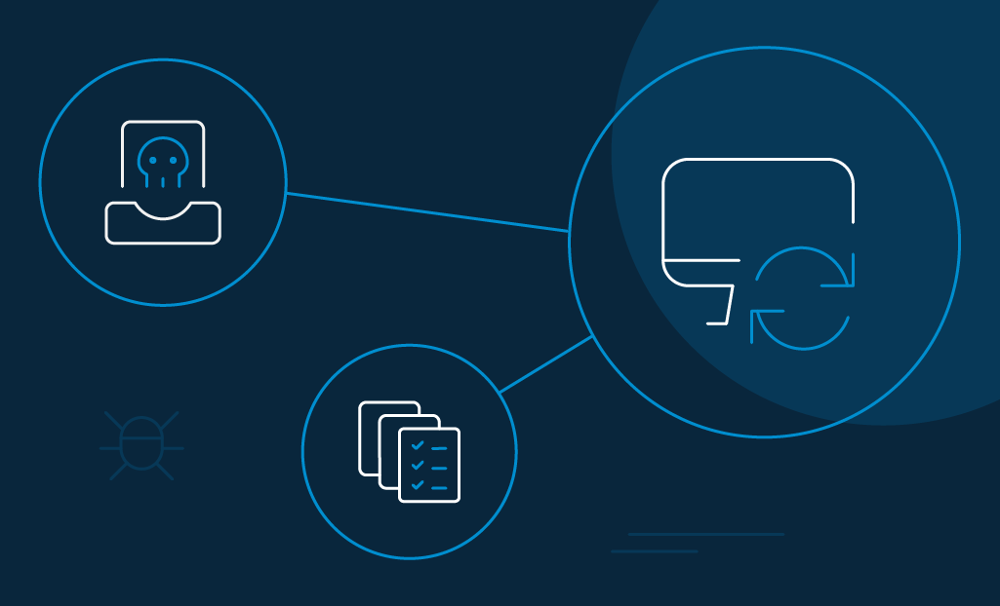
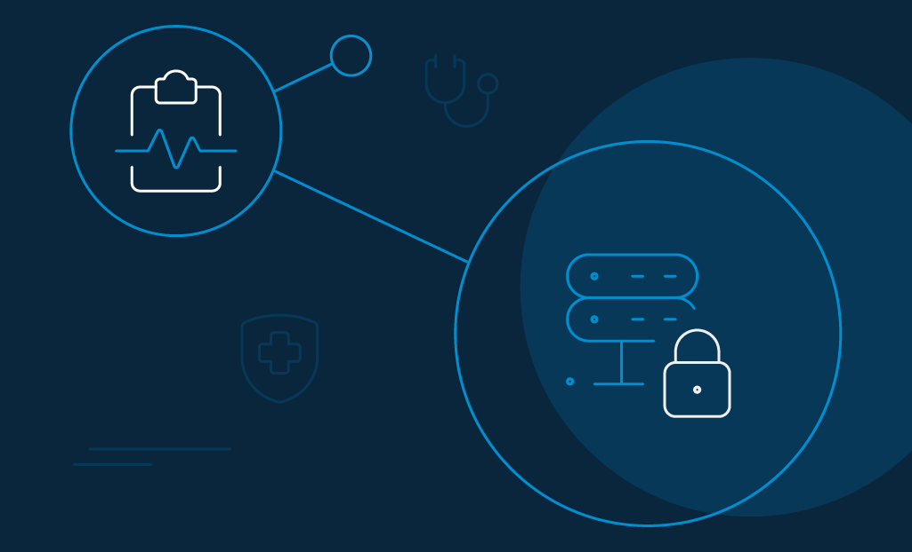

Healthcare is one of the most heavily regulated sectors in existence, mostly because of the sensitivity of the collected data—such as social security numbers, patient medical records, insurance policy details, and credit card numbers.

Patients expect that their data remain confidential, and they enjoy a quality experience. This is the primary reason why modern, digital health care is based on cooperation, and the _opportunity is immense_. 

Employing identity management in healthcare can genuinely make all the difference. How? Let's explain with a use case. 

Almost every patient goes through multiple registration processes in their lives. They could be looking for specialists, booking an appointment, or getting test results. Implementing identity management in healthcare facilities can lead medical professionals to enjoy a single view of identity, reduce human error, cut down costs, [improve data security and compliance](https://www.loginradius.com/security/)—all while optimizing their organizational efficiency.

We also need to understand the fact that identity and access management (IAM) solutions are more than just security tools, or they only enhance technological skill sets. They are also the drivers of emerging healthcare opportunities. 

First, though, we need to discuss what makes the control of healthcare identities so complicated and overwhelming. 

## Current Security Challenges in the Healthcare Sector

Simply put, the more data compromised, the more it leads to regulatory penalties, loss of patient trust, and bad publicity. 

- According to the 2020 Breach Barometer published by Protenus, more than 41 million patient records were breached in 2019.  
- 59 percent of the respondents surveyed in Europe and the U.S. were [concerned about their medical data](https://www.rsa.com/content/dam/en/e-book/rsa-data-privacy-report.pdf) security, while 39% were worried that hackers would play foul with their digital data. 

So, why are information networks for healthcare a priority for hackers? 

The answers lie in the interconnected nature of modern healthcare facilities—namely that integrating so much critical data derived from a huge chunk of the population makes it a noticeable target for hackers and cybercriminals. 

A few other reasons include: 

### 1\. The growing attack surface.

The transition from hard papers to electronic health records (EHRs) containing a host of confidential data on patients' medical history has dramatically changed the quality and reliability of patient care. However, the increase in the number of healthcare service providers has also broadened the attack surface. 

Governments worldwide are ensuring that all health records are digitized as quickly as possible, yet investment in [data technology and cybersecurity](https://www.loginradius.com/blog/2019/10/cybersecurity-best-practices-for-enterprises/) is lagging far behind.

### 2\. Patient's lack of adequate knowledge.

Usually, patients do not have adequate knowledge of the data security hazard of their EHRs. They do not understand the gravity of medical privacy and aren't as cautious. 

For example, they store their data in unencrypted folders or even send their results via email, which could be quite an easy pathway for [cybercriminals](https://www.loginradius.com/blog/2019/10/cybersecurity-attacks-business/) to grab their records and also hack other personal details.

### 3\. The rise of ransomware and phishing attempts.

An entire device can be infiltrated by advanced ransomware and phishing programs. Hackers can easily plant malicious scripts on a computer or steal login credentials. 

Just last week, a joint alert from Cybersecurity and Infrastructure Security Agency (CISA), the Federal Bureau of Investigation (FBI), and the U.S. Department of Health and Human Services (HHS) was released with a [warning about the wave of ransomware attacks](https://us-cert.cisa.gov/ncas/alerts/aa20-302a) in the healthcare and public health sector. 

Similarly, IoT devices like ventilators, insulin pumps, and other medical instruments are vulnerable network access points, and they should be audited for software updates, patches, and other upgrades. 

### 4\. Unrestricted access to computers.

Computers that are out in the open can easily invite unauthorized personnel. If these open systems store confidential patient information, and they fall into the hands of unauthorized staff, the consequences could be dire. 

It may lead to active [phishing](https://www.loginradius.com/blog/phishing-for-identity/) attempts and provide hackers with a backdoor into more vulnerable network areas. Be sure that every device that contains patient data is stored in a safe location.

### 5\. Lack of comprehensive identity management.

Lack of comprehensive identity and access management in healthcare leads to weaker authentication and access control. This is where many healthcare organizations fail. 

It is too common for health facilities to exchange massive databases around the organization. Without data access controls and robust and [adaptive authentication](https://www.loginradius.com/blog/2020/06/authentication-vs-authorization-infographic/) methods, it is difficult to authorize the right employees for the right action. 

## Top 5 Benefits of Choosing the Right Identity and Access Management Solution in Healthcare

Protected health information (PHI) takes ten times the price of the dark web's financial records, and that makes any healthcare institution a highly tempting option for hackers. There was a steep [increase in PHI breaches in the United States alone by 2733%](https://www.privacyaffairs.com/healthcare-data-breach-statistics/) between 2009 and 2019.

Modern identity management in healthcare is designed with an essential security strategy for hospitals embedded just right in. IAM prevents unauthorized people from accessing PHI and the right people from leaking it by accident. When obtaining access to sensitive information and facilities, a sound IAM approach would also minimize costs, decrease help desk calls, and improve the overall patient experience.

Below are a few things that identity management in healthcare businesses actually do as a cybersecurity and convenience gatekeeper. 

### 1\. Protecting patient information.

The first benefit of identity management is healthcare is cybersecurity. Phishing attacks, ransomware, and other malware incidents regularly target the medical facilities, yet rarely they deploy security protocols. This is where IAM takes the front seat. 

For example, businesses can benefit from multi-factor authentication (MFA) as a tool for next-generation identity management in healthcare. Adding multiple layers of security is unquestionably the strongest form of authentication available at the moment. 

Similarly, [single sign-on (SSO)](https://www.loginradius.com/single-sign-on/) can solve the multiple login points paradox by offering patients a single set of credentials to authenticate to multiple accounts. 

### 2\. Securing access and seamless usage.

IAM provides a mechanism for regulating the identities of healthcare staff and determining how they navigate healthcare systems and their responsibilities and roles. Identity access management offers features to centralize the identity of hospital employees, thereby making it easier to add new staff, delete old ones, manage users, and monitor their access. 

It benefits physicians - as they do not have to log in manually and out of different software many times a day. By utilizing single sign-on, they only have to log into their sessions once and access whenever they need to without wasting much time. 

### 3\. Caring about compliance.

Implementing identity management in healthcare makes it easier for medical organizations and facilities to focus on patient privacy, protection, and compliance. A few regulations that have raised the bar for safeguarding both physical and administrative security include:

- **HIPAA**: Health Insurance Portability and Accountability Act (HIPAA) is an established regulation to exercise best practices in the administrative, physical, and technical security of patient's data.
- **EPCS**: Electronic Prescribing for Controlled Substances (EPCS) is a newer industry-specific regulation that mandates two-factor authentication and I.D. proofing to verify a provider, among others. 
- **CCPA**: [California Consumer Privacy Act (CCPA)](https://www.loginradius.com/blog/2020/03/how-loginradius-helps-enterprises-stay-ccpa-compliant-in-2020/) is a state-level regulation that mandates institutions to provide notice to patients before they collect personal data. They can also opt-out, read, and delete their personal data from the hospital's database. 

A comprehensive IAM solution offers the perfect balance by meeting security requirements and the access control needed to comply with international regulations.

### 4\. Improving patient experience.

The possibilities to improve patient experiences by juxtaposing identity management in healthcare are limitless, including the ability to:

- Automate the processes to assign and withdraw privileges as needed.
- Support integrated healthcare delivery.
- Modernize communication collectively through identity federation
- Transform identity verification with [MFA](https://www.loginradius.com/blog/2019/06/what-is-multi-factor-authentication/). 

This, in turn, ensures that patient data remains out of the hands of hackers.

### 5\. Centralizing system audits.

Although IAM solutions provide preventive controls such as access protection, they also offer detective capabilities. IAM solutions include central databases to verify transactions, access requests, and other operations. 

Security departments can produce reliable system audits and documentation effectively through unified logging and reporting tools. Such real-time inspections allow medical facilities to remain [compliant](https://www.loginradius.com/blog/2020/03/how-loginradius-helps-enterprises-stay-ccpa-compliant-in-2020/) with the law and to escape prosecution and fines.

## How Can LoginRadius Help the Healthcare Industry Stay Secure and Compliant

LoginRadius is a powerful player that checks all the major boxes in securing patient identities and authentication throughout the healthcare infrastructure. 

The ability to offer provisioning, reporting, support for identities, compliance benefits, and easy access makes the CIAM provider one of the top contemporary solutions for identity management in healthcare.

With LoginRadius, you can integrate:

- **Role-based management**: Manage access rights for application, provision, or de-provision employees or change roles throughout your health facility.
- **Self-serve capabilities**: Enjoy self-service functionality by allowing healthcare professionals to request access to resources. Consequently, managers can approve or reject them with zero IT intervention.
- **Compliance regulations**: Safeguard patient privacy and sensitive health information via regulations like HIPAA, CCPA, and stay updated on more.
- **Seamless access management**: Improve patient and member access by providing multiple opportunities for making access more seamless and intuitive.

### LoginRadius does identity and access management for healthcare organizations right—with modern authentication.

Modern authenticate is no longer just about the login screen. Rather, there are many benefits attached to it, including auditing, monitoring, provisioning, deprovisioning, enforcing security policies, multi-factor authentication (2FA/MFA), social login, and single sign-on (SSO).

Addressing all of the above depends heavily on an effective [identity management capability](https://www.loginradius.com/industry-healthcare/). Consequently, LoginRadius authenticates patients and healthcare professionals with any third-party identity provider running on any device or the cloud. 

The CIAM provider solves the following modern authentication problems: 

- It establishes a single source of truth for patients and staff identities. 
- It allows SSO where a set of credentials can [unlock login access](https://www.loginradius.com/blog/identity/prevent-credential-stuffing-attacks/) to multiple accounts. 
- It offers centralized provisioning and de-provisioning of patients and healthcare professionals.
- It provides the ability to add extra security layers with stronger second-factor authentication (2FA/MFA).
- It offers out-of-the-box API security and fraud detection to protect against cybercrime.
- It enables consent management to manage and version consent during registration or login.

## Conclusion 

Times are changing—IAM is no longer an administrator-driven set of capabilities. It is gradually shifting to an integrated approach where patient experiences are being optimized, and security and compliance capabilities are being enforced in the zest to accommodate organizational effectiveness.

Moving forward, identity management in healthcare organizations is about to take a giant leap. LoginRadius can help you with that! 

