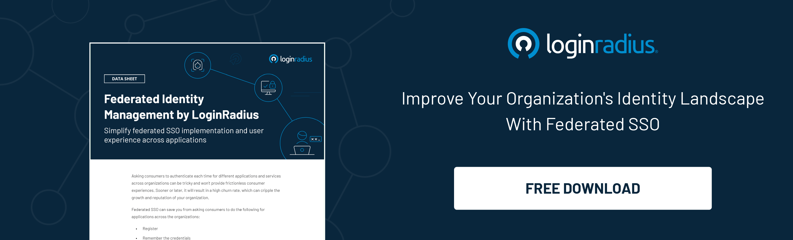

Amid the global pandemic, when everyone was locked inside their homes, businesses were almost at a halt, and the internet became the second home for everyone; we learned an important lesson.

“If the world is online, so should be businesses.”

Movie theatres have been replaced by OTT platforms, books and magazines by e-books and e-magazines, and podcasts are the future of storytelling.

Undoubtedly, the media industry has evolved leaps and bounds by transforming how content is delivered across the internet.  

But besides the rapid technological enhancement of the media industry, several security challenges linger on ad agencies, publication websites, or entertainment platforms.

It’s essential for the businesses serving in this vertical to emphasize both the user experience as well as security since data thefts and identity misuse is becoming the new normal for this industry.

Nevertheless, balancing security without compromising user experience remains an uphill battle for businesses striving to win consumer trust.  

So what can be the ideal solution that can help media companies to ensure their subscribers’ data and privacy isn’t compromised while they fine-tune the user experience?

A [consumer identity and access management solution](https://www.loginradius.com/) (CIAM) is the pressing need for businesses striving to enhance business growth in the media industry.

Let’s learn how identity management works in the media industry for paving a path towards securing subscribers’ identities and ensuring a flawless user experience across their platform.

## Benefits of Identity Management in the Media Industry

**Single Sign-On (SSO) - The Game-Changer**

Honestly, nobody likes to remember long credentials, especially if they can utilize the true potential of frictionless login across all the applications.

While [SSO](https://www.loginradius.com/blog/start-with-identity/2019/05/what-is-single-sign-on/) is on the verge of becoming an industry standard for authentication, the media industry needs to quickly gear up for enhancing the user experience through SSO and Federated SSO.

Since the market is flooded with plenty of OTT platforms and publication websites, the ones offering a seamless experience to the users would get more signups and subscriptions.

**Access Management - For Restricting Content**

With the increasing access to media over OTT platforms, the biggest challenge for the entertainment industry is to set age restrictions for specific content.

While most media platforms aren’t focusing on creating sub-profiles, the competitors are already leveraging access management for a single identity used by multiple users.

Whether we talk about a particular category of content for premium users or setting age restrictions, access management plays a key role in enhancing the user experience for every business.

Access management through a CIAM solution helps improve user experience and eventually plays a crucial role in enhancing overall data and privacy security.

LoginRadius’ cloud-based CIAM solution helps businesses seamlessly manage access without hampering the overall user experience. This helps media businesses to gain more signups, increase retention rates, and scale business growth.

**Progressive Profiling - The Secret to Staying Ahead of the Competitors**

Media businesses need to understand the fact that registration fatigue could be the reason why they lose a potential subscriber.

Admit it; nobody wants to share heaps of personal details in a single go, especially during the sign-up process. Keeping the subscription form compact is the best way to ensure a quick sign-up from the users’ end.

Progressive profiling enables you to gather important details about a subscriber over time and not everything at a single go. This not only improves user experience but eventually helps to build credibility in the long run.

LoginRadius enables you to gather consumer data through various stages of the consumer's journey to share their information as they continue to interact with your business.

Publication websites, OTT platforms, and other media platforms can set their own rules that meet their business requirements to win consumers’ trust with LoginRadius progressive profiling.

**Multi-Factor Authentication - For Enhanced Layers of Security**

While the number of media platform subscriptions surged amid the global pandemic, the fact that cyber-attacks on diverse platforms increased exponentially can’t be overlooked.  

With millions of data breaches and identity thefts in the media industry alone, a CIAM solution with multi-factor authentication can be the ultimate solution.

LoginRadius’ [Multi-factor authentication](https://www.loginradius.com/blog/start-with-identity/2019/06/what-is-multi-factor-authentication/) coupled with risk-based authentication helps businesses in creating a secure login experience for subscribers. If there’s an incident of a cybercriminal trying to gain access from another device, remote location, or repeatedly using wrong credentials, multi-factor authentication kicks in.

The user needs to provide a one-time password received on the phone or a secure login code received through an email to authenticate.

**Final Thoughts**

While the media industry is witnessing a massive transformation, the core values coupled with the responsibilities of businesses remains consistent.

Delivering the best user experience along with the assurance of secured privacy and data of subscribers should be the utmost priority of businesses that are figuring out ways to increase their client base.

Just like every other industry, the media industry can leverage a CIAM solution that helps in scaling business growth by meeting the industry-standard compliances and, at the same time, win consumer trust through flawless user experiences.

