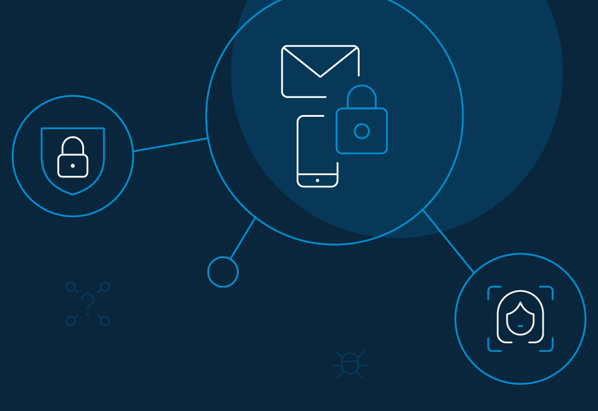
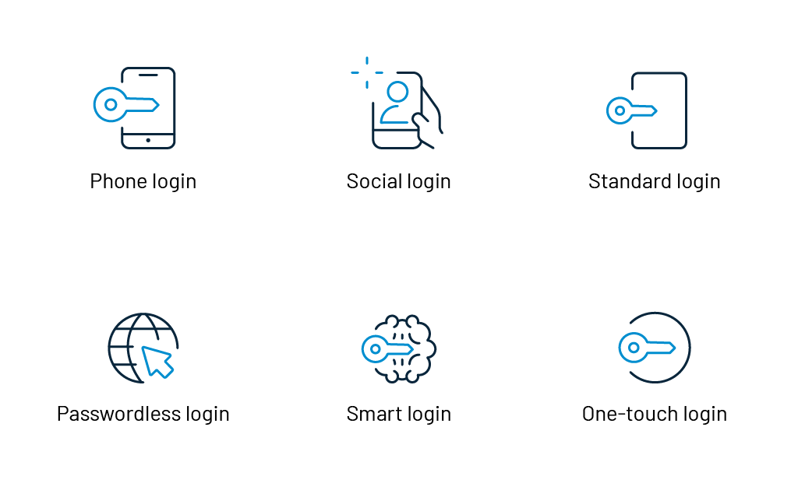
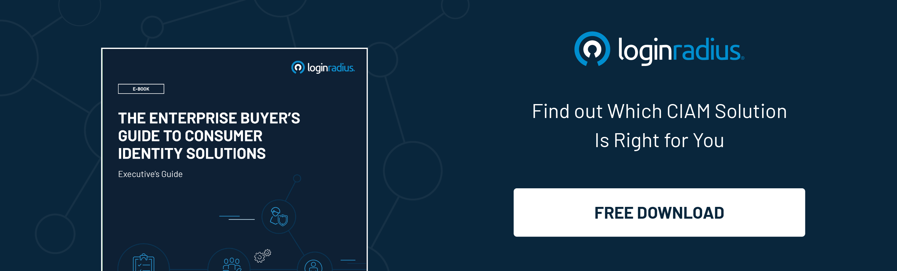

You book a hotel for your stay in Paris; you go to the counter, show your passport and other ID verification documents, and take the keys to your room to finally enjoy your stay. 

This is identity proofing—the process of verifying that the claimed identity_ _of a person matches their actual identity. You’ve probably undergone this process a bunch of times yourself at hotels, financial institutions, and for retailers.

The entire process feels taxing, intrusive, and needlessly comprehensive. Yet, it might be surprising to hear that, despite the measures taken by many institutes, according to Consumer Sentinel Network, [3.4 million identity thefts](https://www.ftc.gov/system/files/documents/reports/consumer-sentinel-network-data-book-2019/consumer_sentinel_network_data_book_2019.pdf) and frauds took place in 2019 alone.

## Importance of Improved Identity Proofing

According to the [2020 State of Cybersecurity Report](https://www.accenture.com/sa-en/insights/security/invest-cyber-resilience) by Accenture, an average company was subject to 22 data breaches in the studied year. Such data breaches are often the consequence of and result in more identity thefts and frauds. 

As a matter of fact, it takes over six months for [an average data breach](https://www.zdnet.com/article/businesses-take-over-six-months-to-detect-data-breaches/) to be detected. That gives the perpetrator six months to exploit your information as vastly as possible. The risk is significantly greater with the onset of higher cloud computing reliance in the day-to-day functioning of an organization.

Typical knowledge-based identity proofing also involves asking a customer a set of common security questions, e.g., “What was your hometown?”, “What was your mother’s maiden name?” etc. These questions are used across a range of organizations. 

So, what happens when an organization as big as [Facebook or Marriott Intl.](https://edition.cnn.com/2019/07/30/tech/biggest-hacks-in-history/index.html) suffer a breach compromising hundreds of millions of accounts?

Your Personally Identifiable Information (PII), including your bank account details and security questions, fall in the hands of fraudsters that can exploit your information through, for instance, fraudulent transactions.

Therefore, effective identity solutions should be one of the top priorities for any organization at this phase. To exemplify, identity proofing is particularly useful when a user is trying to claim an account, access content above a certain age, or register for an ecommerce site.

## How to Implement Effective Identity Proofing

As stated above, identity proofing can be done manually through documentation and interactive checks. This process, as already pointed out, is taxing and poorly affects the user experience. Manual identity solutions are also unscalable for large organizations dealing with hundreds of thousands of consumers every day.

To pick up virtual methods of identity proofing is the right way to go in the current tech-dominated global environment. For instance, the British government has come up with a document on verifying someone’s identity on the [basis of set guidelines](https://www.gov.uk/government/publications/identity-proofing-and-verification-of-an-individual#how-to-check-someones-identity):

*   Strength: Getting evidence of identity from official ID documents.
*   Validity: Confirming that the document is legitimate.
*   Activity: Tracking the prevalence of the identity over time with other records.
*   Identity fraud: Assessing the risk of fraud by comparing it with the national fraud database.
*   Verification: Assuring the identity belongs to the person claiming it.

An adequate identity proofing system should be able to perform most of these tasks on its own. It’s worth noting that such a comprehensive undertaking is not necessary for all activities. The organization’s sound discretion should be used to assess where it wants to employ identity proofing solutions.

## Protect Your Business Identity With LoginRadius CIAM Solutions

### Two-Factor and Multi-Factor Authentication

When dealing with sensitive information, regardless of the network being public or private, it is a good idea to add extra layers of security to an account. 

[Multi-factor authentication](https://www.loginradius.com/blog/identity/2019/06/what-is-multi-factor-authentication/) overcomes the flaws of typical password-based authentication and mandates it for a user to verify the claim to an account through two or more methods.

*   LoginRadius makes it incredibly convenient to implement MFA for consumers as well as employees without disrupting any other services of the company.
*   You can choose the factors via which you would want anyone to verify their claim to the account: SMS, authenticator apps, dynamic security questions, automated phone calls, etc.
*   LoginRadius makes sure that the user experience (UX) is not compromised through its intuitive and easy-to-pick user interface.

### Password Management Solution

Some accounts don’t need the comprehensive identity proofing processes that were explained above because they don’t interact with sensitive information. Nevertheless, it is a [good business practice to safeguard data](https://www.loginradius.com/blog/identity/2020/12/data-security-best-practices/), no matter how insignificant it may seem. 

LoginRadius identity and access management solutions offer password management that helps make traditional password-based identity-proofing safer in itself.

*   **Regulated password resets**: This feature allows you to configure your system to mandate it for users to update their password at regular intervals. The default setting is set at 90 days.
*   **One-way hashing**: This feature encrypts the passwords of users of a system with [customizable hashing](https://www.loginradius.com/docs/security/platform-security/cryptographic-hashing-algorithms/) salts. The one-way here means that the password can only be encrypted, not decrypted. To increase security, each consumer is allowed to set a random hashing salt for each password. Thereby also disallowing anyone with access to the database to find out the passwords of other users.
*   **Password policy**: The password policy recommended is:
    *   Password length + complexity: A minimum of ten characters with at least one number and one symbol.
    *   Password history: Users cannot use the last five passwords again.
    *   Maximum password age: 90 days.
    *   Multi-factor authentication: Optional to enable Google Authenticator or Phone SMS as the second authentication factor.

    

### Built-in layers of protection

To further strengthen your system’s ecosystem, LoginRadius’ tools enforce restricted access and stave off [automated attacks](https://www.loginradius.com/blog/identity/2019/09/prevent-credential-stuffing-attacks/) on your system. Some of the mechanisms involved in implementing it involve:

*   **Blacklisting**: You can ban accounts with specific email address domains and thereby, disallow them from registering into your services. 
*   **Whitelisting**: You can allow email addresses of only set domains to interact with and register to your services.
*   **Brute force lockout**: You can set a threshold for failed login attempts. After a certain number of attempts, you can determine the next course of action. For example, you can temporarily block the account or ask a security question. This effectively reduces the vulnerability to brute force attacks to negligible proportions.
*   **CAPTCHA**: You can use captcha to restrict bots from generating accounts and interacting with your system. It helps you ensure only humans are using the system.

## Conclusion

With the growing reliance on technology and cloud-based ecosystems, there is a higher susceptibility to [cyber-attacks](https://www.loginradius.com/blog/identity/2019/10/cybersecurity-attacks-business/). SME organizations tend to undermine the benefits of identity proofing and cyber security. 

By improving privacy, the identity proofing process helps build a trustable image in the consumers’ minds towards your brand.

