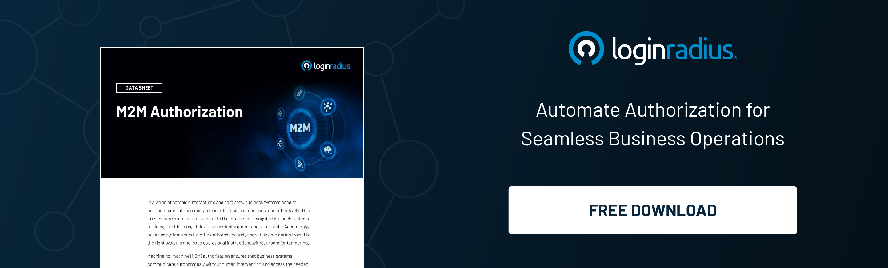

## Introduction

In the rapidly evolving technology landscape, where our devices have become indispensable extensions of ourselves, ensuring their trustworthiness is paramount. Enter identity security for device trust, a concept that gained unprecedented significance in 2024 and is set to shape the [future of cybersecurity](https://www.loginradius.com/blog/identity/cybersecurity-trends-2024/). 

Let’s uncover the intricacies of this crucial topic, exploring its importance, challenges, and the path forward as we navigate the digital landscape of 2024 and beyond.

## Understanding Device Trust and Identity Security

Device trust is not merely a convenience; it is a fundamental necessity in the digital age. It hinges on the assurance that our devices are not compromised or impersonated but rather are genuine and secure. 

This assurance is achieved through robust identity security measures, such as establishing a [digital fingerprint](https://www.loginradius.com/blog/identity/biometric-multi-factor-authentication/) for each device. Think of it as a virtual ID card that verifies the authenticity of the device and its user.

These identity security measures are designed to create a fortress around our digital lives, ensuring that only authorized users and trusted software can access sensitive information and critical resources. Whether it's personal photos, financial details, or confidential work documents, the sanctity of this data relies on the strength of our device trust.

In a nutshell, identity security forms the bedrock upon which device trust stands tall. It's the invisible shield that guards against unauthorized access, cyber intrusions, and data breaches. 

Without this foundation of trust, our devices become vulnerable to exploitation, putting our privacy and security at risk. So, when we talk about device trust, we're talking about the assurance that our digital companions are not just tools but trusted allies in our connected world.

## The Evolution of Identity Security

The evolution of identity security for device trust is palpable. Traditional methods like passwords are being augmented or replaced by more secure and seamless authentication methods. Biometrics, such as fingerprint and facial recognition, are increasingly commonplace, offering convenience and heightened security.

Moreover, the rise of [decentralized identity solutions](https://www.loginradius.com/resource/decentralized-authentication/) powered by cutting-edge technology is revolutionizing how we manage and secure our digital identities. These solutions give users greater control over their personal information, reducing the risk of large-scale data breaches.

## Challenges on the Horizon

However, innovation comes with challenges. As we rely more on interconnected devices and services, the attack surface for cyber threats widens. From sophisticated phishing attempts to AI-powered attacks, adversaries seek to exploit identity security vulnerabilities.

Moreover, the balance between convenience and security remains a delicate one. While users crave frictionless experiences, organizations must maintain the robustness of identity security measures. Striking this balance requires a comprehensive approach that considers user experience and stringent security protocols.

## The Road Ahead: Strategies for a Secure Future

So, how do we navigate the landscape of 2024 and beyond, where identity security for device trust is paramount? Here are some key strategies:

1. **Multi-Factor Authentication (MFA):** Embrace [MFA](https://www.loginradius.com/multi-factor-authentication/) as a standard practice, combining something you know (passwords), something you have (smartphone or token), and something you are (biometrics).

2. **Continuous Authentication:** Move beyond one-time authentication events. Implement solutions that continuously monitor user behavior for anomalies, providing an added layer of security.

3. **Zero-Trust Framework:** Adopt the[ zero-trust model](https://www.loginradius.com/resource/zero-trust-security/), where no device or user is inherently trusted. Every access request is rigorously verified, regardless of whether it originates from within or outside the network.

4. **Education and Awareness:** Empower users with knowledge. Training programs on recognizing phishing attempts and best practices for identity security can significantly reduce the risk of successful attacks.

5. **Collaboration and Standards:** Industry-wide collaboration and adherence to robust standards are essential. Organizations must work together to establish and uphold best practices for identity security.

6. **Secure Software Development:** Ensure that software and applications are developed with security in mind from the outset. Implement secure coding practices and conduct regular security audits.

7. **Data Encryption:** Utilize strong encryption methods to protect sensitive data both at rest and in transit. This ensures that even if data is intercepted, it remains unintelligible to unauthorized parties.

8. **Endpoint Security:** Strengthen endpoint security with measures such as device encryption, endpoint detection and response (EDR), and secure remote access protocols.

9. **User Behavior Analytics:** Leverage user behavior analytics to detect abnormal patterns of activity that may indicate a security breach. This proactive approach allows for swift response and mitigation.

## Conclusion

As we navigate the digital landscape of 2024 and beyond, one thing is clear: identity security for device trust is not a luxury but a necessity. It forms the foundation for our digital interactions, ensuring privacy, data integrity, and security. By embracing evolving technologies, staying vigilant against threats, and fostering a security culture, we can pave the way for a safer and more trustworthy digital future.

Remember, in the realm of device trust, identity security is the key that unlocks a world of possibilities while safeguarding what matters most—our digital identities.

