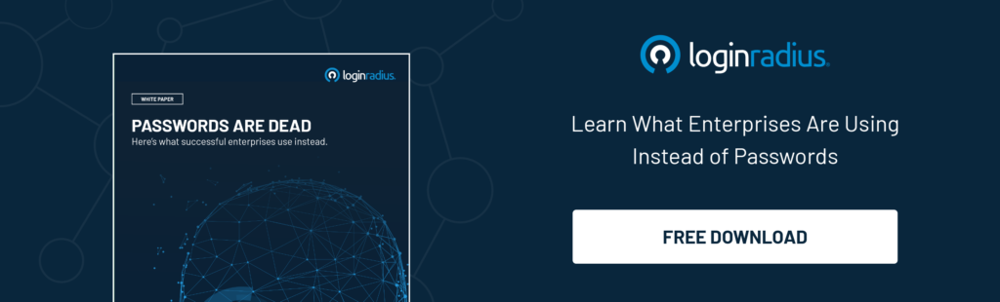
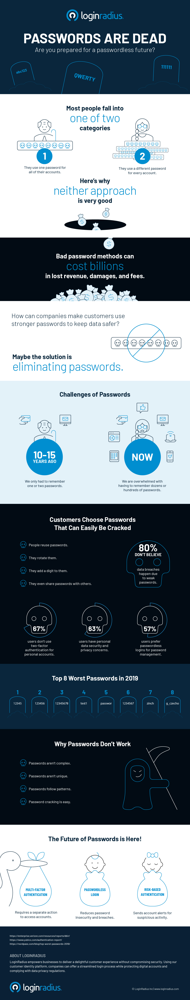

Everyone knows that sinking feeling when you go to log in and realize you’ve forgotten your password.

Maybe you haven’t visited the website in ages. Or you just changed the password but didn’t record it in your password manager. Or you have five variations for that password and you can’t remember which one you used.

Passwords are there to make it safe for customers to use their accounts. But often passwords aren’t enough. And when passwords get in the way of customers using their accounts at all, something’s wrong.

Forward-thinking companies are hurrying along the death of passwords by adopting login features that are more secure than passwords and easier to use. LoginRadius a [customer identity and access management](https://www.loginradius.com/blog/2019/06/customer-identity-and-access-management/) (CIAM) platform provides a secure login solution:

- [Multi-factor authentication](https://www.loginradius.com/blog/2019/06/what-is-multi-factor-authentication/) makes doubly sure of a customer’s identity by asking for a second confirmation (such as a one-time passcode) on top of login credentials.
- [Passwordless authentication](https://www.loginradius.com/blog/identity/passwordless-authentication-the-future-of-identity-and-security/) does away with the password altogether in favor of a one-time passcode or magic link.
- Risk-based authentication lets you capture your customer’s login profile and ask for extra confirmation when their device or location changes.

We’ve put together a few alarming and entertaining facts on the current state of passwords. Customers aren’t going to get any better about using passwords safely, so it’s up to businesses to make those pesky strings of characters obsolete once and for all.

Curious about learning more about these alternative authentication methods?

We further dig into the problems businesses face with existing username/password authentication methods. We will then review the new authentication methods that are becoming popular in the marketplace and how in the near future they might very well replace passwords.

