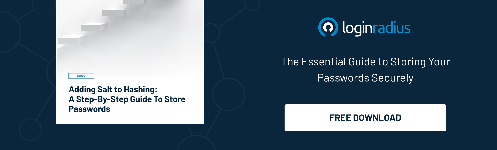

## Introduction

It's happened to all of us: we've forgotten our password and need to reset it (especially after summer vacation).

 
While this should be a [simple process](https://www.loginradius.com/blog/identity/how-to-improve-customer-verification-process/) for most websites, it can be a total nightmare for the customer if it's not done right. In fact, password resets are one of the most common customer service complaints. So, what can enterprises do to make sure this process is as smooth and painless as possible?

We'll be discussing some of the best practices for a password reset, as well as ways to avoid ruining the customer experience!

## Why is the Process of a Password Reset Important?

Password reset is an important process for both customers and businesses. Customers need access to their accounts as quickly as possible when they've forgotten their password (which – they will), and businesses need to make sure that the process is quick and easy for them (which is – inevitable).
 

And with the average web user having multiple online accounts, with accounts doubling every 5 years, this becomes a real issue both for enterprises and personal security.

With information and account overload, user behavior such as using the same password for multiple accounts invites security breaches, making authentication a top priority for enterprises.

## How Can a Password Reset Negatively Affect the Customer Experience?

If the password reset process is lengthy or difficult, customers will inevitably be frustrated which can lead to a number of customer service issues. 

For starters, the customer might not be able to get back into their account, and if this drags on for any length of time causes major inconveniences. If the frustration builds up with a poorly executed process for resetting a password and authenticating the user can lead to negative word-of-mouth advertising and even lost business.

In addition, a [botched password reset](https://www.loginradius.com/blog/identity/common-vulnerabilities-password-based-login/) can also lead to customer data being compromised. This could potentially expose the customer to identity theft or fraud due to the sheer amount of accounts that the average user has. 

Finally, if the password reset process is too difficult or complicated, the customer might be less likely to try again in the future.

All of these scenarios have a negative impact on the customer experience and ultimately damage the relationship with them. It's way easier for a customer to abandon ship at switch over to another business that handles onboarding and customer support excellently. 

There is simply no room for mistakes in a globally competitive market in order to both acquire and retain customers for the long haul.

## How to Make a Password Reset as Seamless as Possible?

When it comes to password resets, enterprises need to be careful about how they go about it. If it's too complicated, customers will inevitably get frustrated. Here are a few tips for making a password reset as seamless as possible:

### 1. Keep the process short.

The key to keeping the process as painless as possible is to keep it short and simple. The last thing you want to do is force your customer to jump through hoops in order to reset their password. Make the process easy to follow, keep it under a minute, and don't require too much information. Entering an email address should be a good sweet spot. 

### 2. Make sure the customer has all the necessary information before starting.

Password resets can be a huge pain for customers, but with the right preparation, they can be as seamless as possible. Make sure the customer has all the necessary information before starting. The customer should also be aware of the reset process and what to expect. The last thing you want is for them to be confused during the process.

### 3. Make sure the information is secure.

One of the most important aspects of a customer's experience is feeling safe and secure. When it comes to resetting passwords, enterprises need to take extra precautions to make sure customer data is secure as well. This means instituting safeguards against things like multiple failed logins and only sending information via secure channels. 

It's also important to make sure that the customer service representatives who are handling password resets are adequately trained in data security. 

By following these simple steps, companies can help ensure that their customers have a positive experience, even in the face of a password reset.

## What are Some Best Practices for Resetting Passwords?

When resetting a customer's password, it's important to keep a few things in mind. Here are some best practices to ensure a positive customer experience:

### 1. Reset passwords in a secure environment.

When it comes to resetting passwords, enterprises have a delicate balance to strike between security and customer experience. 

The system needs to [verify the identity](https://www.loginradius.com/blog/growth/best-practices-verification-emails-effective/) of the user and this can be done through methods such as asking for personal information like SSN/date of birth or sending a reset link to an email address. 

If your system is compromised and user data is leaked, you could put your customers at risk. Make sure you use a reputable authentication vendor to help keep your system secure.

### 2. Send password reset emails from a recognizable address.

One way to ensure a good customer experience is to use recognizable email addresses for password reset communications. 

When a user receives an email from, say, support@company.com for a password reset, they are likely to experience less confusion and frustration than if the email is from an address they don't know. 

This small detail can make all the difference in the world when it comes to resetting passwords. 

### 3. Use a personalized message in the email.

When a customer needs to reset their password, they generally expect a standardized email message from the company. 

However, you can make the experience more personal for your customer by [writing personalized copy](https://chrisstarkhagen.com/blog/ai-writer-ai-content-generator) in the email sequence. This small gesture can make the customer feel appreciated and more likely to continue using your service.

### 4. Make the reset process easy to follow.

Instructions should be clear and concise, without any complicated steps. If possible, the reset process should not require the customer to call customer service or go through a long series of prompts. The easier the reset process is, the better.

## Wrap up

No company wants a disgruntled customer, but all too often password resets – a necessary evil – lead to just that. 

When done correctly, though, password resets can be easy and relatively painless for both the customer and the enterprise. By following these tips that we went through, enterprises can ensure that the customers have a positive experience when resetting their passwords.

