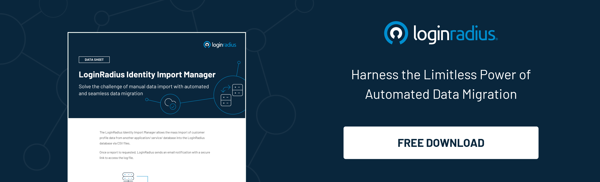

## Introduction

CIAM migration can be challenging, but that doesn't mean it's impossible — thanks to just-in-time migrations.

As part of transitioning from an old Customer (IAM system to a new one, businesses eventually have to migrate their users from one IAM to another. 

Migrating several thousand users at once can be challenging for tech teams, resulting in possible errors and delayed access, which can adversely impact business operations.

Just-in-time migrations are the latest buzz in the [customer identity and access management](https://blog.loginradius.com/identity/customer-identity-and-access-management/) (CIAM) industry. While most organizations still use bulk migrations, a growing segment of cloud services is implementing just-in-time (JIT).

CIAM migrations as an alternative way to move users from their current IAM system to their new IAM. JIT moves one user at a time, which means that the risk of exposing personal data is minimal, and a seamless transition isn’t bothered. 

In a nutshell, just-in-time migrations move users one-by-one from their current IAM to a new IAM once a user logs in. This migration is entirely secure since it helps overcome the challenges of conventional bulk migrations that forces every user to create a new user id and password and eventually affect user experience.  

## How Just-in-Time Migrations Overcome the Password Problems?

Let's face it: [passwords are a pain](https://blog.loginradius.com/identity/infographic-the-death-of-passwords/). They're complicated and hard to remember and take forever to enter into the right boxes.

But they're also serious business when trying to migrate your databases. That's because encrypted passwords are often used as part of the security protections on your database—and when you migrate them, you increase the risk of security breaches exponentially.

Undoubtedly, passwords are the problem that hinders bulk migrations since they’re encrypted for security reasons. And when these encrypted passwords are migrated, security risks increase exponentially.

On the other hand, just-in-time migrations reduce password complexity as it temporarily keeps the current database in place. Whenever a user tries to log in, they are verified through orchestration, and if found authentic, they're securely migrated.

Just-in-time migration is an effective solution to avoid the problem mentioned above associated with bulk migrations. Just-in-time migration is a process where sensitive information is captured only when required and then stored securely in a separate location until it's needed. 

This process allows organizations to impose strict controls on sensitive information access while allowing users to access their data when needed.

## How LoginRadius CIAM Paves the Way for Smooth Migrations through Identity Import Manager?

The LoginRadius Identity Import Manager is a flexible tool that allows companies to import and manage multiple customer profile data from any different application, service, or database into the LoginRadius database via CSV files. 

With the new feature, companies can be confident about the consistency and accuracy of the imported data. Here are the LoginRadius’ identity import manager’s capabilities: 

* **Data Migration Operation:** It imports new data and updates and deletes existing data migration. It also supports automatic mapping with LoginRadius fields. 
* **Data Integration:** It offers a unified view with a real-time progress update and consolidated structured and unstructured data from multiple sources.
* **Data Compliance:** It provides reliable [data protection capabilities](https://www.loginradius.com/compliances-list/) through alignment with the NIST SP 800-53 component. Other certifications include SOC2 Type ll, PCI DSS, ISO 27001, and 27018 with ISO 27001:2013.
* **ETL Optimization:** It optimizes existing ETL processes to improve performance, reduce data points, and decrease resource usage.
* **Log File Protection:** Log files can be protected with a password using the set log file password field.
* **Redundancy Verification:** Redundancy is avoided using the Lookup Type, which locates the customer profile that needs to be added, modified, or deleted, to prevent duplicate profiles.
* **Data ETL Logs:** It shows the history of migrated data requests and the log download links. Logs contain details such as the start date, the expiry date of downloaded files, the status of the data process, etc.
* **Flexible tools:** It is equipped with state-of-the-art solutions that address the exponential growth of various data sources and is designed to work with structured and unstructured data.

## To Conclude 

Two of the most significant pain points of migrating to a CIAM are the resources required and managing multiple vendors with disparate technologies. 

Fortunately, there is an easier way to migrate customer data. Vendors like [LoginRadius](https://www.loginradius.com/) have developed a just-in-time migration solution that can cut costs over traditional approaches and significantly improve the customer experience. 

Moreover, LoginRadius provides a single unified platform for user authentication, user provisioning, and single sign-on for all applications throughout the enterprise. 

This dramatically reduces the number of systems and platforms involved in a migration project and eases the burden on IT teams and administrative responsibilities for end users.

