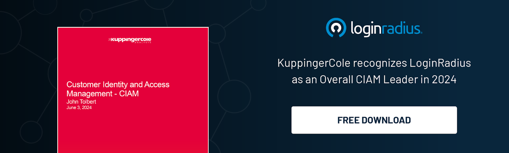

## Introduction

In today’s dynamic digital business landscape, endless opportunities await organizations that prioritize seamless customer experiences without sacrificing security. Mastering the balance between user experience and security—a true symphony—requires a foundation of cutting-edge technology. 

This is precisely where LoginRadius' CIAM excels. Recently, LoginRadius was recognized as an overall leader in Customer Identity and Access Management (CIAM), a Product Leader, and the Largest Pure CIAM Specialist in [KuppingerCole's 2024 Leadership Compass reports](https://www.kuppingercole.com/research/lc80834/customer-identity-and-access-management-ciam). 

## The Report Emphasizes the following Key Strengths of LoginRadius CIAM

### Innovative Workflow and Policy Management

LoginRadius offers intuitive interfaces for designing workflows and authentication policies, enabling organizations to implement secure and scalable CIAM strategies effectively.

### Extensive Integration Capabilities

Recognized for its seamless connectivity with [third-party Identity Verification (IDV) services](https://www.loginradius.com/cloud-integrations/), Customer Data Platforms (CDPs), chatbot services, payment gateways, and various Software-as-a-Service (SaaS) applications, LoginRadius offers unparalleled flexibility and interoperability and is recognized for its broadest range of third-party IDV providers in the field. 

### Comprehensive B2B CIAM Features

LoginRadius supports extensive B2B CIAM functionalities such as compliance checks, per-customer communication and reporting, delegated administration, and granular authentication policies, comprehensively catering to enterprise needs.

### Top-Tier Security Standards

With a wide array of security certifications, including ISO 27001/27017/27018 and SOC 2 Type 2, LoginRadius upholds the [highest standards of data security](https://www.loginradius.com/compliances-list/#compliance-security) and compliance, ensuring robust protection for customer identities.

### Cutting-Edge, Scalable Architecture

Built on a cloud-first approach with an auto-scalable architecture, LoginRadius provides a resilient foundation for organizations looking to future-proof their CIAM infrastructure.

## Your Customers Desire a Seamless User Experience with Security at Its Heart

Creating a flawless user experience isn’t a tough nut to crack. However, what makes a difference is to balance a great user experience with a robust foundation of security. Thankfully, [LoginRadius CIAM ](loginradius.com)has cracked the code and helps businesses stand ahead of the curve with: 

### Seamless User Experience

LoginRadius ensures [a frictionless user experience](https://www.loginradius.com/customer-experience-solutions/), enabling your customers to access services effortlessly. With intuitive interfaces and personalized interactions, your users enjoy a smooth journey from start to finish, enhancing customer satisfaction and loyalty.

### Streamlined User Journeys

By simplifying user authentication and authorization processes, LoginRadius minimizes hurdles and accelerates access. This streamlined approach not only improves the user journey but also reduces abandonment rates, driving higher conversion rates and better business outcomes.

### Robust Security and Compliance

Security remains at the core of LoginRadius' CIAM solution. Employing advanced encryption, multi-factor authentication, [risk-based authentication](https://www.loginradius.com/resource/guide/enterprise-risk-based-authentication/), and threat detection, LoginRadius protects user data against breaches and ensures compliance with industry standards. This robust security framework builds trust and confidence among your customers, assuring them that their information is safe.

### Enhanced Marketing Capabilities

LoginRadius goes beyond security and user experience by empowering businesses with valuable[ customer insights](https://www.loginradius.com/customer-insights/). Businesses can better understand customer behavior, preferences, and trends through comprehensive data analytics. 

This data-driven approach enables targeted marketing campaigns, personalized recommendations, and improved customer engagement, ultimately driving growth and revenue.

## The Journey Ahead

LoginRadius is dedicated to providing cutting-edge, technology-driven solutions while emphasizing continuous improvement and investing in R&D to meet the evolving demands of dynamic markets.

The latest features in LoginRadius CIAM, such as [Passkeys](https://www.loginradius.com/passkeys-login-authentication/) and [Push Notification MFA](https://www.loginradius.com/push-notification-mfa/), are already ahead of the curve, helping organizations deliver a seamless user experience across multiple touchpoints without compromising security.

Additionally, LoginRadius is consistently integrating the full potential of AI and ML technologies into its CIAM to ensure our partners receive the best return on their investment when choosing a reliable identity management solution.

Embrace the future of digital identity management and position your brand at the forefront of your industry. Discover the LoginRadius advantage today and lead the charge in customer IAM.

Ready to transform your customer identity management? Book a personalized demo today to learn how LoginRadius CIAM transforms your business.

