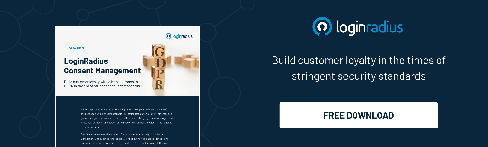

## Introduction

Imagine having the power to access all your favorite online platforms with just one set of login credentials. It's like a magic key that opens multiple doors effortlessly. 

Unlocking a world of convenience and seamless online experiences, Single Sign-On (SSO) has revolutionized how we access multiple platforms. However, amid this [digital transformation](https://www.loginradius.com/blog/identity/digital-transformation-consumer-iam/), an important question arises: What are the legal implications of SSO? 

Let’s explore all the implications and how businesses can ensure they can reap the maximum benefits of SSO. 

## 6 Crucial Legal Implications of SSO

### 1. Privacy Concerns with SSO

[Single sign-on](https://www.loginradius.com/blog/identity/what-is-single-sign-on/) systems typically involve the exchange of user information between multiple platforms. Sharing personal data raises concerns about user privacy and the potential for unauthorized access. 

Organizations implementing SSO must ensure robust privacy measures to protect user information and adhere to applicable privacy laws and regulations. They must establish transparent practices regarding collecting, using, and retaining user data, providing users with clear information and control over their personal information. 

### 2. Data Protection Requirements

Data protection has become increasingly crucial in the digital age. SSO introduces complexities in how user data is collected, stored, and processed across multiple platforms. 

Organizations must establish comprehensive [data protection policies](https://www.loginradius.com/blog/identity/stay-compliant-with-data-privacy-laws-2023/) and practices to ensure compliance with relevant laws and regulations, such as the General Data Protection Regulation (GDPR) or the California Consumer Privacy Act (CCPA). 

This includes implementing appropriate security measures, obtaining informed consent, and giving individuals the right to access, rectify, and delete their data.

### 3. Compliance Considerations

SSO implementations must align with various legal and regulatory requirements. Organizations need to assess the impact of SSO on compliance obligations such as data retention, consent management, and breach notification. 

Depending on the industry, additional healthcare regulations may apply, such as the Health Insurance Portability and Accountability Act (HIPAA) or the Payment Card Industry Data Security Standard (PCI DSS) for payment processing. 

Compliance with these regulations requires careful planning and adherence to specific requirements to protect user data and avoid legal consequences.

### 4. User Consent and Control

In the realm of SSO, user consent and control over personal data are paramount. Organizations must provide clear and understandable information about the data shared between platforms and obtain user consent. 

Users should be able to manage their preferences regarding data usage and make informed choices about what information they share. 

Transparent consent mechanisms, user-friendly privacy settings, and easy-to-understand privacy policies are vital in ensuring user trust and compliance with privacy regulations.

### 5. Security Measures

Robust security measures are crucial for SSO systems to safeguard user data and maintain trust. Organizations should implement strong authentication mechanisms, encryption protocols, and secure transmission channels to protect user credentials and prevent unauthorized access. 

Regular security audits, vulnerability assessments, and [incident response plans](https://www.loginradius.com/blog/identity/difference-between-incident-response-disaster-recovery/) are essential to a comprehensive security strategy.

### 6. Vendor Selection and Agreements

Many organizations rely on third-party vendors or service providers for SSO implementations. Conducting due diligence when selecting vendors and negotiating comprehensive agreements that address data protection, privacy, and compliance requirements is essential. 

Contracts should clearly define the responsibilities of each party, allocate liability, and establish dispute resolution mechanisms.

## How LoginRadius CIAM Helps Overcome the SSO Implications?

The [LoginRadius CIAM](https://www.loginradius.com/) offers a comprehensive solution to overcome the SSO implications and address the legal concerns of Single Sign-On. With LoginRadius, organizations can implement a secure and compliant SSO implementation strategy while prioritizing user privacy and data protection.

LoginRadius provides privacy-enhancing features to address privacy concerns. It ensures the implementation of robust privacy measures, such as transparent data collection, use, and retention practices. Users are provided with clear information and control over their data, empowering them to make informed choices about data sharing.

In terms of data protection, LoginRadius CIAM enables organizations to establish comprehensive data protection policies and practices. It facilitates compliance with relevant laws and regulations, including GDPR and CCPA, by implementing security measures, obtaining informed consent, and offering individuals the right to access, rectify, and delete their data.

LoginRadius also addresses compliance considerations. The solution helps organizations assess the impact of SSO on compliance obligations, such as data retention, consent management, and breach notification.

## Conclusion

Understanding its legal implications is crucial as SSO continues to transform how we access online platforms. Privacy, security, and compliance must be at the forefront of any SSO implementation strategy. 

By prioritizing user privacy, implementing robust security measures, ensuring compliance with relevant regulations, and establishing transparent practices, organizations can navigate the legal landscape surrounding SSO and create a secure and compliant user experience. 

And for this, nothing can replace the true potential of a reliable CIAM like LoginRadius that helps businesses seamlessly integrate SSO without any legal setbacks. 

