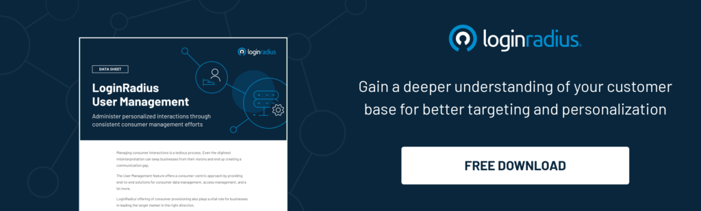

Determining how consumers are introduced to a brand is as important as managing their subsequent journey. With LoginRadius’ recently [launched User Management feature](https://www.loginradius.com/user-management/), businesses can enjoy streamlined access control and adjustable privileges for their consumers. 

## Intent Behind the Launch

Simply put, the LoginRadius User Management feature solves the problem of managing the multiple operations that revolve around consumer data. 

It also has been designed to help your business in the following ways: 

- It is an easy-to-use feature launched to handle your user management and support requirements.
- It allows you to control and restrict access for consumers from the LoginRadius Admin Console. You can also handle consumers from your application’s admin console.
- It allows you to block, or delete consumers based on your business policies. 
- It allows you to feed consumers' data in real-time using Webhooks and APIs.
- It reduces your team effort to maintain and manage consumer data.
- It helps you to migrate the existing consumer data from multiple sources.

## Key Capabilities of LoginRadius User Management

1\. **User management process**: LoginRadius offers complete consumer management features, including: 

- **Provisioning**: To create consumer accounts.
- **Authorization**: To validate the access rights of consumers.
- **Account Management**: To disable consumer accounts, and grant, or restrict access.
- **Password Management**: To trigger the password reset option for consumer accounts.
- **Deprovisioning**: To block, or delete consumer accounts.

2\. **Multiple operations of user data**: LoginRadius allows the following actions to be performed on consumers’ data:

- **Data filtration**: To search consumers based on parameters like Name, Email, UID, ID, and Phone ID via the LoginRadius Admin Console.
- **API support for user management**: To allow all user management features to be directly integrated into your application’s Admin Console.
- **Real-time user data feeds using webhooks**: To obtain real-time feeds of consumer data using the LoginRadius webhooks.
- **Data migration services for user management**: To offer self-serve and CSV-based data migration via the LoginRadius Admin Console.

### A Final Word

The User Management feature by LoginRadius is unique in that it monitors and manages the entire consumer journey through automated access permissions, data migration, API support, and other consumer-centric solutions. Now, blend it with creating [meaningful relationships with your consumers](https://www.loginradius.com/customer-experience-solutions/)—that’s what we offer. 

