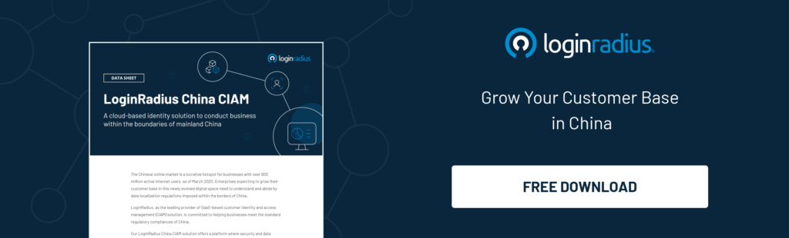

LoginRadius has been simplifying identity management to help businesses build stronger relationships with their customers.

With our LoginRadius China CIAM platform, we aim to help businesses [securely manage digital identities](https://www.loginradius.com/blog/2019/10/digital-identity-management/) within the restrictive borders of mainland China.

## Intend Behind the Launch

The Chinese online market is a lucrative hotspot for businesses with over 900 million active internet users, as of March 2020. From a digital business standpoint, it is critical for enterprises that want to expand their customer base by collecting and storing citizen's data, to understand China's cyber regime.

We ensure that our LoginRadius China [customer identity and access management](https://www.loginradius.com/blog/identity/customer-identity-and-access-management/) platform meets the changing privacy regulations imposed by China, and businesses are able to streamline a hassle-free customer experience in the nation’s digital ecosystem.

## Key Features of the LoginRadius China CIAM

**Data Center**: To meet the data localization regulation requirements of the Chinese government, LoginRadius owns a primary data center in China. We offer a mature operating model where data accessibility and data protection are completely transparent. Our cloud solution is highly scalable and provides up to a **99.99% service level agreement guarantee** with perfect deployment capabilities. 

**Chinese Social Providers**: On the LoginRadius China CIAM platform, businesses can integrate APIs with native social networks like Sina Weibo, Kaixin, QQ Tencent, Renren, WeChat, along with approximately 40 other social providers. There are provisions for mobile native support for WeChat too along with the flexibility to add custom social providers.  

**QQ Tencent Captcha**: Captcha can be applied as a lockout method for brute force attacks. Because China does not support Google reCAPTCHA, LoginRadius serves QQ Tencent Captcha to ensure that the end-user is a human and not bots.

**Multilingual Support**: The LoginRadius China CIAM solution provides local language support through simplified and traditional Chinese. Businesses can easily configure language settings too.

## A Final Word

Privacy and security rule everything in China. With the LoginRadius China customer identity and access management solution, we aim to offer a mainstream business capability for businesses that drive (or aims to drive) revenue growth by leveraging the identity data of Chinese citizens.

From social integration, [strong authentication](https://www.loginradius.com/multi-factor-authentication/), local language support to meeting the standard regional regulatory compliances, they are the key areas no clients should worry about.

