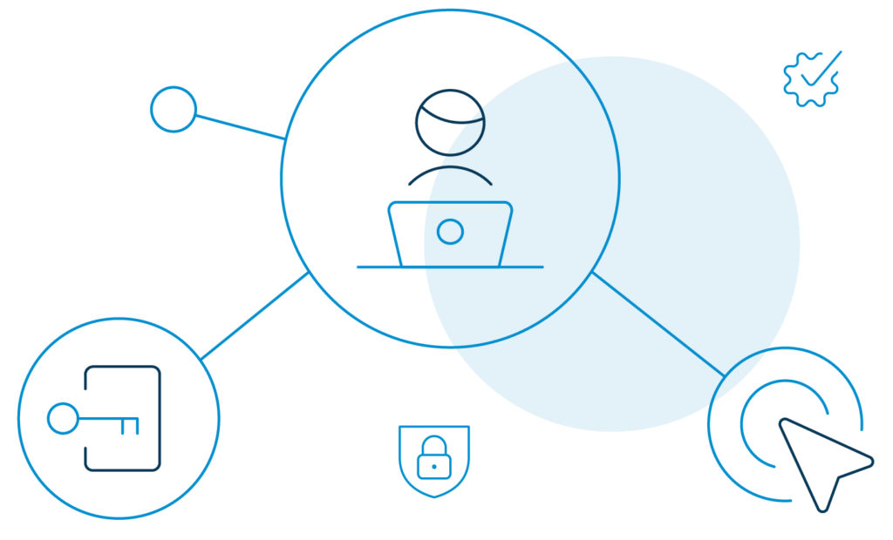
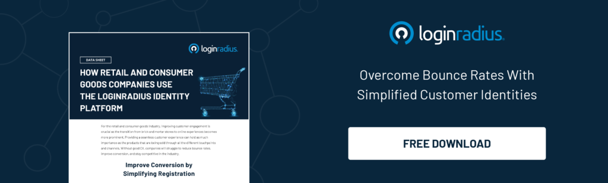
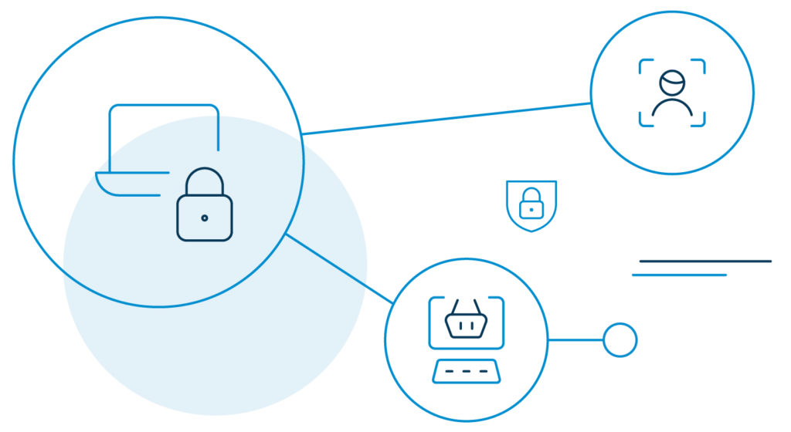
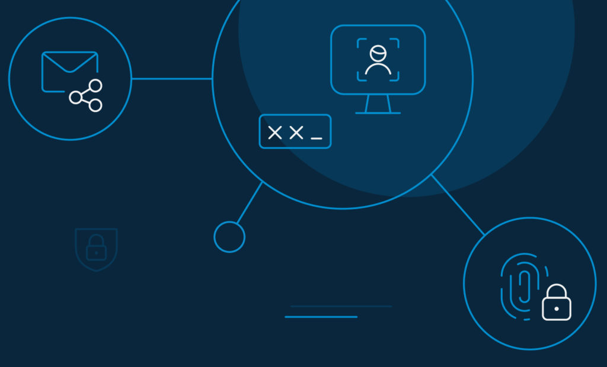

As the retail and e-commerce industry enters the new era of digitalization, customer experience while interacting with a brand has taken a giant leap forward. It has in fact, pushed products and services as a secondary entity to the overall shopping experience. They are no longer the driving motivation for shoppers to approach a store.

Today, customers want to remember how they were treated. And if retailers do it right, they won’t shy away from coming back over and over again.

Therefore, amid the struggle among retailers to stand out, the power has shifted heavily in favor of customers. Today, retailers must be everywhere to make their customers feel unique.

They should be able to identify their visitors and [build personalized](https://www.loginradius.com/customer-experience-solutions/) [experiences](https://www.loginradius.com/customer-experience-solutions/) around major touchpoints like product discovery, research, purchase, and beyond.

No wonder customer identification has been playing a pivotal role in driving new-age marketing campaigns.

## What is Identity Management in the retail and e-commerce industry?

Identity management in the retail and e-commerce industry is a seamless, secure, and scalable solution to identify and protect customer data and ensure that they can easily access any information they need.

Traditionally, identity management solutions have been only about employee-centric internal security. In fact, they were designed to manage the identities of a limited number of users.

Fast forward to today’s scenario – the idea of putting customer identity right in the middle of the retailer's business model is gradually picking up and turning heads.

There are [customer identity and access management](https://www.loginradius.com/blog/2019/06/customer-identity-and-access-management/) providers available that generate automated customer profiles across multiple channels.

As a result, customers enjoy on-time delivery of digital (and physical) goods and services, along with a few add-ons like:

- Ensuring security compliance.
- Eliminating duplicate identity data.
- Reducing application-related complexities.
- Simplifying the customer registration process.
- Developing a larger database using first-party social data.
- Creating a unified customer profile.
- Collecting more customer purchase and interaction data.
- Storing customer data in a secure cloud directory.

These are opportunities ready to be grabbed. But are retailers ready to fuse identity management into their workflow? If not, it is high time that they should.

**A world without an identity management solution will invite the following challenges.**

1. Lack of omnichannel customer experience.
2. Absence of customer identity.
3. Data compliance and security flaws.
4. Lack of role-based privileges.
5. Unmanageable data duplicacy.

## Creating a Frictionless Customer Experience with LoginRadius

Here’s a question. What will turn casual visitors into loyal customers?

As a retailer, you need to understand the demographics of your customers and figure out their preferences. Adding a customer identity and access management (CIAM) solution to your business should do the trick. 

Speaking of which, the LoginRadius identity solution provides a centralized, available, and secure identification and [management of customers' data](https://www.loginradius.com/data-governance/) to retailers. 

Among its solutions include the real-time ability for visitors to self-register for services, login and authenticate, and enjoy a single-source view.

Retailers can manage customer profiles and provide a [personalized omnichannel experience](https://www.loginradius.com/blog/2020/04/omnichannel-customer-experience/) with consent and other preferences.

### Improving Registration and Login Options

The identity management platform allows customers to register using the following registration options quickly:

**1\. Smart Login:** With this login option, a customer can log into a device that is neither a website or a mobile device. For example, if you want to authenticate your customers who are using an application on your smart TV, you can streamline the required authentication flow with this option.

**2\. One-Touch Login:** Passwords are dead. Customers need not remember passwords to login to an application or website anymore. Therefore, to remove further friction during login and avoid too many forgot password requests, retailers can use these login options:

- Magic Link via Email (PasswordLess via Email)
- OTP Login via Email (PasswordLess via Email)
- OTP Login via Phone (PasswordLess via Phone)

### Getting Customer Data with Customer Consent

The concept of progressive profiling is getting a lot of attention these days. So, what is it, and why do retailers need it?

[Progressive profiling](https://www.loginradius.com/progressive-profiling/) is the method of collecting information about your customers using dynamic web forms throughout the purchase journey.

Here's how this works. For example, you want some details from your customers to customize the end-user experience, or you want their consent to use some of your services, but you are afraid of losing them by asking to fill a long registration form. 

Progressive profiling will do wonders here. For instance, when the customer has placed the first three orders, you can ask them to fill in a small questionnaire. They will more likely answer about their preferences at this stage rather than during the registration.

### Utilizing Shopper Insights

One way to increase brand loyalty is by combining a 360-degree view of the [customer demographics](https://www.loginradius.com/customer-insights/) with their behavior and personal preferences. This helps retailers and e-commerce owners tweak the way they interact with their brands.

All-in-all, centrally managing identities can primarily enhance the customer experience and build better relationships.

### Engaging and Attracting Customers

LoginRadius simplifies the shopper registration process with social sign-in and single sign-on. 

**Social Sign-In:** Customers tend to remember the credentials of their frequently used network. As such, [social sign-in is the method](https://www.loginradius.com/social-login/) of one-click authentication with a social media account. It reduces the hassles of the registration process and, thereby, helps a great deal in converting a random user to a value-added customer. 

**Single Sign-On:** It means a customer can access multiple accounts with a [single set of credentials](https://www.loginradius.com/blog/2019/05/what-is-single-sign-on/). It offers ease of authentication and reduces the risk of minimizing poor password habits.

### Providing Customer Security

The LoginRadius platform offers advanced frictionless security to enhance the customer experience in the retail and e-commerce industry. With features like data management and real-time fraud analysis, it prevents fraudulent access attempts.

Privacy compliance is another critical aspect of LoginRadius. Some of the global standards that it abides by include the [EU's GDPR and California's CCPA](https://www.loginradius.com/blog/2019/09/ccpa-vs-gdpr-the-compliance-war/).

### Preventing Account Takeover (ATO)

Account takeover (ATO) fraud prevention is growing popular especially in the retail, and ecommerce sector.

Wondering what is it?

ATO happens when a hacker, for example, steals saved card details and places an order on behalf of the customer, redeems reward points for goods or services, steals gift cards, and sells attacked accounts to other cybercriminals.

Not just the victimized customer, but ATO can cause severe damage to the overall customer experience in the retail and e-commerce industry.

The LoginRadius identity platform protects customers and retailers from attacks such as social engineering, password spraying, [credential stuffing](https://www.loginradius.com/blog/2019/09/prevent-credential-stuffing-attacks/), phishing, brute force, and session hijacking.

## Account Security Best Practices

For any retailer, account management, verification, and password management is a huge deal. But when it comes to relying on an identity management provider platform, account management seems tricky and often falls short of expectations.

LoginRadius offers the following security benefits in the e-commerce spectrum.

- **Password security:** It supports features like setting password validation (minimum/maximum length, at least one special character, alphanumeric, etc.), enforcing password lifetime, password history, and password visibility. 
- **Security against brute force attack:** Brute Force Attack happens when hackers use multiple combinations of credentials to gain access to an account. When it happens, you can suspend your customer's account for a predefined time, prompt the captcha option, ask security questions, or block the account (as a last resort). 
- **Risk-based authentication (RBA):** RBA is an authentication technique where if there is a slight change in customer behavior like changed IP address, suspected search history, or any act that seems suspicious and risky, a new layer of security is triggered. LoginRadius offers a range of authentication protocols to choose from like biometrics, push notifications, OTP, and tokens. 
- **Multi-factor Authentication (MFA):** MFA requires your customers to pass [through multiple layers of authentication](https://www.loginradius.com/blog/identity/what-is-multi-factor-authentication/) during the login process. LoginRadius supports the SMS passcode and Google authenticator to configure the authentication feature.

## Conclusion

Security and seamless customer experience in the retail and e-commerce industry are the major brand differentiators. 

But, there is no magic formula for mastering security. So, if you are not careful, you can lose your customers' trust. Plan and give your shoppers a hassle-free experience with your brand, every time.

