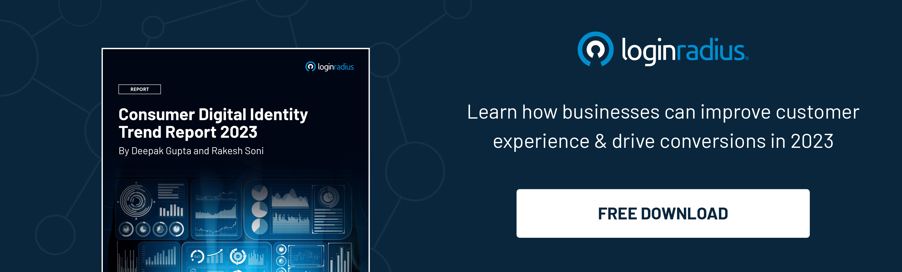

## Introduction 

We are pleased to present our annual **Consumer Digital Identity Trend Report 2023**, the ultimate guide to navigating digital consumer identity's complex and ever-evolving landscape.

We've surveyed over 500 brands and a whopping 1.17 billion users from the LoginRadius Identity Platform to bring you an in-depth analysis of the consumer data market. 

This report offers valuable insights and industry-standard performance benchmarks ranging from consumer behavior and authentication methods to identity verification and IT requirements. It is an essential resource for business leaders, marketers, and IT professionals who want to stay ahead of the curve in the digital era.

Discover the latest changes in consumer behavior and how they will impact business practices and IT requirements.

## Rich Customer Authentication Experience is Pivotal for More Conversions 

According to our Consumer Identity Trend Report 2023, providing a rich and seamless authentication experience to customers is crucial for [driving conversions](https://www.loginradius.com/blog/growth/authentication-tools-boost-sales/). 

Consumers today expect convenient and secure ways to prove their identity, and businesses that fail to meet these expectations risk losing out on potential sales. 

The report shows that businesses that offer passwordless login or multi-factor authentication via email, SMS, or social login have seen a significant increase in conversions. 

Additionally, implementing these authentication methods can help businesses mitigate the risk of identity theft and fraud. By providing a frictionless authentication experience, businesses can enhance the customer journey, increase customer loyalty, and ultimately drive business growth.

## Key Highlights of the Consumer Identity Report 2023

As a leading provider of [Customer Identity and Access Management](https://www.loginradius.com/blog/identity/customer-identity-and-access-management/) solutions, we take great pride in our ability to gather and analyze data globally. Our analysis of our customer base over the past year has revealed valuable insights, which are as follows: 

* **95.82% **of companies offer standard login using an email ID
* Of the customers that use passwordless login, **87.59%** prefer to log in with their email address
* **51.39%** of companies do not offer MFA, but **48.61%** do.

Some more findings of the report have been outlined in the infographic below.

Overall, the CIAM trend report highlights the following:

* The preferable login methods by end-users.
* The preferable verification process.
* The performance benchmarks for identity management platforms.

## Looking Ahead

Companies can gain a significant advantage in the current marketplace by adopting a strategic approach to customer identity management. 

The LoginRadius Consumer Identity Trend Report 2023 highlights the importance of treating CIAM as a critical business process rather than mere operational activity. By doing so, businesses can operate more efficiently, enjoy lower customer acquisition and support costs, and increase customer retention rates. 

The findings of this report are essential for those seeking to enhance their customer experience and improve their overall bottom line. 

**Download your complimentary copy** of the report today and stay ahead of the curve in the ever-evolving landscape of customer identity management.

