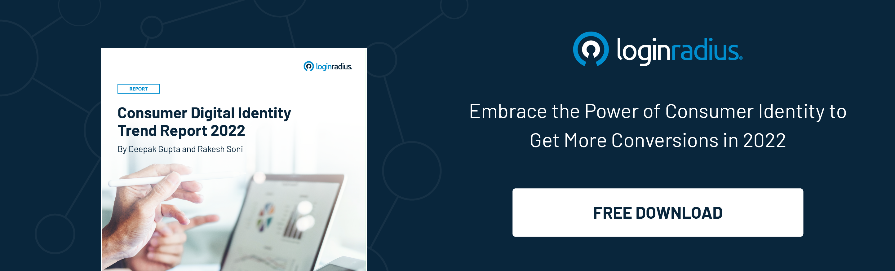

## Introduction

We are thrilled to announce the release of our annual industry report, **Consumer Digital Identity Trend Report 2022**.

We surveyed over 500 brands and 1.17 billion users worldwide from the LoginRadius Identity Platform to provide an in-depth analysis of the consumer data market, including changes in consumer behavior over time and their projected impact on business practices and IT requirements.

## Evolution is Essential for a Great Consumer Experience 

The next few years will be a pivotal time for the digital consumer identity space. One critical aspect covered in this report is that consumers are evolving from the traditional registration model to a more personalized, easy to authenticate model that's secure. Keeping up is a challenge – and it requires businesses to adjust their identity management systems.

The report findings highlight that if your business wants to stand out in a highly competitive world, you’ll need to make a huge improvement in your interactions with your customers. This means not just your interactions with them but also theirs with your brand, starting from registration to checkout.

Businesses can achieve this by tailoring authentication and login methods to their customers' preferences, such as passwordless login or multi-factor authentication via email or SMS, or social sign-on.

## Key Highlights of the Consumer Identity Report 2022

As a company strongly focused on CIAM, we analyzed our global customers over the past year, and discovered the following:

* 95.06% of companies offer standard login using an email ID.
* 59.11% of companies use MFA via SMS messaging and 40.89% via an authenticator app.
* The phone login has the highest return rate of 31.11%. Next is passwordless login with 29.41%. 

Some more findings of the report have been outlined in the infographic below. 

Overall, the CIAM trend report highlights: 

* The preferable login methods by end-users.
* The preferable verification process.
* The performance benchmarks for identity management platforms.

## Looking Ahead

Companies that treat customer identity management as a strategic business process instead of an operational activity will have the advantage in today’s marketplace. These companies will be able to operate more efficiently through lower customer acquisition, onboarding, and support costs and higher customer retention rates.

If you are trying to improve your customer experience, the finding of this report will definitely impact your bottom line. 

Download a complimentary copy of the LoginRadius [Consumer Identity Trend Report](https://www.loginradius.com/resource/consumer-digital-identity-trend-report-2022) here.

