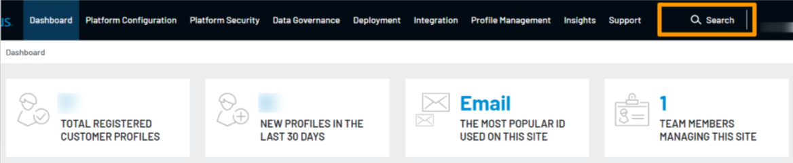
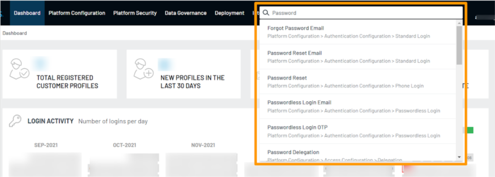
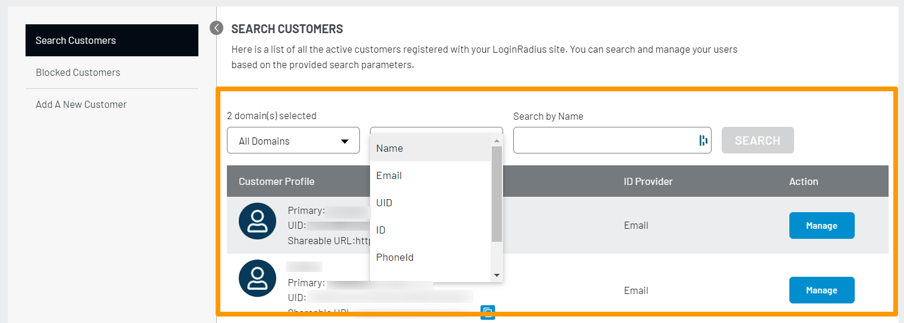
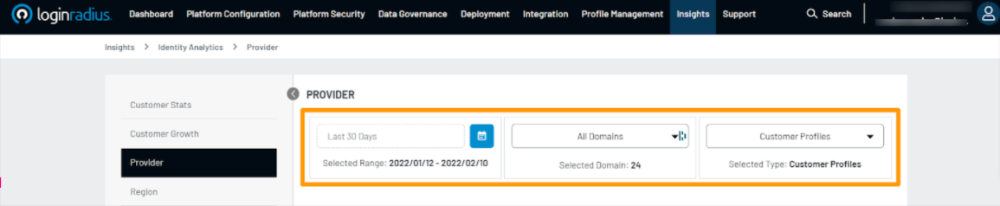

## Introduction 

The LoginRadius Identity Platform is an enterprise CIAM solution with many features fulfilling hundreds and thousands of use cases in this domain. With a vast amount of features, there comes an easy-to-use Admin Console (a dashboard provided to our customers for managing configuration, accessing data, viewing insights, etc.) with a navigation panel to access the desired features.

Being a CIAM solution, LoginRadius understands the importance of Customer Experience (CX). From time to time, we take a look back in the Admin Console and improvise it for a better customer experience.

This blog describes how LoginRadius improved the access of feature and configuration pages for customers to locate them with minimal effort.

## Introducing the New Search Option

As mentioned above, the [LoginRadius CIAM](https://www.loginradius.com/) solution serves many features via its Admin Console, and sometimes it becomes hard for users to locate a feature configuration page.

We decided to shoot this problem away by integrating the navigation panel with an easy-to-access Search option. As a result, you just type in the feature’s name or related keyword and select one result to land on the respective configuration page in Admin Console. Doesn’t that sound heavenly? 

Let’s have a look at the new search option.

### Navigational Search

Click on the search section and type a keyword or phrase to view results. The following is an example of a feature search for the “Password” keyword:

You can click the desired result, and it will land you on the respective feature page in the Admin Console. So, no more scrolling through the navigation menu to find out what you are looking for in the console.

It also displays the results relevant to the keyword or phrase to locate what you are looking for without any hassle.

Now, when we are talking about new search options, let’s have a quick look at other existing search options and how you or your team can use them in an optimized way.

### Customer Support Search

The LoginRadius Admin Console has a dedicated customer management section for your customer support team. You can conveniently manage customers or look around for details to solve their queries or problems.

You can quickly locate a customer by using the search filter options such as domain, name, UID, email highlighted on the screen below:

Similarly, you can search and manage the blocked customers too. 

### Insights Search

The search and extensive filter options are also available in the Insights section of the Admin Console. You can utilize these options to view the stats and analytics associated with customers, growth, usage, identity, provider, and many more.

The following is an example of search options available in the Identity Analytics section:

## Summing Up

The purpose of all the above searches is to let our customers quickly locate the information or sections they want to access. If you value customer experience as much as we do, [reach out to us](https://www.loginradius.com/book-a-demo/), and we will help you improve the consumer experience of your application.

