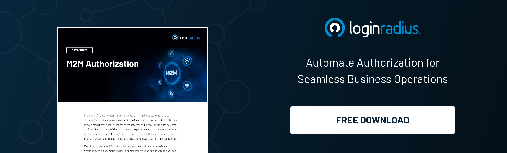

In a modern, digitally advanced environment, business systems undergo complex interactions and communicate autonomously to execute business functions. 

Every day, millions of devices constantly gather and report data, especially concerning the Internet of Things (IoT) ecosystem, which doesn’t even require human intervention. 

Hence, business systems need to efficiently and securely share this data during transit to the suitable systems and issue operational instructions without room for tampering.

Here’s where LoginRadius’ Machine to Machine (M2M) authorization comes into play. 

Machine-to-machine (M2M) authorization ensures that business systems communicate autonomously without human intervention and access the needed information through granular-level access.

M2M Authorization is exclusively used for scenarios in which a business system authenticates and authorizes a service rather than a user. 

Let’s dig deeper into this and understand the role of M2M authorization and how it helps diverse businesses. 

## Intent Behind the Launch 

M2M Authorization is the process of providing remote systems with secure access to information. Using M2M Authorization, business systems can communicate autonomously and execute business functions based on predefined authorization.

M2M apps use the Client Credentials Flow (defined in OAuth 2.0 RFC 6749), in which they pass along secure credentials to authenticate themselves and receive an [authorization token](https://www.loginradius.com/blog/identity/pros-cons-token-authentication/).

LoginRadius understands the risks associated with data transfers, especially in cases where millions of interconnected applications and devices contact each other to gain access to specific resources or devices. This access requires a robust authorization mechanism. 

Machine-to-machine authorization from LoginRadius acts as a game-changer for the business that requires frequent autonomous interactions. 

## How does it Work?

Services require authorization while saving and reading the data to and from the storage as a part of standard process and security measures. Businesses can use LoginRadius for autonomous authorization by creating two dedicated M2M apps with write and read permissions.

For each M2M application, LoginRadius issues secure credentials, and services automatically get the authorization token from LoginRadius using these [secure credentials](https://www.loginradius.com/blog/identity/login-security/) to perform read or write operations. 

In a nutshell, LoginRadius acts as an authorization server. 

Benefits of LoginRadius’ M2M Authorization

M2M Authorization offers secure access to improve business efficiency and ultimately enhances customer experience. M2M provides several business benefits, including, but not limited to: 

* Secure data access across multiple business systems
* Granular data access with predefined scopes
* Efficient authentication and data exchange 
* Grant, limit, or block access permissions at any time

## Final Thoughts 

Businesses these days require a robust [authorization and authentication](https://www.loginradius.com/blog/identity/authentication-vs-authorization-infographic/) mechanism that can carry data access requests like a breeze without hampering the overall business process. 

With LoginRadius M2M authorization, businesses can ensure a secure and reliable method of autonomous interactions since it aids business systems to achieve efficiency and, at the same time, eliminates the need for human intervention. 

LoginRadius M2M helps businesses to provide flexible machine-to-machine communication while ensuring granular access, authorization, and security requirements are enforced.

